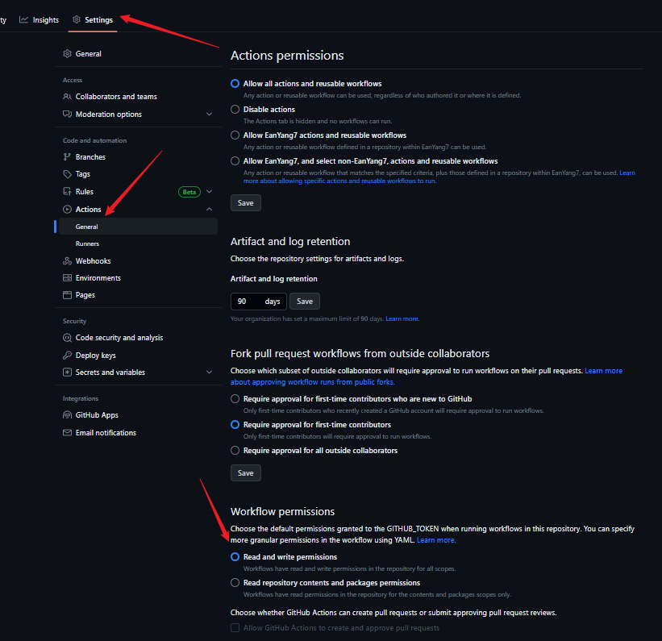
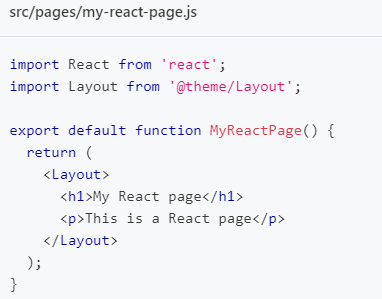
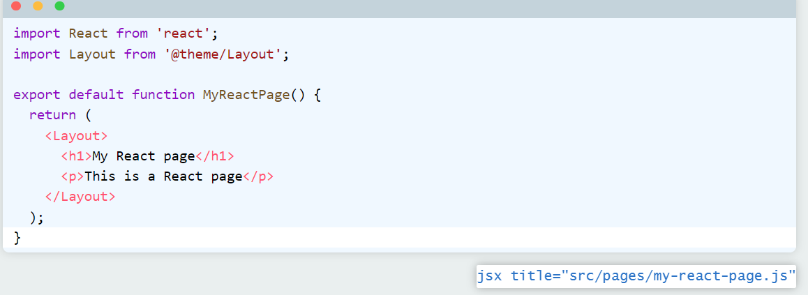
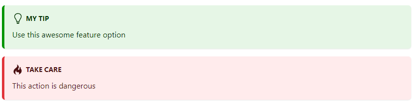

[Build optimized websites quickly, focus on your content | Docusaurus](https://docusaurus.io/zh-CN/)

## 快速开始

```shell
yarn create docusaurus
```

按要求一步步设置

### 运行

```shell
yarn start
```

### 部署

[部署 | Docusaurus](https://docusaurus.io/zh-CN/docs/deployment#deploying-to-github-pages)

#### GitHub Pages

+ 如果部署的仓库是`<用户名>.github.io`，`docusaurus.config.js`中的`baseUrl: "/"`（默认）
+ 如果部署的仓库是`<仓库名>`，`docusaurus.config.js`中的`baseUrl: "/<仓库名>/"`

自动部署在GitHub Pages上，添加action就可以了。

在`.github/workflows`下添加两个文件

>test-deploy:当有一个新的 pull request 被提交到主分支时，确保站点能够顺利地建立，但不会实际进行部署。
>
>deploy:当一个 pull request 被合并到主分支或者有人直接将其推送到主分支时，它将被建立并部署到 gh-pages 分支。在这之后，新的构建输出会被发布在 GitHub Pages 网站上。

```yaml title="deploy.yml"
name: Deploy to GitHub Pages

on:
  push:
    branches:
      - main
    # Review gh actions docs if you want to further define triggers, paths, etc
    # https://docs.github.com/en/actions/using-workflows/workflow-syntax-for-github-actions#on

jobs:
  deploy:
    name: Deploy to GitHub Pages
    runs-on: ubuntu-latest
    steps:
      - uses: actions/checkout@v3
      - uses: actions/setup-node@v3
        with:
          node-version: 18
          cache: yarn

      - name: Install dependencies
        run: yarn install --frozen-lockfile
      - name: Build website
        run: yarn build

      # Popular action to deploy to GitHub Pages:
      # Docs: https://github.com/peaceiris/actions-gh-pages#%EF%B8%8F-docusaurus
      - name: Deploy to GitHub Pages
        uses: peaceiris/actions-gh-pages@v3
        with:
          github_token: ${{ secrets.GITHUB_TOKEN }}
          # Build output to publish to the `gh-pages` branch:
          publish_dir: ./build
          # The following lines assign commit authorship to the official
          # GH-Actions bot for deploys to `gh-pages` branch:
          # https://github.com/actions/checkout/issues/13#issuecomment-724415212
          # The GH actions bot is used by default if you didn't specify the two fields.
          # You can swap them out with your own user credentials.
          user_name: github-actions[bot]
          user_email: 41898282+github-actions[bot]@users.noreply.github.com
```

---

```yaml title="test-deploy.yml"
name: Test deployment

on:
  pull_request:
    branches:
      - main
    # Review gh actions docs if you want to further define triggers, paths, etc
    # https://docs.github.com/en/actions/using-workflows/workflow-syntax-for-github-actions#on

jobs:
  test-deploy:
    name: Test deployment
    runs-on: ubuntu-latest
    steps:
      - uses: actions/checkout@v3
      - uses: actions/setup-node@v3
        with:
          node-version: 18
          cache: yarn

      - name: Install dependencies
        run: yarn install --frozen-lockfile
      - name: Test build website
        run: yarn build
```

#### 权限

需要设置Workflow的读写权限

 

> 注意:如果是组织的仓库，设置中的Workflow读写权限是禁止修改的，需要在组织中的设置中进行操作

#### gh-pages

最后在Settings中将Pages的Branch切换为gh-pages即可

## 项目结构

如果您选择了经典模板并将您的网站命名为 my-website，您将在新目录 my-website/ 下看到生成的以下文件：

```
my-website
├── blog
│   ├── 2019-05-28-hola.md
│   ├── 2019-05-29-hello-world.md
│   └── 2020-05-30-welcome.md
├── docs
│   ├── doc1.md
│   ├── doc2.md
│   ├── doc3.md
│   └── mdx.md
├── src
│   ├── css
│   │   └── custom.css
│   └── pages
│       ├── styles.module.css
│       └── index.js
├── static
│   └── img
├── docusaurus.config.js
├── package.json
├── README.md
├── sidebars.js
└── yarn.lock
```

+ `/blog/` - 包含博客 Markdown 文件。如果你已禁用博客插件，你可以删除此目录，或在设置路径选项后更改其名称。更多详细信息，请参阅[博客指南](https://docusaurus.io/zh-CN/docs/blog)。
+ `/docs/` - 包含文档的 Markdown 文件。在 `sidebars.js` 中自定义文档侧边栏的顺序。如果你已禁用文档插件，则可以删除此目录，或在设置路径选项后更改其名称。更多详细信息，请参阅[文档指南](https://docusaurus.io/zh-CN/docs/docs-introduction)。
+ `/src/` - 非文档类文件，例如页面或自定义 React 组件。严格来说，你不一定要把非文档类文件放在这里。不过把它们放在一个集中的目录，可以让代码检查或者处理更为简便。
  + `/src/pages` - 此目录中的任何 JSX/TSX/MDX 文件都将转换为网站页面。更多详细信息，请参阅[页面指南](https://docusaurus.io/zh-CN/docs/creating-pages)。
+ `/static/` - 静态目录。此处的任何内容都将复制到最终构建目录的根目录中。
+ `/docusaurus.config.js` - 包含站点配置的配置文件。这相当于 Docusaurus v1 中的 siteConfig.js。
+ `/package.json` - Docusaurus 网站是一个 React 应用程序。您可以安装并使用任何 npm 包。
+ `/sidebars.js` - 用于文档，指定侧边栏中文档的顺序。

### 单体仓库Monorepos

如果你打算用 Docusaurus 来给一个现有的项目搭建文档，单仓模式可能是一种解决方案。 单仓允许你在类似项目间共享依赖项。 比如，你的网站可以用本地的包来展示最新的功能，而不是依赖于已发布的版本； 你的贡献者也可以在实现功能时方便地更新文档。 下面是单仓模式文件夹结构的一个例子：

```
my-monorepo
├── package-a # 另一个包，你的项目本身
│   ├── src
│   └── package.json #  package-a 的依赖项
├── website   # Docusaurus 根目录
│   ├── docs
│   ├── src
│   └── package.json # Docusaurus 的依赖项
├── package.json # 单仓的共享依赖项
```

在这种情况下，您应该在`./my-monorepo`文件夹中运行`npx create-docusaurus`。

如果您使用像Netlify或Vercel这样的托管提供商，则需要将站点的基本目录更改为您的Docusaurus根目录所在的位置。在这种情况下，那将是`./website`。阅读有关在[部署文档](https://docusaurus.io/zh-CN/docs/deployment#deploying-to-netlify)中配置忽略命令的更多信息。

在[Yarn文档](https://yarnpkg.com/features/workspaces)中阅读有关monorepos的更多信息（Yarn不是设置monorepo的唯一方法，但它是一个常见的解决方案），或者查看[Docusaurus](https://github.com/facebook/docusaurus) 和[Jest](https://github.com/facebook/jest)的一些实际示例。

## 配置

所有模板都附带一个`docusaurus.config.js`，其中包括常用选项的默认值。

从高维度来说，Docusaurus 配置可被分为这几类：

- [Site metadata](https://docusaurus.io/zh-CN/docs/configuration#site-metadata)
- [Deployment configurations](https://docusaurus.io/zh-CN/docs/configuration#deployment-configurations)
- [Theme, plugin, and preset configurations](https://docusaurus.io/zh-CN/docs/configuration#theme-plugin-and-preset-configurations)
- [Custom configurations](https://docusaurus.io/zh-CN/docs/configuration#custom-configurations)

对于每个可配置字段的准确引用，您可以参考[**`docusaurus.config.js`**](https://docusaurus.io/zh-CN/docs/api/docusaurus-config) API。

### 站点元数据

站点元数据包含基本的全局元数据，如 `title`, `url`, `baseUrl`, 和`favicon`。

你的站点的许多地方都会用到这些信息，比如标题、节标题、浏览器选项卡图标、社交网站信息 (Facebook, Twitter)，等等。如果缺少这些信息，甚至不能生成正确的静态文件路径。

### 部署配置

使用deploy命令部署站点时，将使用部署配置，如`projectName`、`organizationName`和`deploymentBranch`（可选），在使用`deploy`命令部署站点时使用。

建议查看[部署文档](https://docusaurus.io/zh-CN/docs/deployment)以了解更多信息。

### 主题、插件和预设配置

分别在``themes`, `plugins`, 和`presets`字段中列出网站的[themes](https://docusaurus.io/zh-CN/docs/using-plugins#using-themes), [plugins](https://docusaurus.io/zh-CN/docs/using-plugins), 以及[presets](https://docusaurus.io/zh-CN/docs/using-plugins#using-presets)。

这些通常为 npm 软件包：

```js title="docusaurus.config.js"
module.exports = {
  // ...
  plugins: [
    '@docusaurus/plugin-content-blog',
    '@docusaurus/plugin-content-pages',
  ],
  themes: ['@docusaurus/theme-classic'],
};
```

Docusaurus支持[**module shorthands**](https://docusaurus.io/zh-CN/docs/using-plugins#module-shorthands)不足，允许您将上述配置简化为：

```js
module.exports = {
  // ...
  plugins: ['content-blog', 'content-pages'],
  themes: ['classic'],
};
```

这些模块也可以从本地目录加载：

```js title="docusaurus.config.js"
const path = require('path');

module.exports = {
  // ...
  themes: [path.resolve(__dirname, '/path/to/docusaurus-local-theme')],
};
```


要指定插件或主题选项，请将配置文件的插件或主题名称替换一个二元组，包含了名称及配置选项对象：

```js title="docusaurus.config.js"
module.exports = {
  // ...
  plugins: [
    [
      'content-blog',
      {
        path: 'blog',
        routeBasePath: 'blog',
        include: ['*.md', '*.mdx'],
        // ...
      },
    ],
    'content-pages',
  ],
};
```


To specify options for a plugin or theme that is bundled in a preset, pass the options through the `presets` field. In this example, `docs` refers to `@docusaurus/plugin-content-docs` and `theme` refers to `@docusaurus/theme-classic`.

```js title="docusaurus.config.js"
module.exports = {
  // ...
  presets: [
    [
      '@docusaurus/preset-classic',
      {
        docs: {
          sidebarPath: require.resolve('./sidebars.js'),
        },
        theme: {
          customCss: [require.resolve('./src/css/custom.css')],
        },
      },
    ],
  ],
};
```

The `presets: [['classic', {...}]]` shorthand works as well.

For further help configuring themes, plugins, and presets, see [Using Plugins](https://docusaurus.io/zh-CN/docs/using-plugins).

### Custom configurations

Docusaurus guards `docusaurus.config.js` from unknown fields. To add custom fields, define them in `customFields`.

示例：

```js title="docusaurus.config.js"
module.exports = {
  // ...
  customFields: {
    image: '',
    keywords: [],
  },
  // ...
};
```

### Accessing configuration from components

站点中的所有组件都可以访问配置对象。 And you may access them via React context as `siteConfig`.

简单示例：

```jsx
import React from 'react';
import useDocusaurusContext from '@docusaurus/useDocusaurusContext';

const Hello = () => {
  const {siteConfig} = useDocusaurusContext();
  const {title, tagline} = siteConfig;

  return <div>{`${title} · ${tagline}`}</div>;
};
```


提示

If you just want to use those fields on the client side, you could create your own JS files and import them as ES6 modules, there is no need to put them in `docusaurus.config.js`.

### Customizing Babel Configuration

For new Docusaurus projects, we automatically generated a `babel.config.js` in the project root.

```js title="babel.config.js"
module.exports = {
  presets: [require.resolve('@docusaurus/core/lib/babel/preset')],
};
```


大多数情况下，这个配置已经够用了。 如果你想要自定义你的 Babel 配置（比如添加 Flow 支持），你可以直接编辑这个文件。 你需要重新启动 Docusaurus 开发服务器，更改才能生效。

## 文档docs

> 只支持`md`和`mdx`，不支持`js`页面

网站的文档从低到高有四层组织架构：

1. 独立页面。
2. 侧边栏。
3. 版本。
4. 插件实例。

### 仅文档模式

新创建的 Docusaurus 网站会有这样的结构：

```text
example.com/                                -> 生成自 `src/pages/index.js`

example.com/docs/intro                      -> 生成自 `docs/intro.md`
example.com/docs/tutorial-basics/...        -> 生成自 `docs/tutorial-basics/...`
...

example.com/blog/2021/08/26/welcome         -> 生成自 `blog/2021-08-26-welcome/index.md`
example.com/blog/2021/08/01/mdx-blog-post   -> 生成自 `blog/2021-08-01-mdx-blog-post.mdx`
...
```

所有文档都会放在`docs/`子路由下。 但是如果**您的网站只有文档**，或者您想要将文档放在根目录上来优先排序。

假设你的配置中包含以下内容：

```js title="docusaurus.config.js"
module.exports = {
  // ...
  presets: [
    '@docusaurus/preset-classic',
    {
      docs: {
        /* 文档插件配置 */
      },
      blog: {
        /* 博客插件配置 */
      },
      // ...
    },
  ],
};
```

要进入仅文档模式，可以把它改成类似这样：

```js title="docusaurus.config.js"
module.exports = {
  // ...
  presets: [
    '@docusaurus/preset-classic',
    {
      docs: {
        // 高亮下一行
        routeBasePath: '/', // 把文档放在网络根目录
        /* 其他文档插件配置 */
      },
      blog: false, // 可选：禁用博客插件
      // ...
    },
  ],
};
```


注意**您不一定非要放弃使用博客**或其他插件；设置 `routeBasePath: '/'` 所产生的效果就是把文档从 `https://example.com/docs/some-doc` 移到了根目录：`https://example.com/some-doc`。 如果启用了博客，还是可以通过 `blog/` 子路由访问到它。

别忘了通过添加前言把某个页面放置在网站顶部 (`https://example.com/`)：

docs/intro.md

```md
---
slug: /
---

这一页会是用户访问 https://example.com/ 时出现的主页。
```


注意

如果你用 `slug: /` 把某篇文档变成了主页，你就需要删掉 `src/pages/index.js` 的现有首页，否则会有两个文件会映射到同一个路径！

现在，网站的结构会长得像这样：

```text
example.com/                       - 生成自 `docs/intro.md`
example.com/tutorial-basics/...    - 生成自 `docs/tutorial-basics/...`
...
```


提示

Docusaurus 2 中还存在 ”仅博客模式“。 你可以用类似上述的方法实现。 遵循[仅博客模式](https://docusaurus.io/zh-CN/docs/blog#blog-only-mode)上的设置说明。

文档通过以下方式连接到**页面组**：

+ 侧边栏
+ 上一页/下一页导航
+ 版本控制

### 创建Doc

Create a Markdown file at `docs/hello.md`:

docs/hello.md

```md
# Hello

This is my **first Docusaurus document**!
```

A new document is now available at http://localhost:3000/docs/hello.

>docs目录下所有以下划线`_`为前缀的文件都被视为“部分”页面，默认情况下会被忽略。
>
>阅读有关[导入部分页面](https://docusaurus.io/zh-CN/docs/markdown-features/react#importing-markdown)的详细信息。

### front matter

[front matter](https://docusaurus.io/zh-CN/docs/markdown-features#front-matter)用于为文档页面提供额外的元数据。前言是可选的——Docusaurus 能够自行推断所有必要的元数据，无需前言。 例如，下面介绍的[doc tags](https://docusaurus.io/zh-CN/docs/create-doc#dog-tags)功能需要使用front matter。有关所有可能的字段，请参阅[API文档](https://docusaurus.io/zh-CN/docs/api/plugins/@docusaurus/plugin-content-docs#markdown-front-matter)。

#### Doc tags

您可以选择向文档页面添加标签，这将引入除文档侧边栏之外的另一个分类维度。在文档导言中，像这么声明一个标签列表：

```
---
id: doc-with-tags
title: 一篇包含标签的文档
tags:
  - 演示
  - 开始上手
---
```

>Tags can also be declared with `tags: [Demo, Getting started]`.
>
>Read more about all the possible [Yaml array syntaxes](https://www.w3schools.io/file/yaml-arrays/).

#### 接受的字段

| 参数                     | 类型            | 默认值                                     | 描述                                                         |
| ------------------------ | --------------- | ------------------------------------------ | ------------------------------------------------------------ |
| `id`                     | `string`        | 文件路径（包括文件夹，不含扩展名）         | 文档的唯一 ID。                                              |
| `title`                  | `string`        | Markdown title or `id`                     | 你的文档使用的文本标题。 用于页面元数据和多个地方的备用值（侧边栏、下篇/上篇按钮……）。 如果 Markdown 内容没有标题，它会被自动添加到你的文档顶部。 |
| `pagination_label`       | `string`        | `sidebar_label` or `title`                 | 这篇文档在上一篇/下一篇按钮中显示的文本                      |
| `sidebar_label`          | `string`        | `title`                                    | 这篇文档在侧边栏中显示的文本                                 |
| `sidebar_position`       | `number`        | 默认排序                                   | 控制使用 `autogenerated` 的边栏项时文档在生成的侧栏切片中的位置。另请参见自动生成的侧边栏元数据[Autogenerated sidebar metadata](https://docusaurus.io/docs/sidebar#autogenerated-sidebar-metadata). |
| `sidebar_class_name`     | `string`        | `undefined`                                | 在使用自动生成侧边栏时，给相应的侧边栏标签一个特殊类名。     |
| `sidebar_custom_props`   | `object`        | `undefined`                                | 将自定义属性[custom props](https://docusaurus.io/docs/sidebar#passing-custom-props) 分配给引用此文档的侧边栏项 |
| `displayed_sidebar`      | `string`        | `undefined`                                | 强制浏览当前文档时显示给定的侧边栏。有关详细信息，请阅读多个侧边栏指。[multiple sidebars guide](https://docusaurus.io/docs/sidebar/multiple-sidebars) |
| `hide_title`             | `boolean`       | `false`                                    | 是否隐藏文档顶部显示的标题。 此选项只会隐藏前言中定义的标题，对于 Markdown 文档顶部的标题没有任何影响。 |
| `hide_table_of_contents` | `boolean`       | `false`                                    | 是否隐藏右侧的文档目录。                                     |
| `toc_min_heading_level`  | `number`        | `2`                                        | 目录中显示的最小标题层级。 必须介于 2 到 6 之间，并且小于等于最大值。 |
| `toc_max_heading_level`  | `number`        | `3`                                        | 目录中显示的最大标题层级。 必须介于 2 和 6。                 |
| `pagination_next`        | `string | null` | 侧边栏的下一个文档                         | 「下篇文档」按钮链接到的文档 ID。 Use `null` to disable showing "Next" for this page. |
| `pagination_prev`        | `string | null` | 侧边栏的上一个文档                         | 「上篇文档」按钮链接到的文档 ID。 Use `null` to disable showing "Previous" for this page. |
| `parse_number_prefixes`  | `boolean`       | `numberPrefixParser` plugin option         | 是否禁用本文档的数字前缀解析。 See also [Using number prefixes](https://docusaurus.io/zh-CN/docs/sidebar#using-number-prefixes). |
| `custom_edit_url`        | `string`        | Computed using the `editUrl` plugin option | 编辑此文档时要跳转到的 URL。                                 |
| `keywords`               | `string[]`      | `undefined`                                | 用于搜索引擎优化的文档关键词元标签。                         |
| `description`            | `string`        | Markdown 正文的第一行                      | 文档描述，将成为`<head>`中的`<meta name="description" content="..."/>` 和`<meta property="og:description" content="..."/>`, 由搜索引擎使用。 |
| `image`                  | `string`        | `undefined`                                | 显示文档链接时所用的缩略图或封面。                           |
| `slug`                   | `string`        | 文件路径                                   | 允许自定义文档URL(`/<routeBasePath>/<slug>`). 支持多种模式:`slug: my-doc`, `slug: /my/path/myDoc`, `slug: /`. |
| `tags`                   | `Tag[]`         | `undefined`                                | 一个包含两个字符串字段（标签`label` 和永久链接`permalink`）的字符串或对象列表，用于标记您的文档。 |
| `draft`                  | `boolean`       | `false`                                    | 一个布尔值，表明文档处于未完成状态。 文档草稿只会在开发模式下显示。 |
| `last_update`            | `FileChange`    | `undefined`                                | 允许覆盖最后更新的作者、日期。 Date can be any [parsable date string](https://developer.mozilla.org/en-US/docs/Web/JavaScript/Reference/Global_Objects/Date/parse). |

```ts
type Tag = string | {label: string; permalink: string};
```

```ts
type FileChange = {date: string; author: string};
```

示例：

```md
---
id: doc-markdown
title: 文档 Markdown 特性
hide_title: false
hide_table_of_contents: false
sidebar_label: Markdown
sidebar_position: 3
pagination_label: Markdown 特性
custom_edit_url: https://github.com/facebook/docusaurus/edit/main/docs/api-doc-markdown.md
description: 我解决不了这个问题时在哪里找到你
keywords:
  - docs
  - docusaurus
image: https://i.imgur.com/mErPwqL.png
slug: /myDoc
last_update:
  date: 1/1/2000
  author: 自定义作者名
---

# Markdown 特性

我的 Markdown 文档的内容
```

### 组织文件夹结构

Markdown文件在`docs`文件夹下的排列方式可能会对Docusaurus内容的生成产生多种影响。然而，其中绝大多数可以与文件结构脱钩。

#### Document ID

每个文档都有一个唯一的id。默认情况下，文档id是相对于根文档目录的文档名称（没有扩展名）。

例如，greeting.md的ID是`greeting`，`guide/hello.md`的ID为`guide/hello`。

```
website # 你的网站的根目录
└── docs
   ├── greeting.md
   └── guide
      └── hello.md
```

然而，id的最后一部分可以由用户在前面的内容中定义。例如，如果`guide/hello.md`的内容定义如下，那么它的最终id是`guide/part1`。

```
---
id: part1
---

Lorem ipsum
```

当手写侧边栏，或这使用与文档相关的布局或钩子时，ID 会被用来指代某篇文档。

#### Doc URLs

默认情况下，文档的URL位置是其相对于`docs`文件夹的文件路径。使用`slug` front matter来更改文档的URL。

比如，假设你的网站结构长得像这样：

```bash
website # 你的网站的根目录
└── docs
    └── guide
        └── hello.md
```


By default `hello.md` will be available at `/docs/guide/hello`. You can change its URL location to `/docs/bonjour`:

```md
---
slug: /bonjour
---

Lorem ipsum
```


`slug` will be appended to the doc plugin's `routeBasePath`, which is `/docs` by default. See [Docs-only mode](https://docusaurus.io/zh-CN/docs/docs-introduction#docs-only-mode) for how to remove the `/docs` part from the URL.

备注

你可以使用：

- absolute slugs: `slug: /mySlug`, `slug: /`...
- relative slugs: `slug: mySlug`, `slug: ./../mySlug`...

If you want a document to be available at the root, and have a path like `https://docusaurus.io/docs/`, you can use the slug front matter:

```md
---
id: my-home-doc
slug: /
---

Lorem ipsum
```

#### 侧边栏

当使用[自动生成的边栏](https://docusaurus.io/zh-CN/docs/sidebar/autogenerated)时，文件结构将决定边栏结构。

我们对文件系统组织的建议是：让你的文件系统镜像侧边栏结构（这样你就不需要手工编写`sidbars.js`文件），并使用`slug` front matter来定制每个文档的URL。

### 侧边栏

[侧边栏 | Docusaurus](https://docusaurus.io/zh-CN/docs/sidebar)

#### 标题优先级

sidebar_label(font matter)>正文标题（必须是一级标题）>id(font matter)>md文件名

#### 自动生成

Docusaurus会**自动**从docs文件夹中创建一个侧边栏。

#### 手动调整

添加元数据以自定义**侧边栏标签**和**位置**：

```md title="docs/hello.md"
---
sidebar_label: 'Hi!'
sidebar_position: 3
---

# Hello

This is my **first Docusaurus document**!
```

#### 自定义

也可以在`sidebars.js`中显式地手动创建侧边栏：

```js title="sidebars.js"
module.exports = {
  tutorialSidebar: [
    'intro',
    'hello',
    {
      type: 'category',
      label: 'Tutorial',
      items: ['tutorial-basics/create-a-document'],
    },
  ],
};
```

### plugin-content-docs

提供[文档](https://docusaurus.io/zh-CN/docs/docs-introduction)功能，是Docusaurus的默认文档插件。

```bash
yarn add @docusaurus/plugin-content-docs
```

If you use the preset `@docusaurus/preset-classic`, you don't need to install this plugin as a dependency.

你可以通过[预设选项](https://docusaurus.io/zh-CN/docs/using-plugins#docusauruspreset-classic)来配置这个插件。

接受的字段：

| 参数                                 | 类型                                                         | 默认值                                   | 描述                                                         |
| ------------------------------------ | ------------------------------------------------------------ | ---------------------------------------- | ------------------------------------------------------------ |
| `path`                               | `string`                                                     | `'docs'`                                 | 文档内容目录的文件系统路径，相对于站点目录。                 |
| `editUrl`                            | `string | EditUrlFunction`                                   | `undefined`                              | 编辑文档的基础 URL。 The final URL is computed by `editUrl + relativeDocPath`. 使用函数可以允许你更精细地控制每一个文件。 完全忽略这个变量就会禁用编辑链接。 |
| `editLocalizedFiles`                 | `boolean`                                                    | `false`                                  | 编辑 URL 会指向本地化的文件，而不是原始的未翻译文件。 Ignored when `editUrl` is a function. |
| `editCurrentVersion`                 | `boolean`                                                    | `false`                                  | 编辑 URL 会永远指向当前版本文档而不是历史版本。 Ignored when `editUrl` is a function. |
| `routeBasePath`                      | `string`                                                     | `'docs'`                                 | 站点文档部分的 URL 前缀。 **DO NOT** include a trailing slash. Use `/` for shipping docs without base path. |
| `tagsBasePath`                       | `string`                                                     | `'tags'`                                 | 站点标签列表部分的 URL 前缀。 It is prepended to the `routeBasePath`. |
| `include`                            | `string[]`                                                   | `['**/*.{md,mdx}']`                      | 相对于内容路径的 glob 模式列表，匹配到的 Markdown 文件会被构建。 |
| `exclude`                            | `string[]`                                                   | *See example configuration*              | Glob 模式列表，匹配到的 Markdown 文件会被排除。 Serves as refinement based on the `include` option. |
| `sidebarPath`                        | `false | string`                                             | `undefined`                              | 侧边栏配置的路径。 Use `false` to disable sidebars, or `undefined` to create a fully autogenerated sidebar. |
| `sidebarCollapsible`                 | `boolean`                                                    | `true`                                   | 侧边栏类别是否默认可折叠。 See also [Collapsible categories](https://docusaurus.io/zh-CN/docs/sidebar#collapsible-categories) |
| `sidebarCollapsed`                   | `boolean`                                                    | `true`                                   | 侧边栏类别是否默认被折叠。 See also [Expanded categories by default](https://docusaurus.io/zh-CN/docs/sidebar#expanded-categories-by-default) |
| `sidebarItemsGenerator`              | [`SidebarGenerator`](https://docusaurus.io/zh-CN/docs/api/plugins/@docusaurus/plugin-content-docs#SidebarGenerator) | *Omitted*                                | Function used to replace the sidebar items of type `'autogenerated'` with real sidebar items (docs, categories, links...). See also [Customize the sidebar items generator](https://docusaurus.io/zh-CN/docs/sidebar#customize-the-sidebar-items-generator) |
| `numberPrefixParser`                 | `boolean |` [`PrefixParser`](https://docusaurus.io/zh-CN/docs/api/plugins/@docusaurus/plugin-content-docs#PrefixParser) | *Omitted*                                | 自定义从文件名中提取数字前缀的逻辑。 Use `false` to disable this behavior and leave the docs untouched, and `true` to use the default parser. See also [Using number prefixes](https://docusaurus.io/zh-CN/docs/sidebar#using-number-prefixes) |
| `docLayoutComponent`                 | `string`                                                     | `'@theme/DocPage'`                       | 每个文档页面的根布局组件。 提供了版本的数据 context，不会在切换文档时卸载。 |
| `docItemComponent`                   | `string`                                                     | `'@theme/DocItem'`                       | 文档主容器，包括了目录、页面导航等。                         |
| `docTagsListComponent`               | `string`                                                     | `'@theme/DocTagsListPage'`               | 标签列表页的根组件                                           |
| `docTagDocListComponent`             | `string`                                                     | `'@theme/DocTagDocListPage'`             | 「包含某标签的所有文档」页面的根组件。                       |
| `docCategoryGeneratedIndexComponent` | `string`                                                     | `'@theme/DocCategoryGeneratedIndexPage'` | 自动生成类别索引页的根组件。                                 |
| `remarkPlugins`                      | `any[]`                                                      | `[]`                                     | 传递给 MDX 的 Remark 插件。                                  |
| `rehypePlugins`                      | `any[]`                                                      | `[]`                                     | 传递给 MDX 的 Rehype 插件。                                  |
| `beforeDefaultRemarkPlugins`         | `any[]`                                                      | `[]`                                     | 在 Docusaurus 默认 Remark 插件之前传递给 MDX 的自定义 Remark 插件。 |
| `beforeDefaultRehypePlugins`         | `any[]`                                                      | `[]`                                     | 在 Docusaurus 默认 Rehype 插件之前传递给 MDX 的自定义 Rehype 插件。 |
| `showLastUpdateAuthor`               | `boolean`                                                    | `false`                                  | 是否显示最后更新文档的作者。                                 |
| `showLastUpdateTime`                 | `boolean`                                                    | `false`                                  | 是否显示最后更新文档的时间。                                 |
| `breadcrumbs`                        | `boolean`                                                    | `true`                                   | 在文档页面上启用或禁用面包屑导航。                           |
| `disableVersioning`                  | `boolean`                                                    | `false`                                  | 即使存在多个版本，也明确禁用分版功能。 这会让网站只包含当前版本。 Will error if `includeCurrentVersion: false` and `disableVersioning: true`. |
| `includeCurrentVersion`              | `boolean`                                                    | `true`                                   | 包含文档的当前版本。                                         |
| `lastVersion`                        | `string`                                                     | First version in `versions.json`         | 文档类的导航栏项会默认显示并跳转到的文档版本。               |
| `onlyIncludeVersions`                | `string[]`                                                   | 所有版本                                 | 只包含所有可用版本中的一个子集。                             |
| `versions`                           | [`VersionsConfig`](https://docusaurus.io/zh-CN/docs/api/plugins/@docusaurus/plugin-content-docs#VersionsConfig) | `{}`                                     | 独立自定义每个版本的属性。                                   |

```js
module.exports = {
  presets: [
    [
      '@docusaurus/preset-classic',
      {
        docs: {
          path: 'docs',
          breadcrumbs: true,
          // Simple use-case: string editUrl
          // editUrl: 'https://github.com/facebook/docusaurus/edit/main/website/',
          // Advanced use-case: functional editUrl
          editUrl: ({versionDocsDirPath, docPath}) =>
            `https://github.com/facebook/docusaurus/edit/main/website/${versionDocsDirPath}/${docPath}`,
          editLocalizedFiles: false,
          editCurrentVersion: false,
          routeBasePath: 'docs',
          include: ['**/*.md', '**/*.mdx'],
          exclude: [
            '**/_*.{js,jsx,ts,tsx,md,mdx}',
            '**/_*/**',
            '**/*.test.{js,jsx,ts,tsx}',
            '**/__tests__/**',
          ],
          sidebarPath: 'sidebars.js',
          async sidebarItemsGenerator({
            defaultSidebarItemsGenerator,
            numberPrefixParser,
            item,
            version,
            docs,
            isCategoryIndex,
          }) {
            // Use the provided data to generate a custom sidebar slice
            return [
              {type: 'doc', id: 'intro'},
              {
                type: 'category',
                label: 'Tutorials',
                items: [
                  {type: 'doc', id: 'tutorial1'},
                  {type: 'doc', id: 'tutorial2'},
                ],
              },
            ];
          },
          numberPrefixParser(filename) {
            // Implement your own logic to extract a potential number prefix
            const numberPrefix = findNumberPrefix(filename);
            // Prefix found: return it with the cleaned filename
            if (numberPrefix) {
              return {
                numberPrefix,
                filename: filename.replace(prefix, ''),
              };
            }
            // No number prefix found
            return {numberPrefix: undefined, filename};
          },
          docLayoutComponent: '@theme/DocPage',
          docItemComponent: '@theme/DocItem',
          remarkPlugins: [require('remark-math')],
          rehypePlugins: [],
          beforeDefaultRemarkPlugins: [],
          beforeDefaultRehypePlugins: [],
          showLastUpdateAuthor: false,
          showLastUpdateTime: false,
          disableVersioning: false,
          includeCurrentVersion: true,
          lastVersion: undefined,
          versions: {
            current: {
              label: 'Android SDK v2.0.0 (WIP)',
              path: 'android-2.0.0',
              banner: 'none',
            },
            '1.0.0': {
              label: 'Android SDK v1.0.0',
              path: 'android-1.0.0',
              banner: 'unmaintained',
            },
          },
          onlyIncludeVersions: ['current', '1.0.0', '2.0.0'],
        },
      },
    ],
  ],
};
```

## 页面pages

> 不会像docs下的文件一样自动创建侧边栏

将**Markdown**或**React**文件添加到`src/pages`以创建独立页面：

- `src/pages/index.js` → `localhost:3000/`
- `src/pages/foo.md` → `localhost:3000/foo`
- `src/pages/foo/bar.js` → `localhost:3000/foo/bar`

### React.js

Create a file at `src/pages/my-react-page.js`:

src/pages/my-react-page.js

```jsx
import React from 'react';
import Layout from '@theme/Layout';

export default function MyReactPage() {
  return (
    <Layout>
      <h1>My React page</h1>
      <p>This is a React page</p>
    </Layout>
  );
}
```

A new page is now available at http://localhost:3000/my-react-page.

### MD

.md文件都会默认解析为文档的布局

:::tip

在`.md`文件中插入react组件会自动按照`MDX`解析

:::

### MDX

和`.md`文件一样都会默认解析为文档的布局。

例如：

```mdx
export const Highlight = ({ children, color }) => (
  <span
    style={{
      backgroundColor: color,
      borderRadius: "2px",
      color: "#fff",
      padding: "0.2rem",
    }}
  >
    {children}
  </span>
);

<Highlight color="#25c2a0">Docusaurus green</Highlight> and <Highlight color="#1877F2">
  Facebook blue
</Highlight> are my favorite colors.

I can write **Markdown** alongside my _JSX_!
```

## 博客blog

Docusaurus 为每篇博客文章创建一个页面，还有一个博客索引页面，一个标签系统，一个 RSS 订阅源...

### 创建文章

```md title="blog/2021-02-28-greetings.md"
---
slug: greetings
title: Greetings!
authors:
  - name: Joel Marcey
    title: Co-creator of Docusaurus 1
    url: https://github.com/JoelMarcey
    image_url: https://github.com/JoelMarcey.png
  - name: Sébastien Lorber
    title: Docusaurus maintainer
    url: https://sebastienlorber.com
    image_url: https://github.com/slorber.png
tags: [greetings]
---

Congratulations, you have made your first post!

Feel free to play around and edit this post as much you like.
```

A new blog post is now available at http://localhost:3000/blog/greetings.

## markdown

### 代码

如果要显示代码文件名，加上`title`

```jsx title="src/pages/my-react-page.js"
import React from 'react';
import Layout from '@theme/Layout';

export default function MyReactPage() {
  return (
    <Layout>
      <h1>My React page</h1>
      <p>This is a React page</p>
    </Layout>
  );
}
```

  

Markdown文件在顶部有称为 [Front Matter](https://jekyllrb.com/docs/front-matter/)的元数据:

```markdown title="my-doc.md"
---
id: my-doc-id
title: My document title
description: My document description
slug: /my-custom-url
---

## Markdown heading

Markdown text with [links](./hello.md)
```

> slug可以设置网址的后缀

### Links

Regular Markdown links are supported, using url paths or relative file paths.

```md
Let's see how to [Create a page](/create-a-page).
```


```md
Let's see how to [Create a page](./create-a-page.md).
```


**Result:** Let's see how to [Create a page](https://eanyang7.github.io/docs/tutorial-basics/create-a-page).

### Images

Regular Markdown images are supported.

You can use absolute paths to reference images in the static directory (`static/img/docusaurus.png`):

```md

```


![Docusaurus logo](data:image/png;base64,iVBORw0KGgoAAAANSUhEUgAAAMgAAADICAYAAACtWK6eAAAT3UlEQVR42u1dCVQVV5pWXNt2N0czykl33KImZ7IgKgqIghq3KCDK+qowCek2c2K0Mx3idBxakzYxJnZiq3Gf6Bg7UdN2R51MxnTSia3gew9Rwccm7oqiiIK4sPxTt1hEHo9XvPVW1fed852Dr+67UNb/1f3/+9/731atAAAAAAAAAAAAAAAAAAAAAAAAAAAAAAAAAAAAAAAAAAAAAAAAAAAAAO8i2CxGjDUJXzMGmcSZnmoHAF7B6GMJvYPNwq5gk1AmMS/YJMbaahtkNsRLbeghmoU4d7cDAO+NCEbhQCMjrZbe5q81bhdyVOwuXbtqZdDSZ+yau9oBgNcgGeIvmzDQJkUy1ix8ZKMtsWvuagcAXsNYs/iyLSNlIgk2GebLQjKJQ6R/32+mbcWYI8KTrm6HJwR4170yCV80Y6T1I4kklH122lFNG9e2wxMC3Ao/U1KnQLPgF2SK/xeri5TiIxlikX1DBXVANpoXSy/DzGCjYfdYs2FRiFkcxWxEu/GF0RAm3fT1Bv8JJyV+LLlV08ccnNuFCQeGAdrheWkkXxaSGueruZFDurlrzfn4QSbDGRgAqJD3JK4NMcU8oo3RIz1hOB4q6AZeCzKK0aoXCIs58DBBt9Esfip5Ke3UPkN1Eg8TdB8N+5grr+JRxPAJHiLoTgaZhf97MiuqvVqTgNPxEEEPcK0qBTIyNa6rnWw1CLooJjHMUZc6KMWnNs9xDg8Q9ACLQtMMvbhfeFi7tuoLZMhBz1NczaUw2H4OFizhAYFe5l0uM+61m53wgMAWM+C7aBr425Ey2c8umPpdxmO+oxQPWz8cvnOmTGf7Gf1DDHXs25lYxMrIfmafOdnvOe4WONZsk4XhaD7nkJpAPQN96w2a/cw+c7S/QYsC6vuq46D/CHD+7zQaRvDmYsXVbG6CEWmZQ5YGWRk0+8zR/phb1bg/9pkLgvVk/twso+EViETbfPw1PyuDHrDQ36n4o6GL1eHRn7skDhlrEnZyuvbKMN/TIglKM9AzmyfLbzL2sBjZz89sniJfg2G7Nvbwad+m3qB9OrQh/z0RTschzK1yXZAu8zi/CxQ9NJL4fT6d+kwdQG27drB6q9WxXbcO1GfaAPL78wswcBfx6Y2T6ZHxv5DJfuY1acj5Kl55JHHPtOCBaOozZQC18mltUxhWlNoyobjwDQVyng/hVhyBaYbBrEKhW0aNL2Y85LO2lB37daHhX86AAemAPC4z6R5sEt9j6nWXONr8vJ3D4qhj287tIRIIxMP7PmrKd151p1vV3MjRtmt7eiT0F+QbN4z6xQ6T/eO2XdrbbP8z3y5wtyAQT+VAxAh336wcczQVhPfsKM+ANJWsYp+xRFS7Hh2b/C6LSWBIEIgnsuh73T1b1VRA3ql/dxq5d5bd74/4OlJu21TgjtktCMT9uwbdFJDXjx5TBzQ5cigRR71I/hZJ7bpbTwf3mT4QxgSBuHtbrSHcnUlAlstwxXqdgcmjmsyTIJkIgag2SGcZ8qYCckcWyAUdTpBnsBr398yWKTAoCESd07xD3rFeHMdmqxztj81uNe5v6B+CYVAQiAeD9qPiIOkP/NIVN9l//nArg/ZNeNLh/nzjn7Tqr//rw2FQEIg6M+lN7RcY/LvR3PQHupdh6S9R+LH5ZMh8i17NfoeS81bSO6fX0cfn/ps2X/wL7bzyv/TNtYP0z5KjdLw0hwrKL1DR/Rt0r+q+Plys0d/HyMtDGib4nNlx5ur+QPcZuLPQTSa9bjk0oyuM2dX9adm4Zx57jeIzk+lXliX0Ru4KSjm1hlac/S/69MKXtP3yXvrr1b/Td8WplHbzOGWV5dPZO5fo+v0Slxi4ZgTiiUw66BoD/32BPQO/zI2Ba0cgbs6kg9aMPfFbWn5mM/258H80a+CaEYi7M+ngA7JR4ERpHgFqEogbM+lgDSelv0LfFx+B1SNIBxtzWsarlH27ABavZoF4YsOUHhliEuX4AlCOwsJC2rVrF7+JwjHGuU8Em4X9MHDn+afzOzRtzGVlZbR69WqKjY2lqKgoev/996m4uNihvqqrqyklJYU6dKhf3Kq/Pel6izuKK246bYQXLlygvXv30ldffUWZmZlO9cX6CAwMpI4dO1Lbtm3pueeeo61btzrUV1ZWFj3++ONWKxseffRRMpvNLe7vzTffrClF5ONDEydOhIuldb53ZqNTxpyfn08RERFWBsiM2mQytbi/+fPn29zCnJSU1KK+ioqKyNe3poTpU089RRs3bqTt27dTQEBAvUiuXr2quL8ff/xRFgYT7e7duxGk64E/FBsdFsfhw4epR48eNTsvO3WioKAgmjRpEvXu3Vv+rHPnzvTTTz8p7u/dd9+tqXwouS/Lly+nS5cuUUlJCa1fv17ui11j7pFSTJs2Tf4O+7tu3bpV//ndu3fr3v40Y8YMRX1VVFTQkCFD5O8sW7YMmXS98MLdQofEYbFYqFu3brLBsBGEBa11KC0tpcTERPkaa8NGGXs4ePCg/HZu06YN7du3z+r6/v3769/e6enpdvvbs2dPTeHrnj1l968xLl68SN2712yR/vbbb+3299lnn8ltn3jiCbp37x4y6XphedWdFouDBbiDBw+WDWb27NlUWVlp1aaqqooiIyPlNsOHD3/IqBrj9u3bNGjQILnt4sWLbbZbuHCh3Mbf37/J31kH9rvq+mPBuS2w0Yi18fPzk4NvW2C/iwmDtd22bRsy6RAINWvM48aNq48z2L9tgblH/fv3l9suWLDAZrt58+bJbZ5++ulmhcRGpscee8yu4a9YsUJuM2zYMNk1soXy8nLq16+f3Hbnzp0227EJAtZm4MCBVv0hkw4XS8aNGzdkV4S9bZmxMMM6f/683e+lpaVR+/Y1W5A//PBDq+vr1q2Tr7E2GRkZil2nrl27Um5ubpOTBuwaa/PNN9/Y7a/u97MRgsUmjcE+Y8JgbbZs2YJMut6oZGnJ6NGjHz5bQzKYggLlWXf2BmbxA/suC+LZbNKOHTsoLi6OWrduLXPz5s2K+2P5DNYXC5rz8h6sGbt8+bI8qrFrrI3S4JuNNOw7ycnJVtfffvvtZkcjTPNqnMtOb7BrRGPGjJFnlpiRfPDBB826VbbABNGrVy/rii/t2tGqVata7OY9++yz8ve7dOkiC41NAdfNng0dOlR2x5TCaDTKfwf77tKlS2UhsJiEuXFs0oCJ+9ChQ+pYauKOPel65sT0JJckCpXmJVhgzLLZM2fOpEWLFj00ArR0oqCp/AuLj9hI0lIwkbKRrG7mqy42YVyyZIl61mJhqYnruercdtUuI2HTzZs2baK1a9fSkSPOrURm8U1droOxb9++tGHDBixWxGJFkVJLjmEFYoMcCYuxmpsBQ5Cuu+Xu8+hk2SmoQ63L3ZFJ90w8cuD6YVi9KgWCTLrHuDB3uVwep5qqoQC1CASZdM8z+sQb9P6ZTbSjcD+KNnAvEGTSUfYHAkGQDoGhcBymeUGUHkUmHdS6wG5VlmFPOgjq/gAdEMQRbCCoZYEgkw5CIMikgxAIMukgBIJMOgiBIEgHIRBM84KgegSCTDoIgSCTzvcWXbNAv7bE0/oL0fSPG1F0+k4k3aoMp4rqmUSkL8LFAus563gCbb88h4ruR+hOCKoQCIJ07/CFDAP9rWg23a+GILgVCDLp3uGSghi6WREOMXAvEGTSPcrxUpzxtTRqQAQqEQgCck9WNzFQasksCEBVAkEm3WMjB8SBIB20QbhVmOYFbXBpQazLDYjlR25XhetGIJOyXuw5JntuF2TSNVd61EAlLpytqpa4sjCWJmSLMtdcidG2QKhV67CcxHVh2WJVLVcik65zjmVZ9QyRxmcKFHpSJMkoaGqOSHGnDPTGuXj53w1pLIvSnECk+yoPzRZPh2Un/r3x/YZZEifBxdLrcpOMB6JQyt3Fc7QokOb4OoJ0vdEs0LgTLRNGHQ/cnE07JZEcLo2SXTCtC2RCdmJ8aI64MNSSOI25YMik64COiqMxPy6M0cMI0oDCGmTSdeBWuUIcYbWBe6kGZrdacM/VIafF7sikazggb2nMYU8gJZURehJIVUhO0iPIpGt29HCdOBj/qDMXS3ohfIogXctLUDJd516xaeCvb8yhMv24WGekQP2VsFNJ3TDNq1G60r2qY4IkFLWLpIX3fMojIkEm3QsV0LMFlwuEcfS/P0N+ft29ypdf/qWnBEJhFiEJmXQIRDH7RQ2uP5fcW+zbt6PHBDIhJ/EluFhwsRRxzsl4OmgeTyZTiFdZXDzVUwLJd6uLhSBdO0H63huzdRWkM9fKreJAJl07SULGjy7H6iuTbhHXI5Ou8URhGBKFHCcKEZB7fxQ5iqUm/C41QSadk8WKrhHJJ4X6crFCLeKfkEnXiavl7HL31LJZutgPUrfcPSxXmIoNU3rcMGURsGGKpw1TyKTzKZTxmWJtnkT6OSOBxhyYRX6fPW9lML0C+3k9KdgUR47s4dSWW4kF3Gy5RSbdtXTUMEaM6NG84bVuRUNSAiThSCNNlkCDk/25FAfjqFE9XVO0IVtcW1uwoTLMInyEsj86FohSllaGU7mOyv5MPR7bIyRrXmcUjoNAQFR3h0BAVHeHQEBUdwchEFR3ByEQVHdHkA6BQCCY5oVAIBBk0tUrEH//Htwm/jyZSedWIMikc55JVxFdkkmHiwWBgAjSIRAQmXQQAkEmHYRAkEkHeRDIP0ujaOG5eJqWK8j8jfQzOyQHAkEmXfcC2XA12uaOuk1F0RAIgnRtC4Qd4XyifBZZ7kRaHefMRg5722wbjySsD9YX61MLx0OH5cwNnJwX1xXTvDoTyF3JeD8pjKHncx4Y+xTp51VXYuRrrM3CJk6ybUx22u2D/mLlPuquTc4RavqrVv2e9LthOcKqgPNRP0MmXQcCqZAMdsFZ28b/unTNf1QvGpceZ1cg48xx5NPOh4Z/PsVmG79tz1Prtj5q3ZPekD/4mZLaIZOu9dpXx+1XKBl3XFlFk9BMAw1+a4Tddo8Zhqkyk95EQbz5cLG0Xsk9S3TLUQfN8ddnErRS9seMIF3rZ4FYPC+QF3IFrQjkFjLpOAvE5UwsMGhFIBZk0rV+FsgJweMC+Vilp95a34uwBpl0rdffNXtWIKzS+9Hbs2hlYSwZThnkqWA2onx+LZr7KeDGFdxDsw3jwnIS18mnSWWLd9iIEmpJfMvtU8DIpHtwBMny/Ahii/8mBe88JxRb8BJIc3tCEUG6Nt0re/zgcozqBVLrfm3GNK+aC1Ef408cjBM5Po2qhfdS6dZTppBJd2/cEWoRuRQIY8/RfdWQSbfP3LlhSoPuxSGpcb7IpMO1UsIe/n1UkUm3OxrmCsF2jTs09aU+0kO5zQwcLhYHTBe5Fgdb1HirMlwLLtbdSVkv9lSS01ha93CCzMpP4UGQzve5g+7iHzk+z7CF97JWadIvr8EDqmJZcmTSvUSzd5aWKOX8swn1y+tVLpCD001JnezHHkdE/yYe1B17IkEm3U3BeTq/o8faK9Hy0nvVn3JrET5SvAxeeii/sfGwqqSY5DVk0j3sXh3jd/Rgm7V43+Ou8F7uSyyT+P1EizjdnkC+sDPk7x+TPrcvMukemr3K5DtA532PuyP3EZojvtvc9G6mggd3LcgoLAg49PD6FQTp7li5K6hGIE3tcVejQGSRWBKn2RpBLrXgAbK2vws0zu2PaV7t7P1whnV73NUuEHZstC2B3HFwtuVIkEn8cKxRiJFGkn8NyZgbGGw07IaROzmCZKtLIGyPu6oz6fY2VkkP5R4MEwJxlCGmOG4y6ferw525l5u2BHIdhsmRQOBiOUy2gNLhGCRb/M6ZIB3U8PZaZ5haNosbgRTcjXT8XnKFqbZGkK9gmDxtjlKPOLZwNs37j1uzHbwXYWlzOwMXwTCRKFSaKJyeK8huFU8jh5K6xNaJQqGUuVU2R476aVqzOAqGiaUmSnjmXiTXy0xePZOgLN7ISxymfL06pfhID+YcjJMTgXAah7xymu9CclfuR8jFJhTcy1EHSvgYlsE41VVq1NPccX0O1wJhFVcU3UuOmNzyfeWpcb7Ih/C1YYqnfAirsnijkt8l7iz/EZ1vUJQMnJif0NvRQnBrYZw8bZriRyDbrvE9euwpnqOs1E+OsNjhogsBh17sKT2YIhgnLxunRC7WZc3OF6ic4w1SN6WRLTJP0ehxOSRrXmfn6lwZxWgYJ8r+NKywmMbhdG5DLrkYp+ReqsbnGCa7qij1pzBOVDdh3HqN7zMN/3pjttLA/D9dVt8q6suoNmNNwl9gnPreRPV76c1czbE4WKJyUo6il8euFErxcWkROD9TUqdgk2EfjJOf3IgnRfLepViqrOY37mCbtKbmKhLH1pDvU9q6pVIi29SOmS19zWxNqC3MUM25W6Vg5KhmhRlaUavWHjgoxzAHs1scBe4ZclUOl4sjJt9AxrIoboVRUhmuNCA/F2ZJnOTRs0BC0wy9gk3iamyr5ad2lquCd1alZM2VGG6PNGBJQJbnCM+ze7+sSslKr56RPj7D0K92WQrWbnEiFLYsxZG1W2zEYMszeC0herUiQv77FGTIz7EDcRSVEPUYKMUnyGgYIY0qyVIAuVN6WMdrdyZiuYqXgvixRwX5KOjxmTWLHdnORLZchfnrEdLb9+XTCZKLEiv78GfvRXA0QsykmxXhlF8eST8UR9G6i9H0q7x4Cm10H2HZQoUkhmsSj0/IFnZOyBFeDctNGNoKAAAAAAAAAAAAAAAAAAAAAAAAAAAAAAAAAAAAAAAAAAAAAAAAAAAAsI3/BxVeQNnL1kBuAAAAAElFTkSuQmCC)

You can reference images relative to the current file as well. This is particularly useful to colocate images close to the Markdown files using them:

```md

```

### 忠告Admonitions

Docusaurus有一个特殊的语法来创建警告和标注:

```text
:::tip My tip

Use this awesome feature option

:::

:::danger Take care

This action is dangerous

:::
```

 

:::tip 小提示

Use this awesome feature option

:::

:::danger 注意

This action is dangerous

:::

### MDX and React Components

[MDX](https://mdxjs.com/) 可以使你的文档更具有交互性，并允许在 Markdown 中使用任何 React 组件：

```jsx
export const Highlight = ({children, color}) => (
  <span
    style={{
      backgroundColor: color,
      borderRadius: '20px',
      color: '#fff',
      padding: '10px',
      cursor: 'pointer',
    }}
    onClick={() => {
      alert(`You clicked the color ${color} with label ${children}`)
    }}>
    {children}
  </span>
);

This is <Highlight color="#25c2a0">Docusaurus green</Highlight> !

This is <Highlight color="#1877F2">Facebook blue</Highlight> !
```

## HTML标签

### `<font>`

虽然html5中已经弃用了.但这里面还是可以使用。

#### size

```html
<font size="10">字体大小</font>
```

<font size="10">字体大小</font>

#### color

```html
<font color="red">字体颜色</font>
```

<font color="red">字体颜色</font>