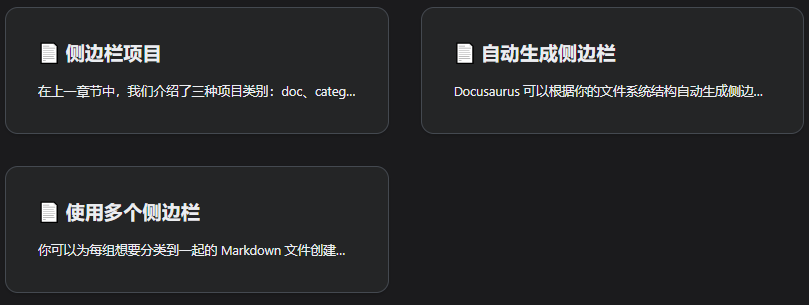

# Docusaurus

[Build optimized websites quickly, focus on your content | Docusaurus](https://docusaurus.io/zh-CN/)

## 快速开始

```shell
yarn create docusaurus
```

按要求一步步设置

### 运行

```shell
yarn start
```

### 部署

[部署 | Docusaurus](https://docusaurus.io/zh-CN/docs/deployment#deploying-to-github-pages)

#### GitHub Pages

+ 如果部署的仓库是`<用户名>.github.io`，`docusaurus.config.js`中的`baseUrl: "/"`（默认）
+ 如果部署的仓库是`<仓库名>`，`docusaurus.config.js`中的`baseUrl: "/<仓库名>/"`

自动部署在GitHub Pages上，添加action就可以了。

在`.github/workflows`下添加两个文件

>test-deploy:当有一个新的 pull request 被提交到主分支时，确保站点能够顺利地建立，但不会实际进行部署。
>
>deploy:当一个 pull request 被合并到主分支或者有人直接将其推送到主分支时，它将被建立并部署到 gh-pages 分支。在这之后，新的构建输出会被发布在 GitHub Pages 网站上。

```yaml title="deploy.yml"
name: Deploy to GitHub Pages

on:
  push:
    branches:
      - main
    # Review gh actions docs if you want to further define triggers, paths, etc
    # https://docs.github.com/en/actions/using-workflows/workflow-syntax-for-github-actions#on

jobs:
  deploy:
    name: Deploy to GitHub Pages
    runs-on: ubuntu-latest
    steps:
      - uses: actions/checkout@v3
      - uses: actions/setup-node@v3
        with:
          node-version: 18
          cache: yarn

      - name: Install dependencies
        run: yarn install --frozen-lockfile
      - name: Build website
        run: yarn build

      # Popular action to deploy to GitHub Pages:
      # Docs: https://github.com/peaceiris/actions-gh-pages#%EF%B8%8F-docusaurus
      - name: Deploy to GitHub Pages
        uses: peaceiris/actions-gh-pages@v3
        with:
          github_token: ${{ secrets.GITHUB_TOKEN }}
          # Build output to publish to the `gh-pages` branch:
          publish_dir: ./build
          # The following lines assign commit authorship to the official
          # GH-Actions bot for deploys to `gh-pages` branch:
          # https://github.com/actions/checkout/issues/13#issuecomment-724415212
          # The GH actions bot is used by default if you didn't specify the two fields.
          # You can swap them out with your own user credentials.
          user_name: github-actions[bot]
          user_email: 41898282+github-actions[bot]@users.noreply.github.com
```

---

```yaml title="test-deploy.yml"
name: Test deployment

on:
  pull_request:
    branches:
      - main
    # Review gh actions docs if you want to further define triggers, paths, etc
    # https://docs.github.com/en/actions/using-workflows/workflow-syntax-for-github-actions#on

jobs:
  test-deploy:
    name: Test deployment
    runs-on: ubuntu-latest
    steps:
      - uses: actions/checkout@v3
      - uses: actions/setup-node@v3
        with:
          node-version: 18
          cache: yarn

      - name: Install dependencies
        run: yarn install --frozen-lockfile
      - name: Test build website
        run: yarn build
```

#### 权限

需要设置Workflow的读写权限

 

> 注意:如果是组织的仓库，设置中的Workflow读写权限是禁止修改的，需要在组织中的设置中进行操作

#### gh-pages

最后在Settings中将Pages的Branch切换为gh-pages即可

## 项目结构

如果您选择了经典模板并将您的网站命名为 my-website，您将在新目录 my-website/ 下看到生成的以下文件：

```
my-website
├── blog
│   ├── 2019-05-28-hola.md
│   ├── 2019-05-29-hello-world.md
│   └── 2020-05-30-welcome.md
├── docs
│   ├── doc1.md
│   ├── doc2.md
│   ├── doc3.md
│   └── mdx.md
├── src
│   ├── css
│   │   └── custom.css
│   └── pages
│       ├── styles.module.css
│       └── index.js
├── static
│   └── img
├── docusaurus.config.js
├── package.json
├── README.md
├── sidebars.js
└── yarn.lock
```

+ `/blog/` - 包含博客 Markdown 文件。如果你已禁用博客插件，你可以删除此目录，或在设置路径选项后更改其名称。更多详细信息，请参阅[博客指南](https://docusaurus.io/zh-CN/docs/blog)。
+ `/docs/` - 包含文档的 Markdown 文件。在 `sidebars.js` 中自定义文档侧边栏的顺序。如果你已禁用文档插件，则可以删除此目录，或在设置路径选项后更改其名称。更多详细信息，请参阅[文档指南](https://docusaurus.io/zh-CN/docs/docs-introduction)。
+ `/src/` - 非文档类文件，例如页面或自定义 React 组件。严格来说，你不一定要把非文档类文件放在这里。不过把它们放在一个集中的目录，可以让代码检查或者处理更为简便。
  + `/src/pages` - 此目录中的任何 JSX/TSX/MDX 文件都将转换为网站页面。更多详细信息，请参阅[页面指南](https://docusaurus.io/zh-CN/docs/creating-pages)。
+ `/static/` - 静态目录。此处的任何内容都将复制到最终构建目录的根目录中。
+ `/docusaurus.config.js` - 包含站点配置的配置文件。这相当于 Docusaurus v1 中的 siteConfig.js。
+ `/package.json` - Docusaurus 网站是一个 React 应用程序。您可以安装并使用任何 npm 包。
+ `/sidebars.js` - 用于文档，指定侧边栏中文档的顺序。

### 单体仓库Monorepos

如果你打算用 Docusaurus 来给一个现有的项目搭建文档，单仓模式可能是一种解决方案。 单仓允许你在类似项目间共享依赖项。 比如，你的网站可以用本地的包来展示最新的功能，而不是依赖于已发布的版本； 你的贡献者也可以在实现功能时方便地更新文档。 下面是单仓模式文件夹结构的一个例子：

```
my-monorepo
├── package-a # 另一个包，你的项目本身
│   ├── src
│   └── package.json #  package-a 的依赖项
├── website   # Docusaurus 根目录
│   ├── docs
│   ├── src
│   └── package.json # Docusaurus 的依赖项
├── package.json # 单仓的共享依赖项
```

在这种情况下，您应该在`./my-monorepo`文件夹中运行`npx create-docusaurus`。

如果您使用像Netlify或Vercel这样的托管提供商，则需要将站点的基本目录更改为您的Docusaurus根目录所在的位置。在这种情况下，那将是`./website`。阅读有关在[部署文档](https://docusaurus.io/zh-CN/docs/deployment#deploying-to-netlify)中配置忽略命令的更多信息。

在[Yarn文档](https://yarnpkg.com/features/workspaces)中阅读有关monorepos的更多信息（Yarn不是设置monorepo的唯一方法，但它是一个常见的解决方案），或者查看[Docusaurus](https://github.com/facebook/docusaurus) 和[Jest](https://github.com/facebook/jest)的一些实际示例。

## 配置

所有模板都附带一个`docusaurus.config.js`，其中包括常用选项的默认值。

从高维度来说，Docusaurus 配置可被分为这几类：

- [Site metadata](https://docusaurus.io/zh-CN/docs/configuration#site-metadata)
- [Deployment configurations](https://docusaurus.io/zh-CN/docs/configuration#deployment-configurations)
- [Theme, plugin, and preset configurations](https://docusaurus.io/zh-CN/docs/configuration#theme-plugin-and-preset-configurations)
- [Custom configurations](https://docusaurus.io/zh-CN/docs/configuration#custom-configurations)

对于每个可配置字段的准确引用，您可以参考[**`docusaurus.config.js`**](https://docusaurus.io/zh-CN/docs/api/docusaurus-config) API。

### 站点元数据

站点元数据包含基本的全局元数据，如 `title`, `url`, `baseUrl`, 和`favicon`。

你的站点的许多地方都会用到这些信息，比如标题、节标题、浏览器选项卡图标、社交网站信息 (Facebook, Twitter)，等等。如果缺少这些信息，甚至不能生成正确的静态文件路径。

### 部署配置

使用deploy命令部署站点时，将使用部署配置，如`projectName`、`organizationName`和`deploymentBranch`（可选），在使用`deploy`命令部署站点时使用。

建议查看[部署文档](https://docusaurus.io/zh-CN/docs/deployment)以了解更多信息。

### 主题、插件和预设配置

分别在`themes`, `plugins`, 和`presets`字段中列出网站的[themes](https://docusaurus.io/zh-CN/docs/using-plugins#using-themes), [plugins](https://docusaurus.io/zh-CN/docs/using-plugins), 以及[presets](https://docusaurus.io/zh-CN/docs/using-plugins#using-presets)。

这些通常为 npm 软件包：

```js title="docusaurus.config.js"
module.exports = {
  // ...
  plugins: [
    '@docusaurus/plugin-content-blog',
    '@docusaurus/plugin-content-pages',
  ],
  themes: ['@docusaurus/theme-classic'],
};
```

:::tip

没有`themes`配置时就是默认使用预设主题`preset-classic`

:::

Docusaurus支持[**module shorthands**](https://docusaurus.io/zh-CN/docs/using-plugins#module-shorthands)模块简写，允许您将上述配置简化为：

```js
module.exports = {
  // ...
  plugins: ['content-blog', 'content-pages'],
  themes: ['classic'],
};
```

这些模块也可以从本地目录加载：

```js title="docusaurus.config.js"
const path = require('path');

module.exports = {
  // ...
  themes: [path.resolve(__dirname, '/path/to/docusaurus-local-theme')],
};
```


要指定插件或主题选项，请将配置文件的插件或主题名称替换一个二元组，包含了名称及配置选项对象：

```js title="docusaurus.config.js"
module.exports = {
  // ...
  plugins: [
    [
      'content-blog',
      {
        path: 'blog',
        routeBasePath: 'blog',
        include: ['*.md', '*.mdx'],
        // ...
      },
    ],
    'content-pages',
  ],
};
```

要为绑定在预设中的插件或主题指定选项，请通过预设字段传递选项。在这个例子中, `docs` 指的是`@docusaurus/plugin-content-docs` 并且`theme` 指的是 `@docusaurus/theme-classic`.

```js title="docusaurus.config.js"
module.exports = {
  // ...
  presets: [
    [
      '@docusaurus/preset-classic',
      {
        docs: {
          sidebarPath: require.resolve('./sidebars.js'),
        },
        theme: {
          customCss: [require.resolve('./src/css/custom.css')],
        },
      },
    ],
  ],
};
```

 `presets: [['classic', {...}]]`也支持简写。

有关配置主题、插件和预设的进一步帮助，请参阅 [使用插件](https://docusaurus.io/zh-CN/docs/using-plugins).

### 自定义配置

Docusaurus保护 `docusaurus.config.js` 不受未知字段的影响。要添加自定义字段，请在`customFields`中定义它们。

示例：

```js title="docusaurus.config.js"
module.exports = {
  // ...
  customFields: {
    image: '',
    keywords: [],
  },
  // ...
};
```

### 从组件访问配置

站点中的所有组件都可以访问配置对象。 可以通过React上下文`siteConfig`来访问它们。

简单示例：

```jsx
import React from 'react';
import useDocusaurusContext from '@docusaurus/useDocusaurusContext';

const Hello = () => {
  const {siteConfig} = useDocusaurusContext();
  const {title, tagline} = siteConfig;

  return <div>{`${title} · ${tagline}`}</div>;
};
```

:::tip

如果你只想在客户端使用这些字段，你可以创建自己的JS文件，并将它们作为ES6模块导入，不需要将它们放在`docusaurus.config.js`中。

也就是说：

如果你有一些变量、函数、类等只在浏览器中使用，而不需要在服务器端或其他地方使用，你可以把它们写在一个单独的JS文件中，并用ES6模块的语法来导入它们。这样你就不需要把它们写在docusaurus.config.js文件中，这个文件是用来配置Docusaurus网站的一些选项的。

>ES6模块是一种JavaScript的新特性，可以让我们将JavaScript代码分割成不同的文件，每个文件就是一个模块。模块可以使用import和export语句来导入和导出其他模块中的功能1。

:::

### 自定义Babel配置

对于新的Docusaurus项目，我们在项目根目录中自动生成了一个`babel.config.js`。

```js title="babel.config.js"
module.exports = {
  presets: [require.resolve('@docusaurus/core/lib/babel/preset')],
};
```

大多数情况下，这个配置已经够用了。 如果你想要自定义你的 Babel 配置（比如添加 Flow 支持），你可以直接编辑这个文件。 你需要重新启动 Docusaurus 开发服务器，更改才能生效。

>**Babel**是一个JavaScript编译器，可以将ES6或更高版本的代码转换为ES5或更低版本的代码，以便在不支持新特性的浏览器或环境中运行。Babel也可以支持Flow，一种JavaScript的静态类型检查器。
>
>**Flow**可以帮助你在JavaScript代码中添加类型注释，以便在编译时检查代码中的类型错误。Flow可以和Babel一起使用，通过`@babel/preset-flow`插件来去除类型注释，生成纯净的JavaScript代码。

### Navbar导航栏

接受的字段：

| 参数           | 类型                 | 默认值         | 描述                                    |
| -------------- | -------------------- | -------------- | --------------------------------------- |
| `title`        | `string`             | `undefined`    | 导航栏标题。                            |
| `logo`         | *See below*          | `undefined`    | 图标对象的自定义。                      |
| `items`        | `NavbarItem[]`       | `[]`           | 导航栏项目列表。 见下文的说明。         |
| `hideOnScroll` | `boolean`            | `false`        | 当用户向下滚动时，导航栏是否隐藏。      |
| `style`        | `'primary' | 'dark'` | 与色彩模式一致 | 设置导航栏样式，忽略暗黑/浅色色彩模式。 |

#### 导航栏图标

图标可以放在[静态文件夹](https://docusaurus.io/zh-CN/docs/static-assets)中。图标链接的 URL 会被默认设置为网站的 base URL。 尽管你可以为图标指定自己的 URL，但如果链接是外部的，它会打开一个新标签页。 此外，你还可以覆盖图标链接的 target 属性值，如果你把文档网站托管在主网站的一个子目录中，这个配置会很有用。这种情况下，你可能不需要在链接到主网站的时候打开新标签页。

为了改善暗黑模式支持，你也可以为暗黑模式设置一个不同的图标。

接受的字段：

| 参数        | 类型              | 默认值                                                       | 描述                                                         |
| ----------- | ----------------- | ------------------------------------------------------------ | ------------------------------------------------------------ |
| `alt`       | `string`          | `undefined`                                                  | 图片的 alt 属性。                                            |
| `src`       | `string`          | **Required**                                                 | 图片的 URL。 Base URL 会被默认添加。                         |
| `srcDark`   | `string`          | `logo.src`                                                   | 暗黑模式下使用的替代图像 URL。                               |
| `href`      | `string`          | `siteConfig.baseUrl`                                         | 点击图标时跳转到的链接。                                     |
| `width`     | `string | number` | `undefined`                                                  | Specifies the `width` attribute.                             |
| `height`    | `string | number` | `undefined`                                                  | Specifies the `height` attribute.                            |
| `target`    | `string`          | Calculated based on `href` (external links will open in a new tab, all others in the current one). | The `target` attribute of the link; controls whether the link is opened in a new tab, the current one, or otherwise. |
| `className` | `string`          | `undefined`                                                  | 图片的 CSS 类名。                                            |
| `style`     | `object`          | `undefined`                                                  | 内联 CSS 样式对象。 React/JSX 风格，所有属性都是驼峰格式 (camelCase)。 |

示例配置：

docusaurus.config.js

```js
module.exports = {
  themeConfig: {
    navbar: {
      title: '网站标题',
      logo: {
        alt: 'Site Logo',
        src: 'img/logo.svg',
        srcDark: 'img/logo_dark.svg',
        href: 'https://docusaurus.io/',
        target: '_self',
        width: 32,
        height: 32,
        className: 'custom-navbar-logo-class',
        style: {border: 'solid red'},
      },
    },
  },
};
```


#### 导航栏项目

:::tip

* `docId`:默认是base—url后面的后缀（`docs/`后面的路径）
* `sidebarId`:在`sidebar.js`中创建

:::

你可以通过向导航栏 `themeConfig.navbar.items` 添加项目。

```js title=docusaurus.config.js
module.exports = {
  themeConfig: {
    navbar: {
      items: [
        {
          type: 'doc',
          position: 'left',
          docId: 'introduction',
          label: '文档',
        },
        {to: 'blog', label: '博客', position: 'left'},
        {
          type: 'docsVersionDropdown',
          position: 'right',
        },
        {
          type: 'localeDropdown',
          position: 'right',
        },
        {
          href: 'https://github.com/facebook/docusaurus',
          position: 'right',
          className: 'header-github-link',
          'aria-label': 'GitHub 仓库',
        },
      ],
    },
  },
};
```

根据 `type` 字段，导航栏项目的行为可能不同。 下面的部分会为你介绍所有的导航栏项目类型。

##### 导航栏链接

导航栏项目默认是一个普通链接（内部或外部均可）。

React Router 会自动给链接应用活跃样式，但在边缘情况下，你可以使用 `activeBasePath`。 对于链接应该在几个不同路径上激活的情况（比如你在同一个侧边栏下有多个文件夹）， 你可以使用 `activeBaseRegex`。 `activeBaseRegex` 是一个比 `activeBasePath` 更灵活的替代选项，并且优先于后者——Docusaurus 会把它作为正则表达式解析，并与当前的 URL 匹配。

外部链接会自动获得 `target="_blank" rel="noopener noreferrer"` 属性。

接受的字段：

| 参数                   | 类型               | 默认值        | 描述                                                         |
| ---------------------- | ------------------ | ------------- | ------------------------------------------------------------ |
| `type`                 | `'default'`        | 可选          | 把这个项目的类型设置为链接。                                 |
| `label`                | `string`           | **必填**      | 项目显示的名称。                                             |
| `html`                 | `string`           | 可选          | 和 `label` 一样，但渲染纯 HTML 而不是文字内容。              |
| `to`                   | `string`           | **必填**      | 客户端路由，用于站内导航。 会自动在开头添加 base URL。       |
| `href`                 | `string`           | **必填**      | 整页导航，用于站外跳转。 **只能使用 `to` 或 `href` 中的一个。** |
| `prependBaseUrlToHref` | `boolean`          | `false`       | 在 `href` 前添加 base URL。                                  |
| `position`             | `'left' | 'right'` | `'left'`      | 项目应该出现在导航栏的哪一侧。                               |
| `activeBasePath`       | `string`           | `to` / `href` | 在以此路径开始的所有路由上应用活跃类样式。 通常没有必要设置。 |
| `activeBaseRegex`      | `string`           | `undefined`   | 如果有需要，可以替代 `activeBasePath`。                      |
| `className`            | `string`           | `''`          | 自定义 CSS 类（用于任何项目的样式）。                        |


:::tip

+ `label`和`html`不能同时存在，`to`和`href`也不能同时存在，

+ 除了上面的字段外，你可以指定其他任何 HTML 链接[`<link>`](https://www.w3schools.com/tags/tag_link.asp)接受的属性。

:::

示例配置：

```js title=docusaurus.config.js
module.exports = {
  themeConfig: {
    navbar: {
      items: [
        {
          to: 'docs/introduction',
          // Only one of "to" or "href" should be used
          // href: 'https://www.facebook.com',
          label: 'Introduction',
          // Only one of "label" or "html" should be used
          // html: '<b>Introduction</b>'
          position: 'left',
          activeBaseRegex: 'docs/(next|v8)',
          target: '_blank',
        },
      ],
    },
  },
};
```

##### 导航栏下拉菜单

`dropdown` 类型的导航栏项有一个额外的 `items` 字段，一组内部的导航栏项目。

下拉菜单的内部项目只支持以下**「类链接」的项目类型**：

- [导航栏链接](https://docusaurus.io/zh-CN/docs/next/api/themes/configuration#navbar-link)
- [导航栏文档链接](https://docusaurus.io/zh-CN/docs/next/api/themes/configuration#navbar-doc-link)
- [导航栏文档版本](https://docusaurus.io/zh-CN/docs/next/api/themes/configuration#navbar-docs-version)
- [导航栏文档侧边栏链接](https://docusaurus.io/zh-CN/docs/next/api/themes/configuration#navbar-doc-sidebar)
- [导航栏自定义 HTML 项目](https://docusaurus.io/zh-CN/docs/next/api/themes/configuration#navbar-with-custom-html)

请注意下拉菜单的主项也是一个可点击的链接，所以它可以接受[普通导航栏链接](https://docusaurus.io/zh-CN/docs/next/api/themes/configuration#navbar-link)的任何属性。

接受的字段：

| 参数       | 类型               | 默认值   | 描述                             |
| ---------- | ------------------ | -------- | -------------------------------- |
| `type`     | `'dropdown'`       | 可选     | 把这个项目的类型设置为下拉菜单。 |
| `label`    | `string`           | **必填** | 项目显示的名称。                 |
| `items`    | `LinkLikeItem[]`   | **必填** | 下拉菜单中包含的项目。           |
| `position` | `'left' | 'right'` | `'left'` | 项目应该出现在导航栏的哪一侧。   |

:::tip

还是可以使用`html`字段

:::

示例配置：

docusaurus.config.js

```js
module.exports = {
  themeConfig: {
    navbar: {
      items: [
        {
          type: 'dropdown',
          label: '社区',
          position: 'left',
          items: [
            {
              label: 'Facebook',
              href: 'https://www.facebook.com',
            },
            {
              type: 'doc',
              label: '社交',
              docId: 'social',
            },
            // ... more items
          ],
        },
      ],
    },
  },
};
```

##### 导航栏文档链接

如果你想要链接到某篇指定文档，这个特别的导航栏项目类型会渲染一个链接，指向带有给定的 `docId` 的文档。 只要你在浏览同一侧边栏的文档，它就会获得 `navbar__link--active` 类名。

接受的字段：

| 参数           | 类型               | 默认值      | 描述                             |
| -------------- | ------------------ | ----------- | -------------------------------- |
| `type`         | `'doc'`            | **必填**    | 把这个项目的类型设置为文档链接。 |
| `docId`        | `string`           | **必填**    | 这个项目链接到的文档的 ID。      |
| `label`        | `string`           | `docId`     | 项目显示的名称。                 |
| `position`     | `'left' | 'right'` | `'left'`    | 项目应该出现在导航栏的哪一侧。   |
| `docsPluginId` | `string`           | `'default'` | 这篇文档所属的文档插件的 ID。    |

示例配置：

```js title=docusaurus.config.js
module.exports = {
  themeConfig: {
    navbar: {
      items: [
        {
          type: 'doc',
          position: 'left',
          docId: 'introduction',
          label: '文档',
        },
      ],
    },
  },
};
```

##### 导航栏文档侧边栏链接

你可以将一个导航栏项目链接到某个给定侧边栏的第一个文档链接（可能是文档或者生成类别索引），而不需要硬编码一个文档 ID。

接受的字段：

| 参数           | 类型               | 默认值                     | 描述                               |
| -------------- | ------------------ | -------------------------- | ---------------------------------- |
| `type`         | `'docSidebar'`     | **必填**                   | 把这个项目的类型设置为侧边栏链接。 |
| `sidebarId`    | `string`           | **必填**                   | 这个项目链接到的侧边栏的 ID。      |
| `label`        | `string`           | 第一个文档链接的侧边栏标签 | 项目显示的名称。                   |
| `position`     | `'left' | 'right'` | `'left'`                   | 项目应该出现在导航栏的哪一侧。     |
| `docsPluginId` | `string`           | `'default'`                | 这个侧边栏所属的文档插件的 ID。    |

:::tip

如果你的侧边栏经常更新而且顺序不稳定，请使用这个导航栏项目类型。

:::

示例配置：

```js title=docusaurus.config.js
module.exports = {
  themeConfig: {
    navbar: {
      items: [
        {
          type: 'docSidebar',
          position: 'left',
          sidebarId: 'api',
          label: 'API',
        },
      ],
    },
  },
};
```

```js title=sidebars.js
module.exports = {
  tutorial: [
    {
      type: 'autogenerated',
      dirName: 'guides',
    },
  ],
  api: [
    'cli', // 导航栏项会链接到这篇文档
    'docusaurus-core',
    {
      type: 'autogenerated',
      dirName: 'api',
    },
  ],
};
```


##### 导航栏文档版本下拉菜单

如果你使用文档版本化，这个特别的导航栏项目类型会渲染一个下拉菜单，包含你的网站的所有可用版本。

用户可以从一个版本切换到另一个版本。 而仍然保持在同一篇文档上（只要文档 ID 在版本之间保持不变）。

接受的字段：

| 参数                          | 类型                    | 默认值      | 描述                                     |
| ----------------------------- | ----------------------- | ----------- | ---------------------------------------- |
| `type`                        | `'docsVersionDropdown'` | **必填**    | 把这个项目的类型设置为文档版本下拉菜单。 |
| `position`                    | `'left' | 'right'`      | `'left'`    | 项目应该出现在导航栏的哪一侧。           |
| `dropdownItemsBefore`         | `LinkLikeItem[]`        | `[]`        | 在下拉菜单开头添加额外的项目。           |
| `dropdownItemsAfter`          | `LinkLikeItem[]`        | `[]`        | 在下拉菜单结尾添加额外的项目。           |
| `docsPluginId`                | `string`                | `'default'` | 这个版本下拉菜单所属的文档插件的 ID。    |
| `dropdownActiveClassDisabled` | `boolean`               | `false`     | 不要在浏览文档时添加链接活跃类名。       |

示例配置：

```js title=docusaurus.config.js
module.exports = {
  themeConfig: {
    navbar: {
      items: [
        {
          type: 'docsVersionDropdown',
          position: 'left',
          dropdownItemsAfter: [{to: '/versions', label: '所有版本'}],
          dropdownActiveClassDisabled: true,
        },
      ],
    },
  },
};
```


##### 导航栏文档版本

如果你使用文档版本化，这个特别的的导航栏项目类型会链接到你的文档的活跃版本（正浏览的版本；取决于当前的 URL）。如果没有版本处于活跃状态，则链接到最新版本。

接受的字段：

| 参数           | 类型               | 默认值                | 描述                                  |
| -------------- | ------------------ | --------------------- | ------------------------------------- |
| `type`         | `'docsVersion'`    | **必填**              | 把这个项目的类型设置为文档版本链接。  |
| `label`        | `string`           | 活跃/最新版本的标签。 | 项目显示的名称。                      |
| `to`           | `string`           | 活跃/最新版本。       | 项目指向的内部链接。                  |
| `position`     | `'left' | 'right'` | `'left'`              | 项目应该出现在导航栏的哪一侧。        |
| `docsPluginId` | `string`           | `'default'`           | 这个版本下拉菜单所属的文档插件的 ID。 |

示例配置：

```js title=docusaurus.config.js
module.exports = {
  themeConfig: {
    navbar: {
      items: [
        {
          type: 'docsVersion',
          position: 'left',
          to: '/path',
          label: '标签',
        },
      ],
    },
  },
};
```


##### 导航栏语言下拉菜单

如果您使用[i18n](https://docusaurus.io/zh-CN/docs/next/i18n/introduction)功能，这种特殊的导航栏项目类型将呈现一个下拉列表，其中包含您网站的所有可用区域设置。

用户能够从一种语言切换到另一种语言，同时保持在同一个页面上。

接受的字段：

| 参数                  | 类型               | 默认值   | 描述                                 |
| --------------------- | ------------------ | -------- | ------------------------------------ |
| `type`                | `'localeDropdown'` | **必填** | 把这个项目的类型设置为语言下拉菜单。 |
| `position`            | `'left' | 'right'` | `'left'` | 项目应该出现在导航栏的哪一侧。       |
| `dropdownItemsBefore` | `LinkLikeItem[]`   | `[]`     | 在下拉菜单开头添加额外的项目。       |
| `dropdownItemsAfter`  | `LinkLikeItem[]`   | `[]`     | 在下拉菜单结尾添加额外的项目。       |

示例配置：

```js title=docusaurus.config.js
module.exports = {
  themeConfig: {
    navbar: {
      items: [
        {
          type: 'localeDropdown',
          position: 'left',
          dropdownItemsAfter: [
            {
              to: 'https://my-site.com/help-us-translate',
              label: '帮助我们翻译',
            },
          ],
        },
      ],
    },
  },
};
```


##### 导航栏搜索框

如果您使用[搜索](https://docusaurus.io/zh-CN/docs/next/search)，搜索栏将是导航栏中最右边的元素。

然而，通过这个特别的导航栏项目类型，你可以更改默认位置。

| 参数        | 类型               | 默认值   | 描述                           |
| ----------- | ------------------ | -------- | ------------------------------ |
| `type`      | `'search'`         | **必填** | 把这个项目的类型设置为搜索框。 |
| `position`  | `'left' | 'right'` | `'left'` | 项目应该出现在导航栏的哪一侧。 |
| `className` | `string`           | /        | 项目的自定义 CSS 类名。        |

docusaurus.config.js

```js
module.exports = {
  themeConfig: {
    navbar: {
      items: [
        {
          type: 'search',
          position: 'right',
        },
      ],
    },
  },
};
```


##### 导航栏自定义 HTML 项目

你也可以用这个导航栏项目类型在导航栏中渲染自己的 HTML 标记。

| 参数        | 类型               | 默认值   | 描述                               |
| ----------- | ------------------ | -------- | ---------------------------------- |
| `type`      | `'html'`           | **必填** | 把这个项目的类型设置为 HTML 元素。 |
| `position`  | `'left' | 'right'` | `'left'` | 项目应该出现在导航栏的哪一侧。     |
| `className` | `string`           | `''`     | 项目的自定义 CSS 类名。            |
| `value`     | `string`           | `''`     | 在这个项目中渲染的自定义 HTML。    |

```js title=docusaurus.config.js
module.exports = {
  themeConfig: {
    navbar: {
      items: [
        {
          type: 'html',
          position: 'right',
          value: '<button>提交反馈</button>',
        },
      ],
    },
  },
};
```


#### 自动隐藏顶部导航栏

你可以启用这个很酷的界面功能，它会在用户开始向下滚动页面时，自动隐藏导航栏，当用户向上滚动时再显示它。

```js title=docusaurus.config.js
module.exports = {
  themeConfig: {
    navbar: {
      hideOnScroll: true,
    },
  },
};
```


#### 导航栏样式

你可以把导航栏样式设置为静态，而不禁用主题切换功能。 无论用户选择哪个主题，所选的样式都会被应用。

目前有两种样式选项：`dark` 和 `primary`（基于 `--ifm-color-main` 的颜色）。 你可以在 [Infima 文档](https://infima.dev/docs/components/navbar/)中看到样式的预览。

docusaurus.config.js

```js
module.exports = {
  themeConfig: {
    navbar: {
      style: 'primary',
    },
  },
};
```

## 文档docs

文档功能允许用户以层级格式组织编排 Markdown 文件

:::info

查看[Docs Plugin API Reference](https://docusaurus.io/zh-CN/docs/next/api/plugins/@docusaurus/plugin-content-docs)文档以获取选项的详尽列表。

:::

:::caution 注意

只支持`md`和`mdx`，不支持`js`页面

:::

网站的文档从低到高有四层组织架构：

1. 独立页面。
2. 侧边栏。
3. 版本。
4. 插件实例。

### 仅文档模式

新创建的 Docusaurus 网站会有这样的结构：

```text
example.com/                                -> 生成自 `src/pages/index.js`

example.com/docs/intro                      -> 生成自 `docs/intro.md`
example.com/docs/tutorial-basics/...        -> 生成自 `docs/tutorial-basics/...`
...

example.com/blog/2021/08/26/welcome         -> 生成自 `blog/2021-08-26-welcome/index.md`
example.com/blog/2021/08/01/mdx-blog-post   -> 生成自 `blog/2021-08-01-mdx-blog-post.mdx`
...
```

所有文档都会放在`docs/`子路由下。 但是如果**您的网站只有文档**，或者您想要将文档放在根目录上来优先排序。

假设你的配置中包含以下内容：

```js title="docusaurus.config.js"
module.exports = {
  // ...
  presets: [
    '@docusaurus/preset-classic',
    {
      docs: {
        /* 文档插件配置 */
      },
      blog: {
        /* 博客插件配置 */
      },
      // ...
    },
  ],
};
```

要进入仅文档模式，可以把它改成类似这样：

```js title="docusaurus.config.js"
module.exports = {
  // ...
  presets: [
    '@docusaurus/preset-classic',
    {
      docs: {
        // 高亮下一行
        routeBasePath: '/', // 把文档放在网络根目录
        /* 其他文档插件配置 */
      },
      blog: false, // 可选：禁用博客插件
      // ...
    },
  ],
};
```

注意**您不一定非要放弃使用博客**或其他插件；设置 `routeBasePath: '/'` 所产生的效果就是把文档从 `https://example.com/docs/some-doc` 移到了根目录：`https://example.com/some-doc`。 如果启用了博客，还是可以通过 `blog/` 子路由访问到它。

别忘了通过添加前言Font Matter把某个页面放置在网站顶部 (`https://example.com/`)：

```md title='docs/intro.md'
---
slug: /
---

这一页会是用户访问 https://example.com/ 时出现的主页。
```

:::caution 注意

如果你用 `slug: /` 把某篇文档变成了主页，你就需要删掉 `src/pages/index.js` 的现有首页，否则会有两个文件会映射到同一个路径！

:::

现在，网站的结构会长得像这样：

```text
example.com/                       - 生成自 `docs/intro.md`
example.com/tutorial-basics/...    - 生成自 `docs/tutorial-basics/...`
...
```

:::tip

Docusaurus 2 中还存在 ”仅博客模式“。 你可以用类似上述的方法实现。 遵循[仅博客模式](https://docusaurus.io/zh-CN/docs/blog#blog-only-mode)上的设置说明。

:::

### 创建Doc

创建名为 `greeting.md` 的 Markdown 文件，把它放在 `docs` 目录下。

```bash
website # 你的网站的根目录
├── docs
│   └── greeting.md
├── src
│   └── pages
├── docusaurus.config.js
├── ...
```


```md
----
description: 创建一个内容丰富的文档页面。
---

## 来自 Docusaurus 的问候

你准备好为你的开源项目创建文档网站了吗？

## 标题

会显示在右上方的目录

这样，你的用户不用通读全文就可以知晓这篇文章的主要内容。

## 目录默认只包括 h2 和 h3 标题。

你可以在每个文档或主题配置中设置目录包含的标题层级。

标题会保持恰当的间距，让文章看起来层级清晰。

- lists will help you
- present the key points
- that you want your users to remember
  - and you may nest them
    - multiple times
```

:::note

在 `docs` 目录下所有带有下划线（`_`）前缀的文件都会被当作页面「片段」，并被默认忽略。

你可以阅读更多关于[导入页面片段](https://docusaurus.io/zh-CN/docs/next/markdown-features/react#importing-markdown)的内容。

:::

### front matter文档前言

[front matter](https://docusaurus.io/zh-CN/docs/markdown-features#front-matter)用于为文档页面提供额外的元数据。前言是可选的——Docusaurus 能够自行推断所有必要的元数据，无需前言。 例如，下面介绍的[doc tags](https://docusaurus.io/zh-CN/docs/create-doc#dog-tags)功能需要使用front matter。有关所有可能的字段，请参阅[API文档](https://docusaurus.io/zh-CN/docs/api/plugins/@docusaurus/plugin-content-docs#markdown-front-matter)。

#### Doc tags

您可以选择向文档页面添加标签，这将引入除文档侧边栏之外的另一个分类维度。在文档导言中，像这么声明一个标签列表：

```
---
id: doc-with-tags
title: 一篇包含标签的文档
tags:
  - 演示
  - 开始上手
---
```

:::tip

标签也可以用 `tags: [演示, 开始上手]` 的语法定义。

你也可以阅读更多关于所有的 [Yaml 数组声明语法](https://www.w3schools.io/file/yaml-arrays/)的内容。

:::

#### 接受的字段

| 参数                     | 类型            | 默认值                                     | 描述                                                         |
| ------------------------ | --------------- | ------------------------------------------ | ------------------------------------------------------------ |
| `id`                     | `string`        | 文件路径（包括文件夹，不含扩展名）         | 文档的唯一 ID。                                              |
| `title`                  | `string`        | Markdown title or `id`                     | 你的文档使用的文本标题。 用于页面元数据和多个地方的备用值（侧边栏、下篇/上篇按钮……）。 如果 Markdown 内容没有标题，它会被自动添加到你的文档顶部。 |
| `pagination_label`       | `string`        | `sidebar_label` or `title`                 | 这篇文档在上一篇/下一篇按钮中显示的文本                      |
| `sidebar_label`          | `string`        | `title`                                    | 这篇文档在侧边栏中显示的文本                                 |
| `sidebar_position`       | `number`        | 默认排序                                   | 控制使用 `autogenerated` 的边栏项时文档在生成的侧栏切片中的位置。另请参见自动生成的侧边栏元数据[Autogenerated sidebar metadata](https://docusaurus.io/docs/sidebar#autogenerated-sidebar-metadata). |
| `sidebar_class_name`     | `string`        | `undefined`                                | 在使用自动生成侧边栏时，给相应的侧边栏标签一个特殊类名。     |
| `sidebar_custom_props`   | `object`        | `undefined`                                | 将自定义属性[custom props](https://docusaurus.io/docs/sidebar#passing-custom-props) 分配给引用此文档的侧边栏项 |
| `displayed_sidebar`      | `string`        | `undefined`                                | 强制浏览当前文档时显示给定的侧边栏。有关详细信息，请阅读多个侧边栏指。[multiple sidebars guide](https://docusaurus.io/docs/sidebar/multiple-sidebars) |
| `hide_title`             | `boolean`       | `false`                                    | 是否隐藏文档顶部显示的标题。 此选项只会隐藏前言中定义的标题，对于 Markdown 文档顶部的标题没有任何影响。 |
| `hide_table_of_contents` | `boolean`       | `false`                                    | 是否隐藏右侧的文档目录。                                     |
| `toc_min_heading_level`  | `number`        | `2`                                        | 目录中显示的最小标题层级。 必须介于 2 到 6 之间，并且小于等于最大值。 |
| `toc_max_heading_level`  | `number`        | `3`                                        | 目录中显示的最大标题层级。 必须介于 2 和 6。                 |
| `pagination_next`        | `string | null` | 侧边栏的下一个文档                         | 「下篇文档」按钮链接到的文档 ID。 Use `null` to disable showing "Next" for this page. |
| `pagination_prev`        | `string | null` | 侧边栏的上一个文档                         | 「上篇文档」按钮链接到的文档 ID。 Use `null` to disable showing "Previous" for this page. |
| `parse_number_prefixes`  | `boolean`       | `numberPrefixParser` plugin option         | 是否禁用本文档的数字前缀解析。 See also [Using number prefixes](https://docusaurus.io/zh-CN/docs/sidebar#using-number-prefixes). |
| `custom_edit_url`        | `string`        | Computed using the `editUrl` plugin option | 编辑此文档时要跳转到的 URL。                                 |
| `keywords`               | `string[]`      | `undefined`                                | 用于搜索引擎优化的文档关键词元标签。                         |
| `description`            | `string`        | Markdown 正文的第一行                      | 文档描述，将成为`<head>`中的`<meta name="description" content="..."/>` 和`<meta property="og:description" content="..."/>`, 由搜索引擎使用。 |
| `image`                  | `string`        | `undefined`                                | 显示文档链接时所用的缩略图或封面。                           |
| `slug`                   | `string`        | 文件路径                                   | 允许自定义文档URL(`/<routeBasePath>/<slug>`). 支持多种模式:`slug: my-doc`, `slug: /my/path/myDoc`, `slug: /`. |
| `tags`                   | `Tag[]`         | `undefined`                                | 一个包含两个字符串字段（标签`label` 和永久链接`permalink`）的字符串或对象列表，用于标记您的文档。 |
| `draft`                  | `boolean`       | `false`                                    | 一个布尔值，表明文档处于未完成状态。 文档草稿只会在开发模式下显示。 |
| `last_update`            | `FileChange`    | `undefined`                                | 允许覆盖最后更新的作者、日期。 Date can be any [parsable date string](https://developer.mozilla.org/en-US/docs/Web/JavaScript/Reference/Global_Objects/Date/parse). |

```ts
type Tag = string | {label: string; permalink: string};
```

```ts
type FileChange = {date: string; author: string};
```

示例：

```md
---
id: doc-markdown
title: 文档 Markdown 特性
hide_title: false
hide_table_of_contents: false
sidebar_label: Markdown
sidebar_position: 3
pagination_label: Markdown 特性
custom_edit_url: https://github.com/facebook/docusaurus/edit/main/docs/api-doc-markdown.md
description: 我解决不了这个问题时在哪里找到你
keywords:
  - docs
  - docusaurus
image: https://i.imgur.com/mErPwqL.png
slug: /myDoc
last_update:
  date: 1/1/2000
  author: 自定义作者名
---

# Markdown 特性

我的 Markdown 文档的内容
```

### 组织文件夹结构

Markdown文件在`docs`文件夹下的排列方式可能会对Docusaurus内容的生成产生多种影响。然而，其中绝大多数可以与文件结构脱钩。

#### 文档 ID

每个文档均有唯一的 `id`（标识符）。 默认情况下，文档 `id` 是文件相对文档根目录的路径（不包括后缀）。

例如，`greeting.md` 的 ID 是 `greeting`，而 `guide/hello.md` 的 ID 则是 `guide/hello`。

```
website # 你的网站的根目录
└── docs
   ├── greeting.md
   └── guide
      └── hello.md
```

但是，用户可以在前言中指定 `id` 的**最后一部分**。 举个例子，如果 `guide/hello.md` 的内容为如下所示，其最终的 `id` 则为 `guide/part1`。

```md
---
id: part1
---

Lorem ipsum
```

当手写侧边栏，或这使用与文档相关的布局或钩子时，ID 会被用来指代某篇文档。

#### 文档 URL

文档的 URL 路径默认为它相对于 `docs` 文件夹的路径。 你可以用 `slug` 前言来更改文档的 URL。

比如，假设你的网站结构长得像这样：

```bash
website # 你的网站的根目录
└── docs
    └── guide
        └── hello.md
```

默认情况下，`hello.md` 可以在 `/docs/guide/hello` 处访问。 你也可以把它的 URL 位置修改为 `/docs/bonjour`：

```md
---
slug: /bonjour
---

Lorem ipsum
```

`slug` 会被添加到文档插件的 `routeBasePath` 后面。`routeBasePath` 默认是 `/docs`。 有关如何从URL中删除/Docs部分的信息，请参阅[仅文档模式](https://docusaurus.io/zh-CN/docs/next/docs-introduction#docs-only-mode)。

:::note

你可以使用：

- 绝对路径：`slug: /mySlug`、`slug: /`...
- 相对路径：`slug: mySlug`、`slug: ./../mySlug`...

:::

如果你想要让一篇文档位于网站根部下，有形如 `https://docusaurus.io/docs/` 的路径，那么你可以这么填写前言中的 slug：

```md
---
id: my-home-doc
slug: /
---

Lorem ipsum
```

#### 侧边栏

当使用[自动生成的边栏](https://docusaurus.io/zh-CN/docs/sidebar/autogenerated)时，文件结构将决定边栏结构。

我们关于文件系统组织的建议是：让你的文件系统和侧边栏结构保持一致（这样你就不需要手写你的 `sidebars.js` 文件），并使用 `slug` 前言来自定义每个文档的 URL。

### 侧边栏

创建侧边栏可以：

- 分组多篇**相关文档**
- 在每篇文档旁**显示侧边栏**
- 提供下一篇/上一篇按钮的**分页导航**

要在你的 Docusaurus 网站上使用侧边栏，只需两步：

1. 定义一个导出[一组侧边栏对象](https://docusaurus.io/zh-CN/docs/next/sidebar#sidebar-object)的文件。
2. 直接将此对象传入 `@docusaurus/plugin-docs` 或通过 `@docusaurus/preset-classic` 传入。

```js title=docusaurus.config.js
module.exports = {
  presets: [
    [
      '@docusaurus/preset-classic',
      {
        docs: {
          sidebarPath: require.resolve('./sidebars.js'),
        },
      },
    ],
  ],
};
```

#### 默认侧边栏

如果未指定`sidebarPath`，Docusaurus会使用`docs`文件夹的文件系统结构[自动生成一个侧边栏](https://docusaurus.io/zh-CN/docs/next/sidebar/autogenerated)：

```js title=sidebars.js
module.exports = {
  mySidebar: [
    {
      type: 'autogenerated',
      dirName: '.', // 为 docs 目录（或者 versioned_docs/<version>）生成侧边栏
    },
  ],
};
```

你也可以显式定义你的侧边栏。

#### 侧边栏项目

侧边栏简单来说就是由一些类别、文档链接、其他超链接组成的层级结构。

```ts
type Sidebar =
  // 普通语法
  | SidebarItem[]
  // 简写语法
  | {[categoryLabel: string]: SidebarItem[]};
```

举个例子：

```js title=sidebars.js
module.exports = {
  mySidebar: [
    {
      type: 'category',
      label: 'Getting Started',
      items: [
        {
          type: 'doc',
          id: 'doc1',
        },
      ],
    },
    {
      type: 'category',
      label: 'Docusaurus',
      items: [
        {
          type: 'doc',
          id: 'doc2',
        },
        {
          type: 'doc',
          id: 'doc3',
        },
      ],
    },
    {
      type: 'link',
      label: 'Learn more',
      href: 'https://example.com',
    },
  ],
};
```

这是一个导出了一个叫做 `mySidebar` 的侧边栏的文件。 它有三个顶层项目：两个类别和一个外部链接。 每个类别内部都有几个文档链接。

一个边栏文件可以包含[多个边栏对象](https://docusaurus.io/zh-CN/docs/next/sidebar/multiple-sidebars)，由它们的对象键标识。

```ts
type SidebarsFile = {
  [sidebarID: string]: Sidebar;
};
```

##### 项目类别

- **[Doc](https://docusaurus.io/zh-CN/docs/next/sidebar/items#sidebar-item-doc)**: 文档页面的链接，并和侧边栏绑定
- **[Link](https://docusaurus.io/zh-CN/docs/next/sidebar/items#sidebar-item-link)**：内部或外部页面链接
- **[Category](https://docusaurus.io/zh-CN/docs/next/sidebar/items#sidebar-item-category)**：创建侧边栏项下拉菜单
- **[Autogenerated](https://docusaurus.io/zh-CN/docs/next/sidebar/autogenerated)**: 自动生成侧边栏
- **[HTML](https://docusaurus.io/zh-CN/docs/next/sidebar/items#sidebar-item-html)**：在这个位置渲染纯 HTML
- **[Ref](https://docusaurus.io/zh-CN/docs/next/sidebar/multiple-sidebars#sidebar-item-ref)**: 指向文档页面的链接，而不让项目参与导航生成

###### Doc - 文档链接

使用 `doc` 类型链接至文档页面，并分配链接文档至侧边栏。

[侧边栏项目 | Docusaurus](https://docusaurus.io/zh-CN/docs/next/sidebar/items#sidebar-item-doc)

###### Link - 任意页面链接

使用 `link` 类型链接到任何非文档的页面（内部或外部链接）。

[侧边栏项目 | Docusaurus](https://docusaurus.io/zh-CN/docs/next/sidebar/items#sidebar-item-link)

###### HTML - 渲染自定义标记

[侧边栏项目 | Docusaurus](https://docusaurus.io/zh-CN/docs/next/sidebar/items#sidebar-item-html)

使用 `html` 类型在项目的 `<li>` 标签中渲染自定义 HTML。

适用于插入自定义项目，比如分割线、节标题、广告、图片。

###### Category - 创建分类层级

[侧边栏项目 | Docusaurus](https://docusaurus.io/zh-CN/docs/next/sidebar/items#sidebar-item-category)

使用 category 类型创建侧边栏项的层次结构。

#### 主题配置

##### 可隐藏侧边栏

启用 `themeConfig.docs.sidebar.hideable` 选项后，你可以使整个侧边栏变得可隐藏，让用户能够更好地关注内容。 这对于中等屏幕大小（如平板）的读者来说格外有用。

```js title=docusaurus.config.js
module.exports = {
  themeConfig: {
    docs: {
      sidebar: {
        hideable: true,
      },
    },
  },
};
```


##### 自动折叠侧边栏类别

`themeConfig.docs.sidebar.autoCollapseCategories` 选项会在扩展一个类别时折叠所有的同级类别。 这能让用户免于打开过多的菜单，帮助他们关注选定的部分。

```js title=docusaurus.config.js
module.exports = {
  themeConfig: {
    docs: {
      sidebar: {
        autoCollapseCategories: true,
      },
    },
  },
};
```

#### 传递自定义属性

要将自定义道具传递到侧边栏项目，请将可选的`customProps`对象添加到任何项目中。这对于通过快速渲染React组件呈现侧边栏项目来应用站点自定义非常有用。

```js
{
  type: 'doc',
  id: 'doc1',
  customProps: {
    badges: ['new', 'green'],
    featured: true,
  },
};
```

#### 侧边栏面包屑导航

面包屑导航默认会在页面顶端渲染。它用的是当前页面的「侧边栏路径」。

这个行为可以用插件选项禁用：

```js title=docusaurus.config.js
module.exports = {
  presets: [
    [
      '@docusaurus/preset-classic',
      {
        docs: {
          breadcrumbs: false,
        },
      },
    ],
  ],
};
```

#### 复杂侧边栏示例

来自 Docusaurus 网站的真实例子：

```js title=sidebars.js
const sidebars = {
  docs: [
    'introduction',
    {
      type: 'category',
      label: 'Getting Started',
      link: {
        type: 'generated-index',
      },
      collapsed: false,
      items: [
        'installation',
        'configuration',
        'playground',
        'typescript-support',
      ],
    },
    {
      type: 'category',
      label: 'Guides',
      link: {
        type: 'generated-index',
        title: 'Docusaurus Guides',
        description:
          "Let's learn about the most important Docusaurus concepts!",
        keywords: ['guides'],
        image: '/img/docusaurus.png',
      },
      items: [
        'guides/creating-pages',
        {
          type: 'category',
          label: 'Docs',
          link: {
            type: 'doc',
            id: 'guides/docs/introduction',
          },
          items: [
            'guides/docs/create-doc',
            {
              type: 'category',
              label: 'Sidebar',
              link: {
                type: 'doc',
                id: 'guides/docs/sidebar/index',
              },
              items: [
                'guides/docs/sidebar/items',
                'guides/docs/sidebar/autogenerated',
                'guides/docs/sidebar/multiple-sidebars',
              ],
            },
            'guides/docs/versioning',
            'guides/docs/multi-instance',
          ],
        },
        'blog',
        {
          type: 'category',
          label: 'Markdown Features',
          link: {
            type: 'doc',
            id: 'guides/markdown-features/introduction',
          },
          items: [
            'guides/markdown-features/react',
            'guides/markdown-features/tabs',
            'guides/markdown-features/code-blocks',
            'guides/markdown-features/admonitions',
            'guides/markdown-features/toc',
            'guides/markdown-features/assets',
            'guides/markdown-features/links',
            'guides/markdown-features/plugins',
            'guides/markdown-features/math-equations',
            'guides/markdown-features/diagrams',
            'guides/markdown-features/head-metadata',
          ],
        },
        'styling-layout',
        'swizzling',
        'static-assets',
        'search',
        'browser-support',
        'seo',
        'using-plugins',
        'deployment',
        {
          type: 'category',
          label: 'Internationalization',
          link: {type: 'doc', id: 'i18n/introduction'},
          items: [
            {
              type: 'doc',
              id: 'i18n/tutorial',
              label: 'Tutorial',
            },
            {
              type: 'doc',
              id: 'i18n/git',
              label: 'Using Git',
            },
            {
              type: 'doc',
              id: 'i18n/crowdin',
              label: 'Using Crowdin',
            },
          ],
        },
        'guides/whats-next',
      ],
    },
    {
      type: 'category',
      label: 'Advanced Guides',
      link: {type: 'doc', id: 'advanced/index'},
      items: [
        'advanced/architecture',
        'advanced/plugins',
        'advanced/routing',
        'advanced/ssg',
        'advanced/client',
      ],
    },
    {
      type: 'category',
      label: 'Migrating from v1 to v2',
      items: [
        'migration/migration-overview',
        'migration/migration-automated',
        'migration/migration-manual',
        'migration/migration-versioned-sites',
        'migration/migration-translated-sites',
      ],
    },
  ],
  api: [
    'cli',
    'docusaurus-core',
    {
      type: 'autogenerated',
      dirName: 'api',
    },
  ],
};
module.exports = sidebars;
```

#### 标题优先级

sidebar_label(font matter)>正文标题（必须是一级标题）>id(font matter)>md文件名

#### 自动生成侧边栏

Docusaurus 可以根据你的**文件系统结构自动生成侧边栏**：每个文件夹会生成一个类别，每个文件会生成一个文档链接。

```ts
type SidebarItemAutogenerated = {
  type: 'autogenerated';
  dirName: string; // 生成侧边栏切片的源文件夹（相对文档目录）
};
```

Docusaurus 可以从你的 docs 文件夹中自动生成整个侧边栏：

```js title=sidebars.js
module.exports = {
  myAutogeneratedSidebar: [
    {
      type: 'autogenerated',
      dirName: '.', // '.' 即当前的文档文件夹
    },
  ],
};
```

Docusaurus将`autogenerated`项目转换为侧边栏切片**sidebar slice** （也在类别shorthands中讨论）：`doc`或`category`类型的项目列表，因此您可以在一个侧边栏级别中拼接多个目录中的多个自动生成 **`autogenerated`** 项目，将它们与常规侧边栏项目交错。

##### 类别索引惯例

Docusaurus 可以自动给一个类别关联一篇索引文档。

类别索引文档的文件名符合下列条件之一：

- 名为 `index`（大小写不敏感）：`docs/Guides/index.md`
- 名为 `README`（大小写不敏感）：`docs/Guides/README.mdx`
- 和上一级目录的名字一致：`docs/Guides/Guides.md`

:::tip

+ 把引言文档命名为 `README.md`，可以在 GitHub 上浏览此目录的时候显示这篇文档；用 `index.md` 则会更加接近服务器发送 HTML 文件的行为。

+ 如果一个文件夹只有一个索引页，它会变成一个链接，而不是一个类别。 这对于把**资源和文档并置**很有用：

  ```text
  some-doc
  ├── index.md
  ├── img1.png
  └── img2.png
  ```

:::

然后在index.md文档中插入卡片列表

###### 在文档页面中嵌入生成索引

**卡片列表**

通过 `DocCardList` 组件，在普通的文档页中也嵌入自动生成的卡片列表。 它会显示当前文档所属类别的所有侧边栏项目。

 

一般放在类别目录下的索引页面`index.md`中

```markdown
import DocCardList from '@theme/DocCardList';

<DocCardList />
```

也可以指定一个类别的 **id**。

```markdown
mport DocCardList from '@theme/DocCardList';

<DocCardList category="tutorial" />
```

:::tip

简介由各子文档的前言字段`description`决定（没有就是正文第一段）

:::

###### 生成索引页

你可以自动生成一个索引页，显示此类别的所有直接子项。 `slug` 允许你自定义生成页面的路径，默认为 `/category/[类别名]`。

```js title=sidebars.js
module.exports = {
  docs: [
    {
      type: 'category',
      label: '教程',
      link: {
        type: 'generated-index',
        title: 'Docusaurus 教程',
        description: '学习最重要的 Docusaurus 概念！',
        slug: '/category/docusaurus-guides',
        keywords: ['guides'],
        image: '/img/docusaurus.png',
      },
      items: ['pages', 'docs', 'blog', 'search'],
    },
  ],
};
```

在 [Docusaurus 教程页](https://docusaurus.io/zh-CN/docs/category/guides)上看看它的效果。

:::tip

+ 用 `generated-index` 链接来快速生成介绍文档。
+ 嵌入索引适用于侧边栏`type: 'autogenerated'`（放在类别目录下的`index.md`中）,生成索引页适用于侧边栏`type: 'category'`

> 成索引页适用于侧边栏`type: 'category'`，在`sidebar.js`和类别文件夹中的`_category_.yml`都要设置一下
>
> ```js
> link: {
>   type: "generated-index",
>   title: "Docusaurus 教程",
>   description: "学习最重要的 Docusaurus 概念！",
>   slug: "/category/docusaurus-guides",
>   keywords: ["guides"],
>   image: "/img/docusaurus.png",
> }
> ```
>
> 因为`sidebar.js`只用于进入文档单独侧边栏时的索引页面
>
> 而`_category_.yml`只用于`type: "docSidebar"`在侧边栏选择类别目录时的索引页面
>
> :::tip
>
> 选择`_category_.yml`而不选择`_category_.json`是因为yml既可以注释，又方便直接把`sidebar.js`中的代码格式拷贝过来
>
> :::

:::

##### 自动生成侧边栏元数据

对于手写的侧边栏定义，你会通过 `sidebars.js` 给每个项目提供元数据；对于自动生成的侧边栏，Docusaurus 会从项目对应的文件中读取。 除此之外，你还可能想要调整每个项目之间的相对位置，因为默认情况下，同一个侧边栏切片里的项目会根据文件和文件夹名字，按**字母表顺序**生成。

:::tip

自动生成后可以通过元数据调整位置

:::

###### 文档项目元数据

`label`、`className`、`customProps` 属性在前言中声明，对应的字段分别是 `sidebar_label`、`sidebar_class_name`、`sidebar_custom_props`。 相对位置可以用一样的方法声明，也就是 `sidebar_position` 前言。

```md title=docs/tutorials/tutorial-easy.md
---
sidebar_position: 2
sidebar_label: 简单
sidebar_class_name: green
---

# 简单教程

这里是简单教程！
```

###### 类别元数据

在类别相对应的文件夹里新建一个 `_category_.json` 或 `_category_.yml` 文件。 你可以声明类别所需要的任何元数据，以及 `position` 元数据。 如果类别有文档索引链接，`label`、`className`、`position`、`customProps` 会默认为此文档的对应元数据值。

```json title=docs/tutorials/_category_.json
{
  "position": 2.5,
  "label": "教程",
  "collapsible": true,
  "collapsed": false,
  "className": "red",
  "link": {
    "type": "generated-index",
    "title": "教程总览"
  },
  "customProps": {
    "description": "这个描述可以用在 swizzle 的 DocCard 里"
  }
}
```

:::tip

以用小数来表示类别的位置，这样可以在不改变其他类别位置的情况下，插入一个新的类别。

举个例子，如果你有三个类别，它们的 position 分别是 1, 2, 3，那么它们会按照这个顺序显示在侧边栏中。如果你想在第一个和第二个类别之间插入一个新的类别，你可以给它一个 position 为 1.5，这样就不用修改其他类别的 position 了。

:::

##### 使用数字前缀

有一种简单的给自动生成侧边栏排序的方法，就是给每个文档和文件夹添加一个数字前缀。这会让它们在文件系统按文件名排序时也是有序的：

```bash
docs
├── 01-Intro.md
├── 02-Tutorial Easy
│   ├── 01-First Part.md
│   ├── 02-Second Part.md
│   └── 03-End.md
├── 03-Tutorial Advanced
│   ├── 01-First Part.md
│   ├── 02-Second Part.md
│   ├── 03-Third Part.md
│   └── 04-End.md
└── 04-End.md
```

为了**更方便使用此功能**，Docusaurus 支持**多种数字前缀模式**。

默认情况下，Docusaurus 会从文档 ID、标签及 URL 路径中**移除数字前缀**。

#### 使用多个侧边栏

你可以为每组想要**分类到一起**的 Markdown 文件创建一个侧边栏。

:::tip

Docusaurus 就是使用多侧边栏的典范之一：

- [文档](https://docusaurus.io/zh-CN/docs/next)
- [API](https://docusaurus.io/zh-CN/docs/next/cli)

:::

考虑这个例子：

```js title=sidebars.js
module.exports = {
  tutorialSidebar: {
    '分类 A': ['doc1', 'doc2'],
  },
  apiSidebar: ['doc3', 'doc4'],
};
```

当浏览 `doc1` 或者 `doc2` 时，`tutorialSidebar` 会被显示；当浏览 `doc3` 或者 `doc4` 时，`apiSidebar` 会被显示。

##### 理解侧边栏绑定

沿用上面的例子，如果有一篇 `commonDoc` 被同时包含在了两个侧边栏里：

```js title=sidebars.js
module.exports = {
  tutorialSidebar: {
    '分类 A': ['doc1', 'doc2', 'commonDoc'],
  },
  apiSidebar: ['doc3', 'doc4', 'commonDoc'],
};
```

Docusaurus 该怎么知道在浏览 `commonDoc` 的时候展示哪个侧边栏呢？ 答案是：它不知道，我们也不能保证它会选哪个侧边栏。

当你在侧边栏甲中添加一篇文档乙的时候，会创建一个双向绑定：侧边栏甲会包含一个指向乙的链接，并且当浏览乙的时候，甲会被显示。 但是有时候，我们会想要解除这两重绑定关系中的一重。比如：

1. *怎么在侧边栏甲中生成一个文档乙的链接，但不要在浏览乙的时候显示甲？*比如，当我像上文的例子一样，有若干个侧边栏都包含了文档乙的时候，我希望能明确告诉 Docusaurus 显示其中某个侧边栏？
2. *怎么在浏览文档乙的时候显示侧边栏甲，但甲不包含乙的链接？*比如，如果乙是「文档总览页」，而侧边栏这时候只是用来导航的？

前言的 `displayed_sidebar` 字段会强制设置侧边栏的绑定。 继续用上文的例子，你仍然可以用简写形式，不需要任何特别配置：


```js title=sidebars.js
module.exports = {
  tutorialSidebar: {
    '分类 A': ['doc1', 'doc2'],
  },
  apiSidebar: ['doc3', 'doc4'],
};
```

然后加一段前言：

```md title=commonDoc.md
---
displayed_sidebar: apiSidebar
---
```


这会显式地告诉 Docusaurus，在浏览 `commonDoc` 的时候，显示 `apiSidebar`。 用同样的方法，你可以让不包含文档乙的侧边栏甲在文档乙上显示：

```md title=home.md
---
displayed_sidebar: tutorialSidebar
---
```

即便 `tutorialSidebar` 不包含指向 `home` 的链接，`tutorialSidebar` 还是会在浏览 `home` 的时候显示。

如果你设置了 `displayed_sidebar: null`，这一页就不会显示任何侧边栏了，因此也不会有分页导航了。

##### 生成分页导航

Docusaurus 会用侧边栏信息，在每一页文档的末尾生成「下一页」和「上一页」的导航链接。 它严格地使用当前显示的侧边栏：如果没有绑定的侧边栏，它也不会生成分页导航。 然而，链接到的「下一篇」和「上一篇」文档并不保证会显示相同的侧边栏：它们被包含在了这个侧边栏里，但它们的前言里可能有另一个 `displayed_sidebar`。

如果一个侧边栏是因为设置了 `displayed_sidebar` 前言而被显示的，而侧边栏并不包含这个文档本身，那么也不会显示分页导航。

你可以用 `pagination_next` 和 `pagination_prev` 自定义分页导航。 考虑这个侧边栏：

```js title=sidebars.js
module.export =
  教程：[
    '导语',
    {
      安装: ['windows', 'linux', 'macos'],
    },
    '上手',
  ],
};
```

"windows" 页面上的分页链接会指向 "linux"，但这没有意义：你应该想让读者在安装完毕后继续阅读「上手」。 在这种情况下，你可以手动设置分页导航：

```md title=windows.md
---
pagination_next: 上手
---

# Windows 安装
```


你也可以用 `pagination_next: null` 或者 `pagination_prev: null` 禁用分页链接。

分页链接的标签默认为侧边栏标签。 你可以用 `pagination_label` 前言自定义这篇文档应该如何在分页链接中显示。

##### `ref` 项目

The `ref` type is identical to the [`doc` type](https://docusaurus.io/zh-CN/docs/next/sidebar/items#sidebar-item-doc) in every way, except that it doesn't participate in generating navigation metadata. 它只会注册一个链接。 在[生成分页](https://docusaurus.io/zh-CN/docs/next/sidebar/multiple-sidebars#generating-pagination)和[显示侧边栏](https://docusaurus.io/zh-CN/docs/next/sidebar/multiple-sidebars#sidebar-association)时，`ref` 项目会被完全忽略。

当你想要从若干个侧边栏链接到同一篇文档时，ref 会很有用。 文档只会属于一个侧边栏（那个它以 `type: 'doc'` 形式出现的侧边栏，或者包含在自动生成目录里），但它的链接会出现在所有包含了它的侧边栏里。

考虑这个例子：

```js title=sidebars.js
module.exports = {
  tutorialSidebar: {
    'Category A': [
      'doc1',
      'doc2',
      {type: 'ref', id: 'commonDoc'},
      'doc5',
    ],
  },
  apiSidebar: ['doc3', 'doc4', 'commonDoc'],
};
}
```


你可以把 `ref` 类型看做是同时做了下面两件事：

- 为 `commonDoc` 设置了 `displayed_sidebar: tutorialSidebar`（因为 `ref` 会在侧边栏绑定时被忽略）
- 为 `doc2` 设置了 `pagination_next: doc5`，同时为 `doc5` 设置了 `pagination_prev: doc2`（因为 `ref` 会在生成分页导航时被忽略）


### plugin-content-docs

提供[文档](https://docusaurus.io/zh-CN/docs/docs-introduction)功能，是Docusaurus的默认文档插件。

```bash
yarn add @docusaurus/plugin-content-docs
```

If you use the preset `@docusaurus/preset-classic`, you don't need to install this plugin as a dependency.

你可以通过[预设选项](https://docusaurus.io/zh-CN/docs/using-plugins#docusauruspreset-classic)来配置这个插件。

接受的字段：

| 参数                                 | 类型                                                         | 默认值                                   | 描述                                                         |
| ------------------------------------ | ------------------------------------------------------------ | ---------------------------------------- | ------------------------------------------------------------ |
| `path`                               | `string`                                                     | `'docs'`                                 | 文档内容目录的文件系统路径，相对于站点目录。                 |
| `editUrl`                            | `string | EditUrlFunction`                                   | `undefined`                              | 编辑文档的基础 URL。 The final URL is computed by `editUrl + relativeDocPath`. 使用函数可以允许你更精细地控制每一个文件。 完全忽略这个变量就会禁用编辑链接。 |
| `editLocalizedFiles`                 | `boolean`                                                    | `false`                                  | 编辑 URL 会指向本地化的文件，而不是原始的未翻译文件。 Ignored when `editUrl` is a function. |
| `editCurrentVersion`                 | `boolean`                                                    | `false`                                  | 编辑 URL 会永远指向当前版本文档而不是历史版本。 Ignored when `editUrl` is a function. |
| `routeBasePath`                      | `string`                                                     | `'docs'`                                 | 站点文档部分的 URL 前缀。 **DO NOT** include a trailing slash. Use `/` for shipping docs without base path. |
| `tagsBasePath`                       | `string`                                                     | `'tags'`                                 | 站点标签列表部分的 URL 前缀。 It is prepended to the `routeBasePath`. |
| `include`                            | `string[]`                                                   | `['**/*.{md,mdx}']`                      | 相对于内容路径的 glob 模式列表，匹配到的 Markdown 文件会被构建。 |
| `exclude`                            | `string[]`                                                   | *See example configuration*              | Glob 模式列表，匹配到的 Markdown 文件会被排除。 Serves as refinement based on the `include` option. |
| `sidebarPath`                        | `false | string`                                             | `undefined`                              | 侧边栏配置的路径。 Use `false` to disable sidebars, or `undefined` to create a fully autogenerated sidebar. |
| `sidebarCollapsible`                 | `boolean`                                                    | `true`                                   | 侧边栏类别是否默认可折叠。 See also [Collapsible categories](https://docusaurus.io/zh-CN/docs/sidebar#collapsible-categories) |
| `sidebarCollapsed`                   | `boolean`                                                    | `true`                                   | 侧边栏类别是否默认被折叠。 See also [Expanded categories by default](https://docusaurus.io/zh-CN/docs/sidebar#expanded-categories-by-default) |
| `sidebarItemsGenerator`              | [`SidebarGenerator`](https://docusaurus.io/zh-CN/docs/api/plugins/@docusaurus/plugin-content-docs#SidebarGenerator) | *Omitted*                                | Function used to replace the sidebar items of type `'autogenerated'` with real sidebar items (docs, categories, links...). See also [Customize the sidebar items generator](https://docusaurus.io/zh-CN/docs/sidebar#customize-the-sidebar-items-generator) |
| `numberPrefixParser`                 | `boolean |` [`PrefixParser`](https://docusaurus.io/zh-CN/docs/api/plugins/@docusaurus/plugin-content-docs#PrefixParser) | *Omitted*                                | 自定义从文件名中提取数字前缀的逻辑。 Use `false` to disable this behavior and leave the docs untouched, and `true` to use the default parser. See also [Using number prefixes](https://docusaurus.io/zh-CN/docs/sidebar#using-number-prefixes) |
| `docLayoutComponent`                 | `string`                                                     | `'@theme/DocPage'`                       | 每个文档页面的根布局组件。 提供了版本的数据 context，不会在切换文档时卸载。 |
| `docItemComponent`                   | `string`                                                     | `'@theme/DocItem'`                       | 文档主容器，包括了目录、页面导航等。                         |
| `docTagsListComponent`               | `string`                                                     | `'@theme/DocTagsListPage'`               | 标签列表页的根组件                                           |
| `docTagDocListComponent`             | `string`                                                     | `'@theme/DocTagDocListPage'`             | 「包含某标签的所有文档」页面的根组件。                       |
| `docCategoryGeneratedIndexComponent` | `string`                                                     | `'@theme/DocCategoryGeneratedIndexPage'` | 自动生成类别索引页的根组件。                                 |
| `remarkPlugins`                      | `any[]`                                                      | `[]`                                     | 传递给 MDX 的 Remark 插件。                                  |
| `rehypePlugins`                      | `any[]`                                                      | `[]`                                     | 传递给 MDX 的 Rehype 插件。                                  |
| `beforeDefaultRemarkPlugins`         | `any[]`                                                      | `[]`                                     | 在 Docusaurus 默认 Remark 插件之前传递给 MDX 的自定义 Remark 插件。 |
| `beforeDefaultRehypePlugins`         | `any[]`                                                      | `[]`                                     | 在 Docusaurus 默认 Rehype 插件之前传递给 MDX 的自定义 Rehype 插件。 |
| `showLastUpdateAuthor`               | `boolean`                                                    | `false`                                  | 是否显示最后更新文档的作者。                                 |
| `showLastUpdateTime`                 | `boolean`                                                    | `false`                                  | 是否显示最后更新文档的时间。                                 |
| `breadcrumbs`                        | `boolean`                                                    | `true`                                   | 在文档页面上启用或禁用面包屑导航。                           |
| `disableVersioning`                  | `boolean`                                                    | `false`                                  | 即使存在多个版本，也明确禁用分版功能。 这会让网站只包含当前版本。 Will error if `includeCurrentVersion: false` and `disableVersioning: true`. |
| `includeCurrentVersion`              | `boolean`                                                    | `true`                                   | 包含文档的当前版本。                                         |
| `lastVersion`                        | `string`                                                     | First version in `versions.json`         | 文档类的导航栏项会默认显示并跳转到的文档版本。               |
| `onlyIncludeVersions`                | `string[]`                                                   | 所有版本                                 | 只包含所有可用版本中的一个子集。                             |
| `versions`                           | [`VersionsConfig`](https://docusaurus.io/zh-CN/docs/api/plugins/@docusaurus/plugin-content-docs#VersionsConfig) | `{}`                                     | 独立自定义每个版本的属性。                                   |

```js
module.exports = {
  presets: [
    [
      '@docusaurus/preset-classic',
      {
        docs: {
          path: 'docs',
          breadcrumbs: true,
          // Simple use-case: string editUrl
          // editUrl: 'https://github.com/facebook/docusaurus/edit/main/website/',
          // Advanced use-case: functional editUrl
          editUrl: ({versionDocsDirPath, docPath}) =>
            `https://github.com/facebook/docusaurus/edit/main/website/${versionDocsDirPath}/${docPath}`,
          editLocalizedFiles: false,
          editCurrentVersion: false,
          routeBasePath: 'docs',
          include: ['**/*.md', '**/*.mdx'],
          exclude: [
            '**/_*.{js,jsx,ts,tsx,md,mdx}',
            '**/_*/**',
            '**/*.test.{js,jsx,ts,tsx}',
            '**/__tests__/**',
          ],
          sidebarPath: 'sidebars.js',
          async sidebarItemsGenerator({
            defaultSidebarItemsGenerator,
            numberPrefixParser,
            item,
            version,
            docs,
            isCategoryIndex,
          }) {
            // Use the provided data to generate a custom sidebar slice
            return [
              {type: 'doc', id: 'intro'},
              {
                type: 'category',
                label: 'Tutorials',
                items: [
                  {type: 'doc', id: 'tutorial1'},
                  {type: 'doc', id: 'tutorial2'},
                ],
              },
            ];
          },
          numberPrefixParser(filename) {
            // Implement your own logic to extract a potential number prefix
            const numberPrefix = findNumberPrefix(filename);
            // Prefix found: return it with the cleaned filename
            if (numberPrefix) {
              return {
                numberPrefix,
                filename: filename.replace(prefix, ''),
              };
            }
            // No number prefix found
            return {numberPrefix: undefined, filename};
          },
          docLayoutComponent: '@theme/DocPage',
          docItemComponent: '@theme/DocItem',
          remarkPlugins: [require('remark-math')],
          rehypePlugins: [],
          beforeDefaultRemarkPlugins: [],
          beforeDefaultRehypePlugins: [],
          showLastUpdateAuthor: false,
          showLastUpdateTime: false,
          disableVersioning: false,
          includeCurrentVersion: true,
          lastVersion: undefined,
          versions: {
            current: {
              label: 'Android SDK v2.0.0 (WIP)',
              path: 'android-2.0.0',
              banner: 'none',
            },
            '1.0.0': {
              label: 'Android SDK v1.0.0',
              path: 'android-1.0.0',
              banner: 'unmaintained',
            },
          },
          onlyIncludeVersions: ['current', '1.0.0', '2.0.0'],
        },
      },
    ],
  ],
};
```

## 页面pages

> 不会像docs下的文件一样自动创建侧边栏

### plugin-content-pages

`@docusaurus/plugin-content-pages` 插件允许你创建**独立页面**，比如案例展示页面、实时演示页面，或是支持页面。 你可以使用 React 组件，或是 Markdown。

查看[Pages Plugin API Reference](https://docusaurus.io/zh-CN/docs/next/api/plugins/@docusaurus/plugin-content-pages)文档以获取选项的详尽列表。

### 路由

在 `/src/pages/` 目录下所创建的任何 JavaScript 和Markdown文件都会自动转换为网页，网站结构与 `/src/pages/` 的目录结构一致。 举个例子：

- `src/pages/index.js` → `localhost:3000/`
- `src/pages/foo.md` → `localhost:3000/foo`
- `src/pages/foo/bar.js` → `localhost:3000/foo/bar`

在这个基于组件的开发时代，我们鼓励你把样式、标记、行为都放在一个组件中。 每个页面都是组件。如果你需要使用样式自定义页面设计，我们推荐你把样式和页面组件共同放在独立的目录下。 举个例子，如果你要创建「support」页面，你可以在下面两种方式中选择一种：

- 新建一个 `/src/pages/support.js` 文件
- 新建 `/src/pages/support/` 目录及 `/src/pages/support/index.js` 文件

我们推荐**后者**，这样你可以把和页面相关的文件都放在这个文件夹里。 比如说仅用于「support」页面的 CSS 模块文件 (`styles.module.css`)。

:::tip

+ 这只是推荐的项目结构。你仍需要在组件模块 (`support/index.js`) 里手动导入 CSS 模块文件。

:::

默认情况下，以 `_` 开头的任何 Markdown 或 Javascript 文件都会被忽略，也不会为其生成任何路由（参见 `exclude` 选项）。

```bash
my-website
├── src
│   └── pages
│       ├── styles.module.css
│       ├── index.js
│       ├── _ignored.js
│       ├── _ignored-folder
│       │   ├── Component1.js
│       │   └── Component2.js
│       └── support
│           ├── index.js
│           └── styles.module.css
.
```


:::tip 注意

Docusaurus 会自动为 `src/pages/` 内的所有 JavaScript/TypeScript 文件生成相应的网站路径。 如果你想要在这个文件夹中创建可复用的组件，请使用 `exclude` 选项（默认情况下，以 `_` 开头的文件、测试文件 (`.test.js`) 和 `__tests__` 目录内的文件不会被转换成页面）。

:::

#### 重复路由

你可能会不小心创建映射到同一路由的多个页面。 发生这种情况时，Docusaurus 会在运行 `yarn start` 或 `yarn build` 时提醒你存在重复路由，但此时网站仍然能构建成功。 你只能访问最后创建的页面，而其他的冲突页面会被覆盖。 要解决此问题，你需要编辑或移除重复的路由。

### React.js


```jsx title="src/pages/my-react-page.js"
import React from 'react';
import Layout from '@theme/Layout';

export default function MyReactPage() {
  return (
    <Layout>
      <h1>My React page</h1>
      <p>This is a React page</p>
    </Layout>
  );
}
```

页面显示在 `http://localhost:3000/my-react-page`。

:::tip

+ 每个页面均没有样式。 如果你想要显示导航栏、页脚等，需要从 `@theme/Layout` 中导入 `Layout` 组件，然后把你的内容用这个组件包裹。
+ 也可以创建扩展名为 `.tsx` 的 TypeScript 组件 (`helloReact.tsx`)，同样`.jsx`也可以。

:::

### MD

> 自动解析文件夹下的`index.md`
>
> 比如`src/pages/test/index.md`
>
> http://localhost:3000/test/

.md文件都会默认解析为文档的布局

:::tip

+ 在`.md`文件中插入react组件会自动按照`MDX`解析
+ Markdown 不如 React 页面灵活，因为它总是会用主题布局。

:::

### MDX

在 Markdown 页面中发挥 React 的全部功能，所以 [MDX](https://mdxjs.com/) 文档。

和`.md`文件一样都会默认解析为文档的布局。

例如：

```mdx
export const Highlight = ({ children, color }) => (
  <span
    style={{
      backgroundColor: color,
      borderRadius: "2px",
      color: "#fff",
      padding: "0.2rem",
    }}
  >
    {children}
  </span>
);

<Highlight color="#25c2a0">Docusaurus green</Highlight> and <Highlight color="#1877F2">
  Facebook blue
</Highlight> are my favorite colors.

I can write **Markdown** alongside my _JSX_!
```


## 博客blog

Docusaurus 为每篇博客文章创建一个页面，还有一个博客索引页面，一个标签系统，一个 RSS 订阅源...

### 创建文章

```md title="blog/2021-02-28-greetings.md"
---
slug: greetings
title: Greetings!
authors:
  - name: Joel Marcey
    title: Co-creator of Docusaurus 1
    url: https://github.com/JoelMarcey
    image_url: https://github.com/JoelMarcey.png
  - name: Sébastien Lorber
    title: Docusaurus maintainer
    url: https://sebastienlorber.com
    image_url: https://github.com/slorber.png
tags: [greetings]
---

Congratulations, you have made your first post!

Feel free to play around and edit this post as much you like.
```

A new blog post is now available at http://localhost:3000/blog/greetings.

## markdown

### 代码

如果要显示代码文件名，加上`title`

```jsx title="src/pages/my-react-page.js"
import React from 'react';
import Layout from '@theme/Layout';

export default function MyReactPage() {
  return (
    <Layout>
      <h1>My React page</h1>
      <p>This is a React page</p>
    </Layout>
  );
}
```

  

Markdown文件在顶部有称为 [Front Matter](https://jekyllrb.com/docs/front-matter/)的元数据:

```markdown title="my-doc.md"
---
id: my-doc-id
title: My document title
description: My document description
slug: /my-custom-url
---

## Markdown heading

Markdown text with [links](./hello.md)
```

> slug可以设置网址的后缀

### Links

Regular Markdown links are supported, using url paths or relative file paths.

```md
Let's see how to [Create a page](/create-a-page).
```


```md
Let's see how to [Create a page](./create-a-page.md).
```


**Result:** Let's see how to [Create a page](https://eanyang7.github.io/docs/tutorial-basics/create-a-page).

### Images

Regular Markdown images are supported.

You can use absolute paths to reference images in the static directory (`static/img/docusaurus.png`):

```md

```


![Docusaurus logo](data:image/png;base64,iVBORw0KGgoAAAANSUhEUgAAAMgAAADICAYAAACtWK6eAAAT3UlEQVR42u1dCVQVV5pWXNt2N0czykl33KImZ7IgKgqIghq3KCDK+qowCek2c2K0Mx3idBxakzYxJnZiq3Gf6Bg7UdN2R51MxnTSia3gew9Rwccm7oqiiIK4sPxTt1hEHo9XvPVW1fed852Dr+67UNb/1f3/+9/731atAAAAAAAAAAAAAAAAAAAAAAAAAAAAAAAAAAAAAAAAAAAAAAAAAAAAAO8i2CxGjDUJXzMGmcSZnmoHAF7B6GMJvYPNwq5gk1AmMS/YJMbaahtkNsRLbeghmoU4d7cDAO+NCEbhQCMjrZbe5q81bhdyVOwuXbtqZdDSZ+yau9oBgNcgGeIvmzDQJkUy1ix8ZKMtsWvuagcAXsNYs/iyLSNlIgk2GebLQjKJQ6R/32+mbcWYI8KTrm6HJwR4170yCV80Y6T1I4kklH122lFNG9e2wxMC3Ao/U1KnQLPgF2SK/xeri5TiIxlikX1DBXVANpoXSy/DzGCjYfdYs2FRiFkcxWxEu/GF0RAm3fT1Bv8JJyV+LLlV08ccnNuFCQeGAdrheWkkXxaSGueruZFDurlrzfn4QSbDGRgAqJD3JK4NMcU8oo3RIz1hOB4q6AZeCzKK0aoXCIs58DBBt9Esfip5Ke3UPkN1Eg8TdB8N+5grr+JRxPAJHiLoTgaZhf97MiuqvVqTgNPxEEEPcK0qBTIyNa6rnWw1CLooJjHMUZc6KMWnNs9xDg8Q9ACLQtMMvbhfeFi7tuoLZMhBz1NczaUw2H4OFizhAYFe5l0uM+61m53wgMAWM+C7aBr425Ey2c8umPpdxmO+oxQPWz8cvnOmTGf7Gf1DDHXs25lYxMrIfmafOdnvOe4WONZsk4XhaD7nkJpAPQN96w2a/cw+c7S/QYsC6vuq46D/CHD+7zQaRvDmYsXVbG6CEWmZQ5YGWRk0+8zR/phb1bg/9pkLgvVk/twso+EViETbfPw1PyuDHrDQ36n4o6GL1eHRn7skDhlrEnZyuvbKMN/TIglKM9AzmyfLbzL2sBjZz89sniJfg2G7Nvbwad+m3qB9OrQh/z0RTschzK1yXZAu8zi/CxQ9NJL4fT6d+kwdQG27drB6q9WxXbcO1GfaAPL78wswcBfx6Y2T6ZHxv5DJfuY1acj5Kl55JHHPtOCBaOozZQC18mltUxhWlNoyobjwDQVyng/hVhyBaYbBrEKhW0aNL2Y85LO2lB37daHhX86AAemAPC4z6R5sEt9j6nWXONr8vJ3D4qhj287tIRIIxMP7PmrKd151p1vV3MjRtmt7eiT0F+QbN4z6xQ6T/eO2XdrbbP8z3y5wtyAQT+VAxAh336wcczQVhPfsKM+ANJWsYp+xRFS7Hh2b/C6LSWBIEIgnsuh73T1b1VRA3ql/dxq5d5bd74/4OlJu21TgjtktCMT9uwbdFJDXjx5TBzQ5cigRR71I/hZJ7bpbTwf3mT4QxgSBuHtbrSHcnUlAlstwxXqdgcmjmsyTIJkIgag2SGcZ8qYCckcWyAUdTpBnsBr398yWKTAoCESd07xD3rFeHMdmqxztj81uNe5v6B+CYVAQiAeD9qPiIOkP/NIVN9l//nArg/ZNeNLh/nzjn7Tqr//rw2FQEIg6M+lN7RcY/LvR3PQHupdh6S9R+LH5ZMh8i17NfoeS81bSO6fX0cfn/ps2X/wL7bzyv/TNtYP0z5KjdLw0hwrKL1DR/Rt0r+q+Plys0d/HyMtDGib4nNlx5ur+QPcZuLPQTSa9bjk0oyuM2dX9adm4Zx57jeIzk+lXliX0Ru4KSjm1hlac/S/69MKXtP3yXvrr1b/Td8WplHbzOGWV5dPZO5fo+v0Slxi4ZgTiiUw66BoD/32BPQO/zI2Ba0cgbs6kg9aMPfFbWn5mM/258H80a+CaEYi7M+ngA7JR4ERpHgFqEogbM+lgDSelv0LfFx+B1SNIBxtzWsarlH27ABavZoF4YsOUHhliEuX4AlCOwsJC2rVrF7+JwjHGuU8Em4X9MHDn+afzOzRtzGVlZbR69WqKjY2lqKgoev/996m4uNihvqqrqyklJYU6dKhf3Kq/Pel6izuKK246bYQXLlygvXv30ldffUWZmZlO9cX6CAwMpI4dO1Lbtm3pueeeo61btzrUV1ZWFj3++ONWKxseffRRMpvNLe7vzTffrClF5ONDEydOhIuldb53ZqNTxpyfn08RERFWBsiM2mQytbi/+fPn29zCnJSU1KK+ioqKyNe3poTpU089RRs3bqTt27dTQEBAvUiuXr2quL8ff/xRFgYT7e7duxGk64E/FBsdFsfhw4epR48eNTsvO3WioKAgmjRpEvXu3Vv+rHPnzvTTTz8p7u/dd9+tqXwouS/Lly+nS5cuUUlJCa1fv17ui11j7pFSTJs2Tf4O+7tu3bpV//ndu3fr3v40Y8YMRX1VVFTQkCFD5O8sW7YMmXS98MLdQofEYbFYqFu3brLBsBGEBa11KC0tpcTERPkaa8NGGXs4ePCg/HZu06YN7du3z+r6/v3769/e6enpdvvbs2dPTeHrnj1l968xLl68SN2712yR/vbbb+3299lnn8ltn3jiCbp37x4y6XphedWdFouDBbiDBw+WDWb27NlUWVlp1aaqqooiIyPlNsOHD3/IqBrj9u3bNGjQILnt4sWLbbZbuHCh3Mbf37/J31kH9rvq+mPBuS2w0Yi18fPzk4NvW2C/iwmDtd22bRsy6RAINWvM48aNq48z2L9tgblH/fv3l9suWLDAZrt58+bJbZ5++ulmhcRGpscee8yu4a9YsUJuM2zYMNk1soXy8nLq16+f3Hbnzp0227EJAtZm4MCBVv0hkw4XS8aNGzdkV4S9bZmxMMM6f/683e+lpaVR+/Y1W5A//PBDq+vr1q2Tr7E2GRkZil2nrl27Um5ubpOTBuwaa/PNN9/Y7a/u97MRgsUmjcE+Y8JgbbZs2YJMut6oZGnJ6NGjHz5bQzKYggLlWXf2BmbxA/suC+LZbNKOHTsoLi6OWrduLXPz5s2K+2P5DNYXC5rz8h6sGbt8+bI8qrFrrI3S4JuNNOw7ycnJVtfffvvtZkcjTPNqnMtOb7BrRGPGjJFnlpiRfPDBB826VbbABNGrVy/rii/t2tGqVata7OY9++yz8ve7dOkiC41NAdfNng0dOlR2x5TCaDTKfwf77tKlS2UhsJiEuXFs0oCJ+9ChQ+pYauKOPel65sT0JJckCpXmJVhgzLLZM2fOpEWLFj00ArR0oqCp/AuLj9hI0lIwkbKRrG7mqy42YVyyZIl61mJhqYnruercdtUuI2HTzZs2baK1a9fSkSPOrURm8U1droOxb9++tGHDBixWxGJFkVJLjmEFYoMcCYuxmpsBQ5Cuu+Xu8+hk2SmoQ63L3ZFJ90w8cuD6YVi9KgWCTLrHuDB3uVwep5qqoQC1CASZdM8z+sQb9P6ZTbSjcD+KNnAvEGTSUfYHAkGQDoGhcBymeUGUHkUmHdS6wG5VlmFPOgjq/gAdEMQRbCCoZYEgkw5CIMikgxAIMukgBIJMOgiBIEgHIRBM84KgegSCTDoIgSCTzvcWXbNAv7bE0/oL0fSPG1F0+k4k3aoMp4rqmUSkL8LFAus563gCbb88h4ruR+hOCKoQCIJ07/CFDAP9rWg23a+GILgVCDLp3uGSghi6WREOMXAvEGTSPcrxUpzxtTRqQAQqEQgCck9WNzFQasksCEBVAkEm3WMjB8SBIB20QbhVmOYFbXBpQazLDYjlR25XhetGIJOyXuw5JntuF2TSNVd61EAlLpytqpa4sjCWJmSLMtdcidG2QKhV67CcxHVh2WJVLVcik65zjmVZ9QyRxmcKFHpSJMkoaGqOSHGnDPTGuXj53w1pLIvSnECk+yoPzRZPh2Un/r3x/YZZEifBxdLrcpOMB6JQyt3Fc7QokOb4OoJ0vdEs0LgTLRNGHQ/cnE07JZEcLo2SXTCtC2RCdmJ8aI64MNSSOI25YMik64COiqMxPy6M0cMI0oDCGmTSdeBWuUIcYbWBe6kGZrdacM/VIafF7sikazggb2nMYU8gJZURehJIVUhO0iPIpGt29HCdOBj/qDMXS3ohfIogXctLUDJd516xaeCvb8yhMv24WGekQP2VsFNJ3TDNq1G60r2qY4IkFLWLpIX3fMojIkEm3QsV0LMFlwuEcfS/P0N+ft29ypdf/qWnBEJhFiEJmXQIRDH7RQ2uP5fcW+zbt6PHBDIhJ/EluFhwsRRxzsl4OmgeTyZTiFdZXDzVUwLJd6uLhSBdO0H63huzdRWkM9fKreJAJl07SULGjy7H6iuTbhHXI5Ou8URhGBKFHCcKEZB7fxQ5iqUm/C41QSadk8WKrhHJJ4X6crFCLeKfkEnXiavl7HL31LJZutgPUrfcPSxXmIoNU3rcMGURsGGKpw1TyKTzKZTxmWJtnkT6OSOBxhyYRX6fPW9lML0C+3k9KdgUR47s4dSWW4kF3Gy5RSbdtXTUMEaM6NG84bVuRUNSAiThSCNNlkCDk/25FAfjqFE9XVO0IVtcW1uwoTLMInyEsj86FohSllaGU7mOyv5MPR7bIyRrXmcUjoNAQFR3h0BAVHeHQEBUdwchEFR3ByEQVHdHkA6BQCCY5oVAIBBk0tUrEH//Htwm/jyZSedWIMikc55JVxFdkkmHiwWBgAjSIRAQmXQQAkEmHYRAkEkHeRDIP0ujaOG5eJqWK8j8jfQzOyQHAkEmXfcC2XA12uaOuk1F0RAIgnRtC4Qd4XyifBZZ7kRaHefMRg5722wbjySsD9YX61MLx0OH5cwNnJwX1xXTvDoTyF3JeD8pjKHncx4Y+xTp51VXYuRrrM3CJk6ybUx22u2D/mLlPuquTc4RavqrVv2e9LthOcKqgPNRP0MmXQcCqZAMdsFZ28b/unTNf1QvGpceZ1cg48xx5NPOh4Z/PsVmG79tz1Prtj5q3ZPekD/4mZLaIZOu9dpXx+1XKBl3XFlFk9BMAw1+a4Tddo8Zhqkyk95EQbz5cLG0Xsk9S3TLUQfN8ddnErRS9seMIF3rZ4FYPC+QF3IFrQjkFjLpOAvE5UwsMGhFIBZk0rV+FsgJweMC+Vilp95a34uwBpl0rdffNXtWIKzS+9Hbs2hlYSwZThnkqWA2onx+LZr7KeDGFdxDsw3jwnIS18mnSWWLd9iIEmpJfMvtU8DIpHtwBMny/Ahii/8mBe88JxRb8BJIc3tCEUG6Nt0re/zgcozqBVLrfm3GNK+aC1Ef408cjBM5Po2qhfdS6dZTppBJd2/cEWoRuRQIY8/RfdWQSbfP3LlhSoPuxSGpcb7IpMO1UsIe/n1UkUm3OxrmCsF2jTs09aU+0kO5zQwcLhYHTBe5Fgdb1HirMlwLLtbdSVkv9lSS01ha93CCzMpP4UGQzve5g+7iHzk+z7CF97JWadIvr8EDqmJZcmTSvUSzd5aWKOX8swn1y+tVLpCD001JnezHHkdE/yYe1B17IkEm3U3BeTq/o8faK9Hy0nvVn3JrET5SvAxeeii/sfGwqqSY5DVk0j3sXh3jd/Rgm7V43+Ou8F7uSyyT+P1EizjdnkC+sDPk7x+TPrcvMukemr3K5DtA532PuyP3EZojvtvc9G6mggd3LcgoLAg49PD6FQTp7li5K6hGIE3tcVejQGSRWBKn2RpBLrXgAbK2vws0zu2PaV7t7P1whnV73NUuEHZstC2B3HFwtuVIkEn8cKxRiJFGkn8NyZgbGGw07IaROzmCZKtLIGyPu6oz6fY2VkkP5R4MEwJxlCGmOG4y6ferw525l5u2BHIdhsmRQOBiOUy2gNLhGCRb/M6ZIB3U8PZaZ5haNosbgRTcjXT8XnKFqbZGkK9gmDxtjlKPOLZwNs37j1uzHbwXYWlzOwMXwTCRKFSaKJyeK8huFU8jh5K6xNaJQqGUuVU2R476aVqzOAqGiaUmSnjmXiTXy0xePZOgLN7ISxymfL06pfhID+YcjJMTgXAah7xymu9CclfuR8jFJhTcy1EHSvgYlsE41VVq1NPccX0O1wJhFVcU3UuOmNzyfeWpcb7Ih/C1YYqnfAirsnijkt8l7iz/EZ1vUJQMnJif0NvRQnBrYZw8bZriRyDbrvE9euwpnqOs1E+OsNjhogsBh17sKT2YIhgnLxunRC7WZc3OF6ic4w1SN6WRLTJP0ehxOSRrXmfn6lwZxWgYJ8r+NKywmMbhdG5DLrkYp+ReqsbnGCa7qij1pzBOVDdh3HqN7zMN/3pjttLA/D9dVt8q6suoNmNNwl9gnPreRPV76c1czbE4WKJyUo6il8euFErxcWkROD9TUqdgk2EfjJOf3IgnRfLepViqrOY37mCbtKbmKhLH1pDvU9q6pVIi29SOmS19zWxNqC3MUM25W6Vg5KhmhRlaUavWHjgoxzAHs1scBe4ZclUOl4sjJt9AxrIoboVRUhmuNCA/F2ZJnOTRs0BC0wy9gk3iamyr5ad2lquCd1alZM2VGG6PNGBJQJbnCM+ze7+sSslKr56RPj7D0K92WQrWbnEiFLYsxZG1W2zEYMszeC0herUiQv77FGTIz7EDcRSVEPUYKMUnyGgYIY0qyVIAuVN6WMdrdyZiuYqXgvixRwX5KOjxmTWLHdnORLZchfnrEdLb9+XTCZKLEiv78GfvRXA0QsykmxXhlF8eST8UR9G6i9H0q7x4Cm10H2HZQoUkhmsSj0/IFnZOyBFeDctNGNoKAAAAAAAAAAAAAAAAAAAAAAAAAAAAAAAAAAAAAAAAAAAAAAAAAAAAsI3/BxVeQNnL1kBuAAAAAElFTkSuQmCC)

You can reference images relative to the current file as well. This is particularly useful to colocate images close to the Markdown files using them:

```md

```

### 忠告Admonitions

Docusaurus有一个特殊的语法来创建警告和标注:

```text
:::tip My tip

Use this awesome feature option

:::

:::danger Take care

This action is dangerous

:::
```

 

:::tip 小提示

Use this awesome feature option

:::

:::danger 注意

This action is dangerous

:::

### MDX and React Components

[MDX](https://mdxjs.com/) 可以使你的文档更具有交互性，并允许在 Markdown 中使用任何 React 组件：

```jsx
export const Highlight = ({children, color}) => (
  <span
    style={{
      backgroundColor: color,
      borderRadius: '20px',
      color: '#fff',
      padding: '10px',
      cursor: 'pointer',
    }}
    onClick={() => {
      alert(`You clicked the color ${color} with label ${children}`)
    }}>
    {children}
  </span>
);

This is <Highlight color="#25c2a0">Docusaurus green</Highlight> !

This is <Highlight color="#1877F2">Facebook blue</Highlight> !
```

## HTML标签

### `<font>`

虽然html5中已经弃用了.但这里面还是可以使用。

#### size

```html
<font size="10">字体大小</font>
```

<font size="10">字体大小</font>

#### color

```html
<font color="red">字体颜色</font>
```

<font color="red">字体颜色</font>

## 搜索

[搜索 | Docusaurus](https://docusaurus.io/zh-CN/docs/next/search#using-algolia-docsearch)

1. 首先申请注册[DocSearch: Search made for documentation | DocSearch by Algolia](https://docsearch.algolia.com/apply/)
2. 在`docusaurus.config.js`添加`algolia`字段

```js title=docusaurus.config.js
module.exports = {
  // ...
  themeConfig: {
    // ...
    algolia: {
      // Algolia 提供的应用 ID
      appId: 'YOUR_APP_ID',

      //  公开 API 密钥：提交它没有危险
      apiKey: 'YOUR_SEARCH_API_KEY',

      indexName: 'YOUR_INDEX_NAME',

      // 可选：见下文
      contextualSearch: true,

      // 可选：声明哪些域名需要用 window.location 型的导航而不是 history.push。 适用于 Algolia 配置会爬取多个文档站点，而我们想要用 window.location.href 在它们之间跳转时。
      externalUrlRegex: 'external\\.com|domain\\.com',

      // Optional: Replace parts of the item URLs from Algolia. Useful when using the same search index for multiple deployments using a different baseUrl. You can use regexp or string in the `from` param. For example: localhost:3000 vs myCompany.com/docs
      replaceSearchResultPathname: {
        from: '/docs/', // or as RegExp: /\/docs\//
        to: '/',
      },

      // Optional: Algolia search parameters
      searchParameters: {},

      // Optional: path for search page that enabled by default (`false` to disable it)
      searchPagePath: 'search',

      //... other Algolia params
    },
  },
};
```

3. 然后去algolia官网找到上面必须的3个参数`appId`、`apiKey`和`indexName`

4. [Settings | Crawler Admin Console (algolia.com)](https://crawler.algolia.com/admin/crawlers/bfcc2818-8519-42d4-8632-23bb17e965cf/settings)在settings中可以看到`appId`和`apiKey`和`indexName`（就是Project Name）

   :::tip

   可以直接使用这里的`apiKey`,但是不推荐，因为这里的`apiKey`权限很高，而且文档和是公开的，不安全。algolia有提供可以公开的，只供搜索的`apiKey`，在[API Keys | Algolia](https://www.algolia.com/account/api-keys/all?applicationId=R1MCRZE8DZ)可以看到**Search API Key**，作为`apiKey`

   :::

5. [Crawler Admin Console (algolia.com)](https://crawler.algolia.com/admin/crawlers/bfcc2818-8519-42d4-8632-23bb17e965cf/configuration/edit)，可以不用管，使用默认的，但推荐使用algolia专门为Docusaurus提供的模板。

   + 填上appId和apiKey（这里的apiKey使用权限最高的那个）

   + 替换其中的4个`YOUR_WEBSITE_URL`和2个`YOUR_INDEX_NAME`即可

```js
new Crawler({
  appId: 'YOUR_APP_ID',
  apiKey: 'YOUR_API_KEY',
  rateLimit: 8,
  maxDepth: 10,
  startUrls: ['https://YOUR_WEBSITE_URL/'],
  sitemaps: ['https://YOUR_WEBSITE_URL/sitemap.xml'],
  ignoreCanonicalTo: true,
  discoveryPatterns: ['https://YOUR_WEBSITE_URL/**'],
  actions: [
    {
      indexName: 'YOUR_INDEX_NAME',
      pathsToMatch: ['https://YOUR_WEBSITE_URL/**'],
      recordExtractor: ({ $, helpers }) => {
        // priority order: deepest active sub list header -> navbar active item -> 'Documentation'
        const lvl0 =
          $(
            '.menu__link.menu__link--sublist.menu__link--active, .navbar__item.navbar__link--active'
          )
            .last()
            .text() || 'Documentation';

        return helpers.docsearch({
          recordProps: {
            lvl0: {
              selectors: '',
              defaultValue: lvl0,
            },
            lvl1: ['header h1', 'article h1'],
            lvl2: 'article h2',
            lvl3: 'article h3',
            lvl4: 'article h4',
            lvl5: 'article h5, article td:first-child',
            lvl6: 'article h6',
            content: 'article p, article li, article td:last-child',
          },
          indexHeadings: true,
          aggregateContent: true,
          recordVersion: 'v3',
        });
      },
    },
  ],
  initialIndexSettings: {
    YOUR_INDEX_NAME: {
      attributesForFaceting: [
        'type',
        'lang',
        'language',
        'version',
        'docusaurus_tag',
      ],
      attributesToRetrieve: [
        'hierarchy',
        'content',
        'anchor',
        'url',
        'url_without_anchor',
        'type',
      ],
      attributesToHighlight: ['hierarchy', 'content'],
      attributesToSnippet: ['content:10'],
      camelCaseAttributes: ['hierarchy', 'content'],
      searchableAttributes: [
        'unordered(hierarchy.lvl0)',
        'unordered(hierarchy.lvl1)',
        'unordered(hierarchy.lvl2)',
        'unordered(hierarchy.lvl3)',
        'unordered(hierarchy.lvl4)',
        'unordered(hierarchy.lvl5)',
        'unordered(hierarchy.lvl6)',
        'content',
      ],
      distinct: true,
      attributeForDistinct: 'url',
      customRanking: [
        'desc(weight.pageRank)',
        'desc(weight.level)',
        'asc(weight.position)',
      ],
      ranking: [
        'words',
        'filters',
        'typo',
        'attribute',
        'proximity',
        'exact',
        'custom',
      ],
      highlightPreTag: '<span class="algolia-docsearch-suggestion--highlight">',
      highlightPostTag: '</span>',
      minWordSizefor1Typo: 3,
      minWordSizefor2Typos: 7,
      allowTyposOnNumericTokens: false,
      minProximity: 1,
      ignorePlurals: true,
      advancedSyntax: true,
      attributeCriteriaComputedByMinProximity: true,
      removeWordsIfNoResults: 'allOptional',
      separatorsToIndex: '_',
    },
  },
});
```

## 疑问

### `docusaurus.config.js`中的type注释

比如

```js
/** @type {import('@docusaurus/types').Config} */ 
/** @type {import('@docusaurus/preset-classic').ThemeConfig} */
```

这是两个用JSDoc语法写的类型注释，表示这个对象的类型是Docusaurus配置对象。

type注释允许类型检查和ide补全