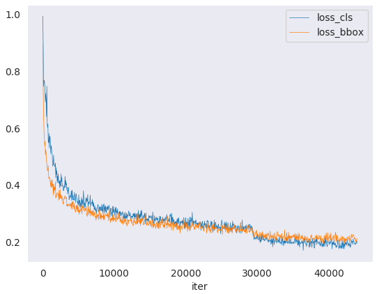

# MMDetection

文档：[Welcome to MMDetection’s documentation! — MMDetection 3.0.0 文档](https://mmdetection.readthedocs.io/zh_CN/3.x/) 

模型库：[模型库 — MMDetection 3.0.0rc5 文档](https://mmdetection.readthedocs.io/zh_CN/3.x/model_zoo.html)

更新日志：[Changelog of v3.x — MMDetection 3.0.0rc5 documentation](https://mmdetection.readthedocs.io/en/3.x/notes/changelog.html)

## 简介

MMDetection 是一个基于 PyTorch 的目标检测开源工具箱。它是 [OpenMMLab](https://openmmlab.com/) 项目的一部分。包含了丰富的目标检测、实例分割、全景分割算法以及相关的组件和模块，下面是它的整体框架：

主分支代码目前支持 PyTorch 1.6 以上的版本。

### 主要特性

#### 模块化设计

MMDetection 将检测框架解耦成不同的模块组件，通过组合不同的模块组件，用户可以便捷地构建自定义的检测模型。

#### 支持多种检测任务

MMDetection 支持了各种不同的检测任务，包括目标检测，实例分割，全景分割，以及半监督目标检测。

#### 速度快

基本的框和 mask 操作都实现了 GPU 版本，训练速度比其他代码库更快或者相当，包括 Detectron2, maskrcnn-benchmark 和 SimpleDet。

#### 性能高

MMDetection 这个算法库源自于 COCO 2018 目标检测竞赛的冠军团队 MMDet 团队开发的代码，我们在之后持续进行了改进和提升。 新发布的 RTMDet 还在实时实例分割和旋转目标检测任务中取得了最先进的成果，同时也在目标检测模型中取得了最佳的的参数量和精度平衡。

> 除了 MMDetection 之外，还开源了深度学习训练库 [MMEngine](https://github.com/open-mmlab/mmengine) 和计算机视觉基础库 [MMCV](https://github.com/open-mmlab/mmcv)，它们是 MMDetection 的主要依赖。

## 主要组件

MMDetection 由 7 个主要部分组成，apis、structures、datasets、models、engine、evaluation 和 visualization。

- **apis** 为模型推理提供高级 API。
- **structures** 提供 bbox、mask 和 DetDataSample 等数据结构。
- **datasets** 支持用于目标检测、实例分割和全景分割的各种数据集。
  - **transforms** 包含各种数据增强变换。
  - **samplers** 定义了不同的数据加载器采样策略。
- **models** 是检测器最重要的部分，包含检测器的不同组件。
  - **detectors** 定义所有检测模型类。
  - **data_preprocessors** 用于预处理模型的输入数据。
  - **backbones** 包含各种骨干网络。
  - **necks** 包含各种模型颈部组件。
  - **dense_heads** 包含执行密集预测的各种检测头。
  - **roi_heads** 包含从 RoI 预测的各种检测头。
  - **seg_heads** 包含各种分割头。
  - **losses** 包含各种损失函数。
  - **task_modules** 为检测任务提供模块，例如 assigners、samplers、box coders 和 prior generators。
  - **layers** 提供了一些基本的神经网络层。
- **engine** 是运行时组件的一部分。
  - **runner** 为 [MMEngine 的执行器](https://mmengine.readthedocs.io/zh_CN/latest/tutorials/runner.html)提供扩展。
  - **schedulers** 提供用于调整优化超参数的调度程序。
  - **optimizers** 提供优化器和优化器封装。
  - **hooks** 提供执行器的各种钩子。
- **evaluation** 为评估模型性能提供不同的指标。
- **visualization** 用于可视化检测结果。

## 开始

### 依赖

本节中，我们将演示如何用 PyTorch 准备一个环境。

MMDetection 支持在 Linux，Windows 和 macOS 上运行。它需要 Python 3.7 以上，CUDA 9.2 以上和 PyTorch 1.6 以上。

**步骤 0.** 从[官方网站](https://docs.conda.io/en/latest/miniconda.html)下载并安装 Miniconda。

**步骤 1.** 创建并激活一个 conda 环境。

```shell
conda create --name openmmlab python=3.8 -y
conda activate openmmlab
```

**步骤 2.** 基于 [PyTorch 官方说明](https://pytorch.org/get-started/locally/)安装 PyTorch。

在 GPU 平台上：

```
conda install pytorch torchvision -c pytorch
```

### 安装流程

我们推荐用户参照我们的最佳实践安装 MMDetection。不过，整个过程也是可定制化的，更多信息请参考[自定义安装](https://mmdetection.readthedocs.io/zh_CN/3.x/get_started.html#id6)章节。

#### 最佳实践

**步骤 0.** 使用 [MIM](https://github.com/open-mmlab/mim) 安装 [MMEngine](https://github.com/open-mmlab/mmengine) 和 [MMCV](https://github.com/open-mmlab/mmcv)。

```shell
pip install -U openmim
mim install mmengine
mim install "mmcv>=2.0.0rc1"
```

> **注意：** 在 MMCV-v2.x 中，`mmcv-full` 改名为 `mmcv`，如果你想安装不包含 CUDA 算子精简版，可以通过 `mim install "mmcv-lite>=2.0.0rc1"` 来安装。

**步骤 1.** 安装 MMDetection。

方案 a：如果你开发并直接运行 mmdet，从源码安装它：

```shell
git clone https://github.com/open-mmlab/mmdetection.git -b 3.x
# "-b 3.x" 表示切换到 `3.x` 分支。
cd mmdetection
pip install -v -e .
# "-v" 指详细说明，或更多的输出
# "-e" 表示在可编辑模式下安装项目，因此对代码所做的任何本地修改都会生效，从而无需重新安装。
```

方案 b：如果你将 mmdet 作为依赖或第三方 Python 包，使用 MIM 安装：

```
mim install "mmdet>=3.0.0rc0"
```

### 验证安装

为了验证 MMDetection 是否安装正确，我们提供了一些示例代码来执行模型推理。

**步骤 1.** 我们需要下载配置文件和模型权重文件。

```shell
mim download mmdet --config mask-rcnn_r50_fpn_1x_coco --dest ./checkpoints
```

下载将需要几秒钟或更长时间，这取决于你的网络环境。完成后，你会在当前文件夹中发现两个文件 `mask-rcnn_r50_fpn_1x_coco.py` 和 `mask_rcnn_r50_fpn_1x_coco_20200205-d4b0c5d6.pth`。

**步骤 2.** 推理验证。

python demo/image_demo.py demo/a.jpg ./checkpoints/panoptic_fpn_r50_fpn_1x_coco.py --weights ./checkpoints/panoptic_fpn_r50_fpn_1x_coco_20210821_101153-9668fd13.pth

```
python demo/image_demo.py demo/demo.jpg ./checkpoints/mask-rcnn_r50_fpn_1x_coco.py --weights ./checkpoints/mask_rcnn_r50_fpn_1x_coco_20200205-d4b0c5d6.pth
```

不设置`--out-dir`就会默认保存在`outputs`文件夹下，里面有两个子文件夹`preds`（预测的数据结果）和`vis`（可视化结果图片）

+ 方案 b：如果你通过 MIM 安装的 MMDetection，那么可以打开你的 Python 解析器，复制并粘贴以下代码：

```python
from mmdet.apis import init_detector, inference_detector

config_file = 'rtmdet_tiny_8xb32-300e_coco.py'
checkpoint_file = 'rtmdet_tiny_8xb32-300e_coco_20220902_112414-78e30dcc.pth'
model = init_detector(config_file, checkpoint_file, device='cpu')  # or device='cuda:0'
inference_detector(model, 'demo/demo.jpg')
```

输出结果`Loads checkpoint by local backend from path`

？没有，有问题？你将会看到一个包含 `DetDataSample` 的列表，预测结果在 `pred_instance` 里，包含有检测框，类别和得分。

## 训练 & 测试

MMDetection 在 [Model Zoo](https://mmdetection.readthedocs.io/en/latest/model_zoo.html) 中提供了数百个预训练的检测模型， 并支持多种标准数据集格式，包括 Pascal VOC、COCO、CityScapes、LVIS 等。本文档将展示如何使用这些模型和数据集来执行常见的训练和测试任务：

### 学习配置文件

MMDetection 和其他 OpenMMLab 仓库使用 [MMEngine 的配置文件系统](https://mmengine.readthedocs.io/zh_CN/latest/advanced_tutorials/config.html)。 配置文件使用了模块化和继承设计，以便于进行各类实验。

#### 配置文件的内容

MMDetection 采用模块化设计，所有功能的模块都可以通过配置文件进行配置。 以 Mask R-CNN 为例，我们将根据不同的功能模块介绍配置文件中的各个字段：

##### 模型配置

在 mmdetection 的配置中，我们使用 `model` 字段来配置检测算法的组件。 除了 `backbone`、`neck` 等神经网络组件外，还需要 `data_preprocessor`、`train_cfg` 和 `test_cfg`。 `data_preprocessor` 负责对 dataloader 输出的每一批数据进行预处理。 模型配置中的 `train_cfg` 和 `test_cfg` 用于设置训练和测试组件的超参数。

```python
model = dict(
    type='MaskRCNN',  # 检测器名
    data_preprocessor=dict(  # 数据预处理器的配置，通常包括图像归一化和 padding
        type='DetDataPreprocessor',  # 数据预处理器的类型，参考 https://mmdetection.readthedocs.io/en/latest/api.html#mmdet.models.data_preprocessors.DetDataPreprocessor
        mean=[123.675, 116.28, 103.53],  # 用于预训练骨干网络的图像归一化通道均值，按 R、G、B 排序
        std=[58.395, 57.12, 57.375],  # 用于预训练骨干网络的图像归一化通道标准差，按 R、G、B 排序
        bgr_to_rgb=True,  # 是否将图片通道从 BGR 转为 RGB
        pad_mask=True,  # 是否填充实例分割掩码
        pad_size_divisor=32),  # padding 后的图像的大小应该可以被 ``pad_size_divisor`` 整除
    backbone=dict(  # 主干网络的配置文件
        type='ResNet',  # 主干网络的类别，可用选项请参考 https://mmdetection.readthedocs.io/en/latest/api.html#mmdet.models.backbones.ResNet
        depth=50,  # 主干网络的深度，对于 ResNet 和 ResNext 通常设置为 50 或 101
        num_stages=4,  # 主干网络状态(stages)的数目，这些状态产生的特征图作为后续的 head 的输入
        out_indices=(0, 1, 2, 3),  # 每个状态产生的特征图输出的索引
        frozen_stages=1,  # 第一个状态的权重被冻结
        norm_cfg=dict(  # 归一化层(norm layer)的配置项
            type='BN',  # 归一化层的类别，通常是 BN 或 GN
            requires_grad=True),  # 是否训练归一化里的 gamma 和 beta
        norm_eval=True,  # 是否冻结 BN 里的统计项
        style='pytorch',  # 主干网络的风格，'pytorch' 意思是步长为2的层为 3x3 卷积， 'caffe' 意思是步长为2的层为 1x1 卷积
        init_cfg=dict(type='Pretrained', checkpoint='torchvision://resnet50')),  # 加载通过 ImageNet 预训练的模型
    neck=dict(
        type='FPN',  # 检测器的 neck 是 FPN，我们同样支持 'NASFPN', 'PAFPN' 等，更多细节可以参考 https://mmdetection.readthedocs.io/en/latest/api.html#mmdet.models.necks.FPN
        in_channels=[256, 512, 1024, 2048],  # 输入通道数，这与主干网络的输出通道一致
        out_channels=256,  # 金字塔特征图每一层的输出通道
        num_outs=5),  # 输出的范围(scales)
    rpn_head=dict(
        type='RPNHead',  # rpn_head 的类型是 'RPNHead', 我们也支持 'GARPNHead' 等，更多细节可以参考 https://mmdetection.readthedocs.io/en/latest/api.html#mmdet.models.dense_heads.RPNHead
        in_channels=256,  # 每个输入特征图的输入通道，这与 neck 的输出通道一致
        feat_channels=256,  # head 卷积层的特征通道
        anchor_generator=dict(  # 锚点(Anchor)生成器的配置
            type='AnchorGenerator',  # 大多数方法使用 AnchorGenerator 作为锚点生成器, SSD 检测器使用 `SSDAnchorGenerator`。更多细节请参考 https://github.com/open-mmlab/mmdetection/blob/main/mmdet/models/task_modules/prior_generators/anchor_generator.py#L18
            scales=[8],  # 锚点的基本比例，特征图某一位置的锚点面积为 scale * base_sizes
            ratios=[0.5, 1.0, 2.0],  # 高度和宽度之间的比率
            strides=[4, 8, 16, 32, 64]),  # 锚生成器的步幅。这与 FPN 特征步幅一致。 如果未设置 base_sizes，则当前步幅值将被视为 base_sizes
        bbox_coder=dict(  # 在训练和测试期间对框进行编码和解码
            type='DeltaXYWHBBoxCoder',  # 框编码器的类别，'DeltaXYWHBBoxCoder' 是最常用的，更多细节请参考 https://github.com/open-mmlab/mmdetection/blob/main/mmdet/models/task_modules/coders/delta_xywh_bbox_coder.py#L13
            target_means=[0.0, 0.0, 0.0, 0.0],  # 用于编码和解码框的目标均值
            target_stds=[1.0, 1.0, 1.0, 1.0]),  # 用于编码和解码框的标准差
        loss_cls=dict(  # 分类分支的损失函数配置
            type='CrossEntropyLoss',  # 分类分支的损失类型，我们也支持 FocalLoss 等，更多细节请参考 https://github.com/open-mmlab/mmdetection/blob/main/mmdet/models/losses/cross_entropy_loss.py#L201
            use_sigmoid=True,  # RPN 通常进行二分类，所以通常使用 sigmoid 函数
            los_weight=1.0),  # 分类分支的损失权重
        loss_bbox=dict(  # 回归分支的损失函数配置
            type='L1Loss',  # 损失类型，我们还支持许多 IoU Losses 和 Smooth L1-loss 等，更多细节请参考 https://github.com/open-mmlab/mmdetection/blob/main/mmdet/models/losses/smooth_l1_loss.py#L56
            loss_weight=1.0)),  # 回归分支的损失权重
    roi_head=dict(  # RoIHead 封装了两步(two-stage)/级联(cascade)检测器的第二步
        type='StandardRoIHead',  # RoI head 的类型，更多细节请参考 https://github.com/open-mmlab/mmdetection/blob/main/mmdet/models/roi_heads/standard_roi_head.py#L17
        bbox_roi_extractor=dict(  # 用于 bbox 回归的 RoI 特征提取器
            type='SingleRoIExtractor',  # RoI 特征提取器的类型，大多数方法使用 SingleRoIExtractor，更多细节请参考 https://github.com/open-mmlab/mmdetection/blob/main/mmdet/models/roi_heads/roi_extractors/single_level_roi_extractor.py#L13
            roi_layer=dict(  # RoI 层的配置
                type='RoIAlign',  # RoI 层的类别, 也支持 DeformRoIPoolingPack 和 ModulatedDeformRoIPoolingPack，更多细节请参考 https://mmcv.readthedocs.io/en/latest/api.html#mmcv.ops.RoIAlign
                output_size=7,  # 特征图的输出大小
                sampling_ratio=0),  # 提取 RoI 特征时的采样率。0 表示自适应比率
            out_channels=256,  # 提取特征的输出通道
            featmap_strides=[4, 8, 16, 32]),  # 多尺度特征图的步幅，应该与主干的架构保持一致
        bbox_head=dict(  # RoIHead 中 box head 的配置
            type='Shared2FCBBoxHead',  # bbox head 的类别，更多细节请参考 https://github.com/open-mmlab/mmdetection/blob/main/mmdet/models/roi_heads/bbox_heads/convfc_bbox_head.py#L220
            in_channels=256,  # bbox head 的输入通道。 这与 roi_extractor 中的 out_channels 一致
            fc_out_channels=1024,  # FC 层的输出特征通道
            roi_feat_size=7,  # 候选区域(Region of Interest)特征的大小
            num_classes=80,  # 分类的类别数量
            bbox_coder=dict(  # 第二阶段使用的框编码器
                type='DeltaXYWHBBoxCoder',  # 框编码器的类别，大多数情况使用 'DeltaXYWHBBoxCoder'
                target_means=[0.0, 0.0, 0.0, 0.0],  # 用于编码和解码框的均值
                target_stds=[0.1, 0.1, 0.2, 0.2]),  # 编码和解码的标准差。因为框更准确，所以值更小，常规设置时 [0.1, 0.1, 0.2, 0.2]。
            reg_class_agnostic=False,  # 回归是否与类别无关
            loss_cls=dict(  # 分类分支的损失函数配
                type='CrossEntropyLoss',  # 分类分支的损失类型，我们也支持 FocalLoss 等
                use_sigmoid=False,  # 是否使用 sigmoid
                loss_weight=1.0),  # 分类分支的损失权重
            loss_bbox=dict(  # 回归分支的损失函数配置
                type='L1Loss',  # 损失类型，我们还支持许多 IoU Losses 和 Smooth L1-loss 等
                loss_weight=1.0)),  # 回归分支的损失权重
        mask_roi_extractor=dict(  # 用于 mask 生成的 RoI 特征提取器
            type='SingleRoIExtractor',  # RoI 特征提取器的类型，大多数方法使用 SingleRoIExtractor
            roi_layer=dict(  # 提取实例分割特征的 RoI 层配置
                type='RoIAlign',  # RoI 层的类型，也支持 DeformRoIPoolingPack 和 ModulatedDeformRoIPoolingPack
                output_size=14,  # 特征图的输出大小
                sampling_ratio=0),  # 提取 RoI 特征时的采样率
            out_channels=256,  # 提取特征的输出通道
            featmap_strides=[4, 8, 16, 32]),  # 多尺度特征图的步幅
        mask_head=dict(  # mask 预测 head 模型
            type='FCNMaskHead',  # mask head 的类型，更多细节请参考 https://mmdetection.readthedocs.io/en/latest/api.html#mmdet.models.roi_heads.FCNMaskHead
            num_convs=4,  # mask head 中的卷积层数
            in_channels=256,  # 输入通道，应与 mask roi extractor 的输出通道一致
            conv_out_channels=256,  # 卷积层的输出通道
            num_classes=80,  # 要分割的类别数
            loss_mask=dict(  # mask 分支的损失函数配置
                type='CrossEntropyLoss',  # 用于分割的损失类型
                use_mask=True,  # 是否只在正确的类中训练 mask
                loss_weight=1.0))),  # mask 分支的损失权重
    train_cfg = dict(  # rpn 和 rcnn 训练超参数的配置
        rpn=dict(  # rpn 的训练配置
            assigner=dict(  # 分配器(assigner)的配置
                type='MaxIoUAssigner',  # 分配器的类型，MaxIoUAssigner 用于许多常见的检测器，更多细节请参考 https://github.com/open-mmlab/mmdetection/blob/main/mmdet/models/task_modules/assigners/max_iou_assigner.py#L14
                pos_iou_thr=0.7,  # IoU >= 0.7(阈值) 被视为正样本
                neg_iou_thr=0.3,  # IoU < 0.3(阈值) 被视为负样本
                min_pos_iou=0.3,  # 将框作为正样本的最小 IoU 阈值
                match_low_quality=True,  # 是否匹配低质量的框(更多细节见 API 文档)
                ignore_iof_thr=-1),  # 忽略 bbox 的 IoF 阈值
            sampler=dict(  # 正/负采样器(sampler)的配置
                type='RandomSampler',  # 采样器类型，还支持 PseudoSampler 和其他采样器，更多细节请参考 https://github.com/open-mmlab/mmdetection/blob/main/mmdet/models/task_modules/samplers/random_sampler.py#L14
                num=256,  # 样本数量。
                pos_fraction=0.5,  # 正样本占总样本的比例
                neg_pos_ub=-1,  # 基于正样本数量的负样本上限
                add_gt_as_proposals=False),  # 采样后是否添加 GT 作为 proposal
            allowed_border=-1,  # 填充有效锚点后允许的边框
            pos_weight=-1,  # 训练期间正样本的权重
            debug=False),  # 是否设置调试(debug)模式
        rpn_proposal=dict(  # 在训练期间生成 proposals 的配置
            nms_across_levels=False,  # 是否对跨层的 box 做 NMS。仅适用于 `GARPNHead` ，naive rpn 不支持 nms cross levels
            nms_pre=2000,  # NMS 前的 box 数
            nms_post=1000,  # NMS 要保留的 box 的数量，只在 GARPNHHead 中起作用
            max_per_img=1000,  # NMS 后要保留的 box 数量
            nms=dict( # NMS 的配置
                type='nms',  # NMS 的类别
                iou_threshold=0.7 # NMS 的阈值
                ),
            min_bbox_size=0),  # 允许的最小 box 尺寸
        rcnn=dict(  # roi head 的配置。
            assigner=dict(  # 第二阶段分配器的配置，这与 rpn 中的不同
                type='MaxIoUAssigner',  # 分配器的类型，MaxIoUAssigner 目前用于所有 roi_heads。更多细节请参考 https://github.com/open-mmlab/mmdetection/blob/main/mmdet/models/task_modules/assigners/max_iou_assigner.py#L14
                pos_iou_thr=0.5,  # IoU >= 0.5(阈值)被认为是正样本
                neg_iou_thr=0.5,  # IoU < 0.5(阈值)被认为是负样本
                min_pos_iou=0.5,  # 将 box 作为正样本的最小 IoU 阈值
                match_low_quality=False,  # 是否匹配低质量下的 box(有关更多详细信息，请参阅 API 文档)
                ignore_iof_thr=-1),  # 忽略 bbox 的 IoF 阈值
            sampler=dict(
                type='RandomSampler',  # 采样器的类型，还支持 PseudoSampler 和其他采样器，更多细节请参考 https://github.com/open-mmlab/mmdetection/blob/main/mmdet/models/task_modules/samplers/random_sampler.py#L14
                num=512,  # 样本数量
                pos_fraction=0.25,  # 正样本占总样本的比例
                neg_pos_ub=-1,  # 基于正样本数量的负样本上限
                add_gt_as_proposals=True
            ),  # 采样后是否添加 GT 作为 proposal
            mask_size=28,  # mask 的大小
            pos_weight=-1,  # 训练期间正样本的权重
            debug=False)),  # 是否设置调试模式
    test_cfg = dict(  # 用于测试 rpn 和 rcnn 超参数的配置
        rpn=dict(  # 测试阶段生成 proposals 的配置
            nms_across_levels=False,  # 是否对跨层的 box 做 NMS。仅适用于 `GARPNHead`，naive rpn 不支持做 NMS cross levels
            nms_pre=1000,  # NMS 前的 box 数
            nms_post=1000,  # NMS 要保留的 box 的数量，只在 `GARPNHHead` 中起作用
            max_per_img=1000,  # NMS 后要保留的 box 数量
            nms=dict( # NMS 的配置
                type='nms',  # NMS 的类型
                iou_threshold=0.7 # NMS 阈值
                ),
            min_bbox_size=0),  # box 允许的最小尺寸
        rcnn=dict(  # roi heads 的配置
            score_thr=0.05,  # bbox 的分数阈值
            nms=dict(  # 第二步的 NMS 配置
                type='nms',  # NMS 的类型
                iou_thr=0.5),  # NMS 的阈值
            max_per_img=100,  # 每张图像的最大检测次数
            mask_thr_binary=0.5)))  # mask 预处的阈值
```


##### 数据集和评测器配置

在使用[执行器](https://mmengine.readthedocs.io/en/latest/tutorials/runner.html) 进行训练、测试、验证时，我们需要配置 [Dataloader](https://pytorch.org/docs/stable/data.html?highlight=data loader#torch.utils.data.DataLoader)。构建数据 dataloader 需要设置数据集（dataset）和数据处理流程（data pipeline）。 由于这部分的配置较为复杂，我们使用中间变量来简化 dataloader 配置的编写。

```python
dataset_type = 'CocoDataset'  # 数据集类型，这将被用来定义数据集。
data_root = 'data/coco/'  # 数据的根路径。

train_pipeline = [  # 训练数据处理流程
    dict(type='LoadImageFromFile'),  # 第 1 个流程，从文件路径里加载图像。
    dict(
        type='LoadAnnotations',  # 第 2 个流程，对于当前图像，加载它的注释信息。
        with_bbox=True,  # 是否使用标注框(bounding box)， 目标检测需要设置为 True。
        with_mask=True,  # 是否使用 instance mask，实例分割需要设置为 True。
        poly2mask=False),  # 是否将 polygon mask 转化为 instance mask, 设置为 False 以加速和节省内存。
    dict(
        type='Resize',  # 变化图像和其标注大小的流程。
        scale=(1333, 800),  # 图像的最大尺寸
        keep_ratio=True  # 是否保持图像的长宽比。
        ),
    dict(
        type='RandomFlip',  # 翻转图像和其标注的数据增广流程。
        prob=0.5),  # 翻转图像的概率。
    dict(type='PackDetInputs')  # 将数据转换为检测器输入格式的流程
]
test_pipeline = [  # 测试数据处理流程
    dict(type='LoadImageFromFile'),  # 第 1 个流程，从文件路径里加载图像。
    dict(type='Resize', scale=(1333, 800), keep_ratio=True),  # 变化图像大小的流程。
    dict(
        type='PackDetInputs',  # 将数据转换为检测器输入格式的流程
        meta_keys=('img_id', 'img_path', 'ori_shape', 'img_shape',
                   'scale_factor'))
]
train_dataloader = dict(  # 训练 dataloader 配置
    batch_size=2,  # 单个 GPU 的 batch size
    num_workers=2,  # 单个 GPU 分配的数据加载线程数
    persistent_workers=True,  # 如果设置为 True，dataloader 在迭代完一轮之后不会关闭数据读取的子进程，可以加速训练
    sampler=dict(  # 训练数据的采样器
        type='DefaultSampler',  # 默认的采样器，同时支持分布式和非分布式训练。请参考 https://mmengine.readthedocs.io/zh_CN/latest/api/generated/mmengine.dataset.DefaultSampler.html#mmengine.dataset.DefaultSampler
        shuffle=True),  # 随机打乱每个轮次训练数据的顺序
    batch_sampler=dict(type='AspectRatioBatchSampler'),  # 批数据采样器，用于确保每一批次内的数据拥有相似的长宽比，可用于节省显存
    dataset=dict(  # 训练数据集的配置
        type=dataset_type,
        data_root=data_root,
        ann_file='annotations/instances_train2017.json',  # 标注文件路径
        data_prefix=dict(img='train2017/'),  # 图片路径前缀
        filter_cfg=dict(filter_empty_gt=True, min_size=32),  # 图片和标注的过滤配置
        pipeline=train_pipeline))  # 这是由之前创建的 train_pipeline 定义的数据处理流程。
val_dataloader = dict(  # 验证 dataloader 配置
    batch_size=1,  # 单个 GPU 的 Batch size。如果 batch-szie > 1，组成 batch 时的额外填充会影响模型推理精度
    num_workers=2,  # 单个 GPU 分配的数据加载线程数
    persistent_workers=True,  # 如果设置为 True，dataloader 在迭代完一轮之后不会关闭数据读取的子进程，可以加速训练
    drop_last=False,  # 是否丢弃最后未能组成一个批次的数据
    sampler=dict(
        type='DefaultSampler',
        shuffle=False),  # 验证和测试时不打乱数据顺序
    dataset=dict(
        type=dataset_type,
        data_root=data_root,
        ann_file='annotations/instances_val2017.json',
        data_prefix=dict(img='val2017/'),
        test_mode=True,  # 开启测试模式，避免数据集过滤图片和标注
        pipeline=test_pipeline))
test_dataloader = val_dataloader  # 测试 dataloader 配置
```


[评测器](https://mmengine.readthedocs.io/zh_CN/latest/tutorials/evaluation.html) 用于计算训练模型在验证和测试数据集上的指标。评测器的配置由一个或一组评价指标（Metric）配置组成：

```python
val_evaluator = dict(  # 验证过程使用的评测器
    type='CocoMetric',  # 用于评估检测和实例分割的 AR、AP 和 mAP 的 coco 评价指标
    ann_file=data_root + 'annotations/instances_val2017.json',  # 标注文件路径
    metric=['bbox', 'segm'],  # 需要计算的评价指标，`bbox` 用于检测，`segm` 用于实例分割
    format_only=False)
test_evaluator = val_evaluator  # 测试过程使用的评测器
```

由于测试数据集没有标注文件，因此 MMDetection 中的 test_dataloader 和 test_evaluator 配置通常等于val。 如果要保存在测试数据集上的检测结果，则可以像这样编写配置：

```python
# 在测试集上推理，
# 并将检测结果转换格式以用于提交结果
test_dataloader = dict(
    batch_size=1,
    num_workers=2,
    persistent_workers=True,
    drop_last=False,
    sampler=dict(type='DefaultSampler', shuffle=False),
    dataset=dict(
        type=dataset_type,
        data_root=data_root,
        ann_file=data_root + 'annotations/image_info_test-dev2017.json',
        data_prefix=dict(img='test2017/'),
        test_mode=True,
        pipeline=test_pipeline))
test_evaluator = dict(
    type='CocoMetric',
    ann_file=data_root + 'annotations/image_info_test-dev2017.json',
    metric=['bbox', 'segm'],
    format_only=True,  # 只将模型输出转换为 coco 的 JSON 格式并保存
    outfile_prefix='./work_dirs/coco_detection/test')  # 要保存的 JSON 文件的前缀
```

##### 训练和测试的配置

MMEngine 的 Runner 使用 Loop 来控制训练，验证和测试过程。 用户可以使用这些字段设置最大训练轮次和验证间隔。

```python
train_cfg = dict(
    type='EpochBasedTrainLoop',  # 训练循环的类型，请参考 https://github.com/open-mmlab/mmengine/blob/main/mmengine/runner/loops.py
    max_epochs=12,  # 最大训练轮次
    val_interval=1)  # 验证间隔。每个 epoch 验证一次
val_cfg = dict(type='ValLoop')  # 验证循环的类型
test_cfg = dict(type='TestLoop')  # 测试循环的类型
```

##### 优化相关配置

- `optim_wrapper` 是配置优化相关设置的字段。优化器封装（OptimWrapper）不仅提供了优化器的功能，还支持梯度裁剪、混合精度训练等功能。更多内容请看[优化器封装教程](https://mmengine.readthedocs.io/zh_CN/latest/tutorials/optim_wrapper.html) 。

  ```
  optim_wrapper = dict(  # 优化器封装的配置
      type='OptimWrapper',  # 优化器封装的类型。可以切换至 AmpOptimWrapper 来启用混合精度训练
      optimizer=dict(  # 优化器配置。支持 PyTorch 的各种优化器。请参考 https://pytorch.org/docs/stable/optim.html#algorithms
          type='SGD',  # 随机梯度下降优化器
          lr=0.02,  # 基础学习率
          momentum=0.9,  # 带动量的随机梯度下降
          weight_decay=0.0001),  # 权重衰减
      clip_grad=None,  # 梯度裁剪的配置，设置为 None 关闭梯度裁剪。使用方法请见 https://mmengine.readthedocs.io/en/latest/tutorials/optimizer.html
      )
  ```

  

  `param_scheduler` 字段用于配置参数调度器（Parameter Scheduler）来调整优化器的超参数（例如学习率和动量）。 用户可以组合多个调度器来创建所需的参数调整策略。 在 [参数调度器教程](https://mmengine.readthedocs.io/zh_CN/latest/tutorials/param_scheduler.html) 和 [参数调度器 API 文档](https://mmengine.readthedocs.io/zh_CN/latest/api/generated/mmengine.optim._ParamScheduler.html#mmengine.optim._ParamScheduler) 中查找更多信息。

  ```
  param_scheduler = [
      dict(
          type='LinearLR',  # 使用线性学习率预热
          start_factor=0.001, # 学习率预热的系数
          by_epoch=False,  # 按 iteration 更新预热学习率
          begin=0,  # 从第一个 iteration 开始
          end=500),  # 到第 500 个 iteration 结束
      dict(
          type='MultiStepLR',  # 在训练过程中使用 multi step 学习率策略
          by_epoch=True,  # 按 epoch 更新学习率
          begin=0,   # 从第一个 epoch 开始
          end=12,  # 到第 12 个 epoch 结束
          milestones=[8, 11],  # 在哪几个 epoch 进行学习率衰减
          gamma=0.1)  # 学习率衰减系数
  ]
  ```

  

  ### 钩子配置

  用户可以在训练、验证和测试循环上添加钩子，以便在运行期间插入一些操作。配置中有两种不同的钩子字段，一种是 `default_hooks`，另一种是 `custom_hooks`。

  `default_hooks` 是一个字典，用于配置运行时必须使用的钩子。这些钩子具有默认优先级，如果未设置，runner 将使用默认值。如果要禁用默认钩子，用户可以将其配置设置为 `None`。更多内容请看 [钩子教程](https://mmengine.readthedocs.io/zh_CN/latest/tutorials/hook.html) 。

  ```
  default_hooks = dict(
      timer=dict(type='IterTimerHook'),
      logger=dict(type='LoggerHook', interval=50),
      param_scheduler=dict(type='ParamSchedulerHook'),
      checkpoint=dict(type='CheckpointHook', interval=1),
      sampler_seed=dict(type='DistSamplerSeedHook'),
      visualization=dict(type='DetVisualizationHook'))
  ```

  

  `custom_hooks` 是一个列表。用户可以在这个字段中加入自定义的钩子。

  ```
  custom_hooks = []
  ```

  

  ### 运行相关配置

  ```
  default_scope = 'mmdet'  # 默认的注册器域名，默认从此注册器域中寻找模块。请参考 https://mmengine.readthedocs.io/zh_CN/latest/advanced_tutorials/registry.html
  
  env_cfg = dict(
      cudnn_benchmark=False,  # 是否启用 cudnn benchmark
      mp_cfg=dict(  # 多进程设置
          mp_start_method='fork',  # 使用 fork 来启动多进程。'fork' 通常比 'spawn' 更快，但可能存在隐患。请参考 https://github.com/pytorch/pytorch/issues/1355
          opencv_num_threads=0),  # 关闭 opencv 的多线程以避免系统超负荷
      dist_cfg=dict(backend='nccl'),  # 分布式相关设置
  )
  
  vis_backends = [dict(type='LocalVisBackend')]  # 可视化后端，请参考 https://mmengine.readthedocs.io/zh_CN/latest/advanced_tutorials/visualization.html
  visualizer = dict(
      type='DetLocalVisualizer', vis_backends=vis_backends, name='visualizer')
  log_processor = dict(
      type='LogProcessor',  # 日志处理器用于处理运行时日志
      window_size=50,  # 日志数值的平滑窗口
      by_epoch=True)  # 是否使用 epoch 格式的日志。需要与训练循环的类型保存一致。
  
  log_level = 'INFO'  # 日志等级
  load_from = None  # 从给定路径加载模型检查点作为预训练模型。这不会恢复训练。
  resume = False  # 是否从 `load_from` 中定义的检查点恢复。 如果 `load_from` 为 None，它将恢复 `work_dir` 中的最新检查点。
  ```

  

  ## Iter-based 配置

  MMEngine 的 Runner 除了基于轮次的训练循环（epoch）外，还提供了基于迭代（iteration）的训练循环。 要使用基于迭代的训练，用户应该修改 `train_cfg`、`param_scheduler`、`train_dataloader`、`default_hooks` 和 `log_processor`。 以下是将基于 epoch 的 RetinaNet 配置更改为基于 iteration 的示例：configs/retinanet/retinanet_r50_fpn_90k_coco.py

  ```
  # iter-based 训练配置
  train_cfg = dict(
      _delete_=True,  # 忽略继承的配置文件中的值（可选）
      type='IterBasedTrainLoop',  # iter-based 训练循环
      max_iters=90000,  # 最大迭代次数
      val_interval=10000)  # 每隔多少次进行一次验证
  
  
  # 将参数调度器修改为 iter-based
  param_scheduler = [
      dict(
          type='LinearLR', start_factor=0.001, by_epoch=False, begin=0, end=500),
      dict(
          type='MultiStepLR',
          begin=0,
          end=90000,
          by_epoch=False,
          milestones=[60000, 80000],
          gamma=0.1)
  ]
  
  # 切换至 InfiniteSampler 来避免 dataloader 重启
  train_dataloader = dict(sampler=dict(type='InfiniteSampler'))
  
  # 将模型检查点保存间隔设置为按 iter 保存
  default_hooks = dict(checkpoint=dict(by_epoch=False, interval=10000))
  
  # 将日志格式修改为 iter-based
  log_processor = dict(by_epoch=False)
  ```

  

  ## 配置文件继承

  在 `config/_base_` 文件夹下有 4 个基本组件类型，分别是：数据集(dataset)，模型(model)，训练策略(schedule)和运行时的默认设置(default runtime)。许多方法，例如 Faster R-CNN、Mask R-CNN、Cascade R-CNN、RPN、SSD 能够很容易地构建出来。由 `_base_` 下的组件组成的配置，被我们称为 *原始配置(primitive)*。

  对于同一文件夹下的所有配置，推荐**只有一个**对应的**原始配置**文件。所有其他的配置文件都应该继承自这个**原始配置**文件。这样就能保证配置文件的最大继承深度为 3。

  为了便于理解，我们建议贡献者继承现有方法。例如，如果在 Faster R-CNN 的基础上做了一些修改，用户首先可以通过指定 `_base_ = ../faster_rcnn/faster-rcnn_r50_fpn_1x_coco.py` 来继承基础的 Faster R-CNN 结构，然后修改配置文件中的必要参数以完成继承。

  如果你在构建一个与任何现有方法不共享结构的全新方法，那么可以在 `configs` 文件夹下创建一个新的例如 `xxx_rcnn` 文件夹。

  更多细节请参考 [MMEngine 配置文件教程](https://mmengine.readthedocs.io/zh_CN/latest/advanced_tutorials/config.html) 。

  通过设置 `_base_` 字段，我们可以设置当前配置文件继承自哪些文件。

  当 `_base_` 为文件路径字符串时，表示继承一个配置文件的内容。

  ```
  _base_ = './mask-rcnn_r50_fpn_1x_coco.py'
  ```

  

  当 `_base_` 是多个文件路径的列表时，表示继承多个文件。

  ```
  _base_ = [
      '../_base_/models/mask-rcnn_r50_fpn.py',
      '../_base_/datasets/coco_instance.py',
      '../_base_/schedules/schedule_1x.py', '../_base_/default_runtime.py'
  ]
  ```

  

  如果需要检查配置文件，可以通过运行 `python tools/misc/print_config.py /PATH/TO/CONFIG` 来查看完整的配置。

  ### 忽略基础配置文件里的部分内容

  有时，您也许会设置 `_delete_=True` 去忽略基础配置文件里的一些域内容。 您也许可以参照 [MMEngine 配置文件教程](https://mmengine.readthedocs.io/zh_CN/latest/advanced_tutorials/config.html) 来获得一些简单的指导。

  在 MMDetection 里，例如为了改变 Mask R-CNN 的主干网络的某些内容：

  ```
  model = dict(
      type='MaskRCNN',
      backbone=dict(
          type='ResNet',
          depth=50,
          num_stages=4,
          out_indices=(0, 1, 2, 3),
          frozen_stages=1,
          norm_cfg=dict(type='BN', requires_grad=True),
          norm_eval=True,
          style='pytorch',
          init_cfg=dict(type='Pretrained', checkpoint='torchvision://resnet50')),
      neck=dict(...),
      rpn_head=dict(...),
      roi_head=dict(...))
  ```

  

  基础配置的 `Mask R-CNN` 使用 `ResNet-50`，在需要将主干网络改成 `HRNet` 的时候，因为 `HRNet` 和 `ResNet` 中有不同的字段，需要使用 `_delete_=True` 将新的键去替换 `backbone` 域内所有老的键。

  ```
  _base_ = '../mask_rcnn/mask-rcnn_r50_fpn_1x_coco.py'
  model = dict(
      backbone=dict(
          _delete_=True,
          type='HRNet',
          extra=dict(
              stage1=dict(
                  num_modules=1,
                  num_branches=1,
                  block='BOTTLENECK',
                  num_blocks=(4, ),
                  num_channels=(64, )),
              stage2=dict(
                  num_modules=1,
                  num_branches=2,
                  block='BASIC',
                  num_blocks=(4, 4),
                  num_channels=(32, 64)),
              stage3=dict(
                  num_modules=4,
                  num_branches=3,
                  block='BASIC',
                  num_blocks=(4, 4, 4),
                  num_channels=(32, 64, 128)),
              stage4=dict(
                  num_modules=3,
                  num_branches=4,
                  block='BASIC',
                  num_blocks=(4, 4, 4, 4),
                  num_channels=(32, 64, 128, 256))),
          init_cfg=dict(type='Pretrained', checkpoint='open-mmlab://msra/hrnetv2_w32')),
      neck=dict(...))
  ```

  

  ### 使用配置文件里的中间变量

  配置文件里会使用一些中间变量，例如数据集里的 `train_pipeline`/`test_pipeline`。我们在定义新的 `train_pipeline`/`test_pipeline` 之后，需要将它们传递到 `data` 里。例如，我们想在训练或测试时，改变 Mask R-CNN 的多尺度策略 (multi scale strategy)，`train_pipeline`/`test_pipeline` 是我们想要修改的中间变量。

  ```
  _base_ = './mask-rcnn_r50_fpn_1x_coco.py'
  
  train_pipeline = [
      dict(type='LoadImageFromFile'),
      dict(type='LoadAnnotations', with_bbox=True, with_mask=True),
      dict(
          type='RandomResize', scale=[(1333, 640), (1333, 800)],
          keep_ratio=True),
      dict(type='RandomFlip', prob=0.5),
      dict(type='PackDetInputs')
  ]
  test_pipeline = [
      dict(type='LoadImageFromFile'),
      dict(type='Resize', scale=(1333, 800), keep_ratio=True),
      dict(
          type='PackDetInputs',
          meta_keys=('img_id', 'img_path', 'ori_shape', 'img_shape',
                     'scale_factor'))
  ]
  train_dataloader = dict(dataset=dict(pipeline=train_pipeline))
  val_dataloader = dict(dataset=dict(pipeline=test_pipeline))
  test_dataloader = dict(dataset=dict(pipeline=test_pipeline))
  ```

  

  我们首先定义新的 `train_pipeline`/`test_pipeline` 然后传递到 `data` 里。

  同样的，如果我们想从 `SyncBN` 切换到 `BN` 或者 `MMSyncBN`，我们需要修改配置文件里的每一个 `norm_cfg`。

  ```
  _base_ = './mask-rcnn_r50_fpn_1x_coco.py'
  norm_cfg = dict(type='BN', requires_grad=True)
  model = dict(
      backbone=dict(norm_cfg=norm_cfg),
      neck=dict(norm_cfg=norm_cfg),
      ...)
  ```

  

  ### 复用 _base_ 文件中的变量

  如果用户希望在当前配置中复用 base 文件中的变量，则可以通过使用 `{{_base_.xxx}}` 的方式来获取对应变量的拷贝。例如：

  ```
  _base_ = './mask-rcnn_r50_fpn_1x_coco.py'
  
  a = {{_base_.model}}  # 变量 a 等于 _base_ 中定义的 model
  ```

  

  ## 通过脚本参数修改配置

  当运行 `tools/train.py` 和 `tools/test.py` 时，可以通过 `--cfg-options` 来修改配置文件。

  - 更新字典链中的配置

    可以按照原始配置文件中的 dict 键顺序地指定配置预选项。例如，使用 `--cfg-options model.backbone.norm_eval=False` 将模型主干网络中的所有 BN 模块都改为 `train` 模式。

  - 更新配置列表中的键

    在配置文件里，一些字典型的配置被包含在列表中。例如，数据训练流程 `data.train.pipeline` 通常是一个列表，比如 `[dict(type='LoadImageFromFile'), ...]`。如果需要将 `'LoadImageFromFile'` 改成 `'LoadImageFromWebcam'`，需要写成下述形式： `--cfg-options data.train.pipeline.0.type=LoadImageFromNDArray`.

  - 更新列表或元组的值

    如果要更新的值是列表或元组。例如，配置文件通常设置 `model.data_preprocessor.mean=[123.675, 116.28, 103.53]`. 如果需要改变这个键，可以通过 `--cfg-options model.data_preprocessor.mean="[127,127,127]"` 来重新设置。需要注意，引号 ” 是支持列表或元组数据类型所必需的，并且在指定值的引号内**不允许**有空格。

  ## 配置文件名称风格

  我们遵循以下样式来命名配置文件。建议贡献者遵循相同的风格。

  ```
  {algorithm name}_{model component names [component1]_[component2]_[...]}_{training settings}_{training dataset information}_{testing dataset information}.py
  ```

  

  文件名分为五个部分。 每个部分用`_`连接，每个部分内的单词应该用`-`连接。

  - `{algorithm name}`: 算法的名称。 它可以是检测器名称，例如 `faster-rcnn`、`mask-rcnn` 等。也可以是半监督或知识蒸馏算法，例如 `soft-teacher`、`lad` 等等
  - `{component names}`: 算法中使用的组件名称，如 backbone、neck 等。例如 `r50-caffe_fpn_gn-head` 表示在算法中使用 caffe 版本的 ResNet50、FPN 和 使用了 Group Norm 的检测头。
  - `{training settings}`: 训练设置的信息，例如 batch 大小、数据增强、损失、参数调度方式和训练最大轮次/迭代。 例如：`4xb4-mixup-giou-coslr-100e` 表示使用 8 个 gpu 每个 gpu 4 张图、mixup 数据增强、GIoU loss、余弦退火学习率，并训练 100 个 epoch。 缩写介绍:
    - `{gpu x batch_per_gpu}`: GPU 数和每个 GPU 的样本数。`bN` 表示每个 GPU 上的 batch 大小为 N。例如 `4x4b` 是 4 个 GPU 每个 GPU 4 张图的缩写。如果没有注明，默认为 8 卡每卡 2 张图。
    - `{schedule}`: 训练方案，选项是 `1x`、 `2x`、 `20e` 等。`1x` 和 `2x` 分别代表 12 epoch 和 24 epoch，`20e` 在级联模型中使用，表示 20 epoch。对于 `1x`/`2x`，初始学习率在第 8/16 和第 11/22 epoch 衰减 10 倍；对于 `20e` ，初始学习率在第 16 和第 19 epoch 衰减 10 倍。
  - `{training dataset information}`: 训练数据集，例如 `coco`, `coco-panoptic`, `cityscapes`, `voc-0712`, `wider-face`。
  - `{testing dataset information}` (可选): 测试数据集，用于训练和测试在不同数据集上的模型配置。 如果没有注明，则表示训练和测试的数据集类型相同。

### 使用已有模型在标准数据集上进行推理

MMDetection 提供了许多预训练好的检测模型，可以在 [Model Zoo](https://mmdetection.readthedocs.io/zh_CN/latest/model_zoo.html) 查看具体有哪些模型。

推理具体指使用训练好的模型来检测图像上的目标，本文将会展示具体步骤。

在 MMDetection 中，一个模型被定义为一个[配置文件](https://mmdetection.readthedocs.io/zh_CN/latest/user_guides/config.html) 和对应被存储在 checkpoint 文件内的模型参数的集合。

首先，我们建议从 [RTMDet](https://github.com/open-mmlab/mmdetection/tree/main/configs/rtmdet) 开始，其 [配置](https://github.com/open-mmlab/mmdetection/blob/main/configs/rtmdet/rtmdet_l_8xb32-300e_coco.py) 文件和 [checkpoint](https://download.openmmlab.com/mmdetection/v3.0/rtmdet/rtmdet_l_8xb32-300e_coco/rtmdet_l_8xb32-300e_coco_20220719_112030-5a0be7c4.pth) 文件在此。 我们建议将 checkpoint 文件下载到 `checkpoints` 文件夹内。

##### 推理的高层编程接口

MMDetection 为在图片上推理提供了 Python 的高层编程接口。下面是建立模型和在图像或视频上进行推理的例子。

```python
import cv2
import mmcv
from mmcv.transforms import Compose
from mmengine.utils import track_iter_progress
from mmdet.registry import VISUALIZERS
from mmdet.apis import init_detector, inference_detector


# 指定模型的配置文件和 checkpoint 文件路径
config_file = 'configs/rtmdet/rtmdet_l_8xb32-300e_coco.py'
checkpoint_file = 'checkpoints/rtmdet_l_8xb32-300e_coco_20220719_112030-5a0be7c4.pth'

# 根据配置文件和 checkpoint 文件构建模型
model = init_detector(config_file, checkpoint_file, device='cuda:0')

# 初始化可视化工具
visualizer = VISUALIZERS.build(model.cfg.visualizer)
# 从 checkpoint 中加载 Dataset_meta，并将其传递给模型的 init_detector
visualizer.dataset_meta = model.dataset_meta

# 测试单张图片并展示结果
img = 'test.jpg'  # 或者 img = mmcv.imread(img)，这样图片仅会被读一次
result = inference_detector(model, img)

# 显示结果
img = mmcv.imread(img)
img = mmcv.imconvert(img, 'bgr', 'rgb')


visualizer.add_datasample(
    'result',
    img,
    data_sample=result,
    draw_gt=False,
    show=True)

# 测试视频并展示结果
# 构建测试 pipeline
model.cfg.test_dataloader.dataset.pipeline[0].type = 'LoadImageFromNDArray'
test_pipeline = Compose(model.cfg.test_dataloader.dataset.pipeline)

# 可视化工具在第33行和35行已经初完成了初始化，如果直接在一个 jupyter nodebook 中运行这个 demo，
# 这里则不需要再创建一个可视化工具了。
# 初始化可视化工具
visualizer = VISUALIZERS.build(model.cfg.visualizer)
# 从 checkpoint 中加载 Dataset_meta，并将其传递给模型的 init_detector
visualizer.dataset_meta = model.dataset_meta

# 显示间隔 (ms), 0 表示暂停
wait_time = 1

video = mmcv.VideoReader('video.mp4')

cv2.namedWindow('video', 0)

for frame in track_iter_progress(video_reader):
    result = inference_detector(model, frame, test_pipeline=test_pipeline)
    visualizer.add_datasample(
        name='video',
        image=frame,
        data_sample=result,
        draw_gt=False,
        show=False)
    frame = visualizer.get_image()
    mmcv.imshow(frame, 'video', wait_time)

cv2.destroyAllWindows()
```

Jupyter notebook 上的演示样例在 [demo/inference_demo.ipynb](https://github.com/open-mmlab/mmdetection/blob/main/demo/inference_demo.ipynb) 。

> 注意：`inference_detector`目前仅支持单图像推断。

#### 演示样例

我们还提供了三个演示脚本，它们是使用高层编程接口实现的。[源码在此](https://github.com/open-mmlab/mmdetection/blob/main/demo) 。

##### 图片样例

这是在单张图片上进行推理的脚本。

```shell
python demo/image_demo.py \
    ${IMAGE_FILE} \
    ${CONFIG_FILE} \
    [--weights ${WEIGHTS}] \
    [--device ${GPU_ID}] \
    [--pred-score-thr ${SCORE_THR}]
```

运行样例：

```shell
python demo/image_demo.py demo/demo.jpg \
    configs/rtmdet/rtmdet_l_8xb32-300e_coco.py \
    --weights checkpoints/rtmdet_l_8xb32-300e_coco_20220719_112030-5a0be7c4.pth \
    --device cpu
```

##### Webcam demo

这是一个来自网络摄像头的现场演示。

```shell
python demo/webcam_demo.py \
    ${CONFIG_FILE} \
    ${CHECKPOINT_FILE} \
    [--device ${GPU_ID}] \
    [--camera-id ${CAMERA-ID}] \
    [--score-thr ${SCORE_THR}]
```

示例：

```shell
python demo/webcam_demo.py \
    configs/faster_rcnn/faster-rcnn_r50_fpn_1x_coco.py \
    checkpoints/faster_rcnn_r50_fpn_1x_coco_20200130-047c8118.pth
```

##### 视频demo

此脚本对视频执行推理。

```shell
python demo/video_demo.py \
    ${VIDEO_FILE} \
    ${CONFIG_FILE} \
    ${CHECKPOINT_FILE} \
    [--device ${GPU_ID}] \
    [--score-thr ${SCORE_THR}] \
    [--out ${OUT_FILE}] \
    [--show] \
    [--wait-time ${WAIT_TIME}]
```

示例：

```shell
python demo/video_demo.py demo/demo.mp4 \
    configs/faster_rcnn/faster-rcnn_r50_fpn_1x_coco.py \
    checkpoints/faster_rcnn_r50_fpn_1x_coco_20200130-047c8118.pth \
    --out result.mp4
```

GPU加速视频demo

此脚本使用GPU加速对视频执行推理。

```shell
python demo/video_gpuaccel_demo.py \
    ${VIDEO_FILE} \
    ${CONFIG_FILE} \
    ${CHECKPOINT_FILE} \
    [--device ${GPU_ID}] \
    [--score-thr ${SCORE_THR}] \
    [--nvdecode] \
    [--out ${OUT_FILE}] \
    [--show] \
    [--wait-time ${WAIT_TIME}]
```

```shell
python demo/video_gpuaccel_demo.py demo/demo.mp4 \
    configs/faster_rcnn/faster-rcnn_r50_fpn_1x_coco.py \
    checkpoints/faster_rcnn_r50_fpn_1x_coco_20200130-047c8118.pth \
    --nvdecode --out result.mp4
```


### 数据集准备（待更新）

MMDetection支持多个公共数据集，包括COCO、Pascal VOC、CityScapes等。

一些公共数据集，比如 Pascal VOC 及其镜像数据集，或者 COCO 等数据集都可以从官方网站或者镜像网站获取。 注意：在检测任务中，Pascal VOC 2012 是 Pascal VOC 2007 的无交集扩展，我们通常将两者一起使用。 我们建议将数据集下载，然后解压到项目外部的某个文件夹内，然后通过符号链接的方式，将数据集根目录链接到 `$MMDETECTION/data` 文件夹下，格式如下所示。 如果你的文件夹结构和下方不同的话，你需要在配置文件中改变对应的路径。 

我们提供了下载 COCO 等数据集的脚本，你可以运行 `python tools/misc/download_dataset.py --dataset-name coco2017` 下载 COCO 数据集。

有关更多用法，请参阅[数据集下载](https://mmdetection.readthedocs.io/en/3.x/user_guides/useful_tools.html#dataset-download)

```
mmdetection
├── mmdet
├── tools
├── configs
├── data
│   ├── coco
│   │   ├── annotations
│   │   ├── train2017
│   │   ├── val2017
│   │   ├── test2017
│   ├── cityscapes
│   │   ├── annotations
│   │   ├── leftImg8bit
│   │   │   ├── train
│   │   │   ├── val
│   │   ├── gtFine
│   │   │   ├── train
│   │   │   ├── val
│   ├── VOCdevkit
│   │   ├── VOC2007
│   │   ├── VOC2012
```

有些模型需要额外的 [COCO-stuff](http://calvin.inf.ed.ac.uk/wp-content/uploads/data/cocostuffdataset/stuffthingmaps_trainval2017.zip) 数据集，比如 HTC，DetectoRS 和 SCNet，你可以下载并解压它们到 `coco` 文件夹下。文件夹会是如下结构：

```
mmdetection
├── data
│   ├── coco
│   │   ├── annotations
│   │   ├── train2017
│   │   ├── val2017
│   │   ├── test2017
│   │   ├── stuffthingmaps
```

PanopticFPN 等全景分割模型需要额外的 [COCO Panoptic](http://images.cocodataset.org/annotations/panoptic_annotations_trainval2017.zip) 数据集，你可以下载并解压它们到 `coco/annotations` 文件夹下。文件夹会是如下结构：

```
mmdetection
├── data
│   ├── coco
│   │   ├── annotations
│   │   │   ├── panoptic_train2017.json
│   │   │   ├── panoptic_train2017
│   │   │   ├── panoptic_val2017.json
│   │   │   ├── panoptic_val2017
│   │   ├── train2017
│   │   ├── val2017
│   │   ├── test2017
```

[Cityscape 数据集](https://www.cityscapes-dataset.com/)的标注格式需要转换，以与 COCO 数据集标注格式保持一致，使用 `tools/dataset_converters/cityscapes.py` 来完成转换：

```shell
pip install cityscapesscripts

python tools/dataset_converters/cityscapes.py \
    ./data/cityscapes \
    --nproc 8 \
    --out-dir ./data/cityscapes/annotations
```


## 测试现有模型

### tools/test.py

用于测试和评估训练好的模型

```bash
python tools/test.py -h
```

```
usage: test.py [-h] [--work-dir WORK_DIR] [--out OUT] [--show] [--show-dir SHOW_DIR] [--wait-time WAIT_TIME]
               [--cfg-options CFG_OPTIONS [CFG_OPTIONS ...]] [--launcher {none,pytorch,slurm,mpi}] [--tta] [--local_rank LOCAL_RANK]
               config checkpoint

MMDet test (and eval) a model

positional arguments:
  config                test config file path
  checkpoint            checkpoint file

optional arguments:
  -h, --help            show this help message and exit
  --work-dir WORK_DIR   the directory to save the file containing evaluation metrics
  --out OUT             dump predictions to a pickle file for offline evaluation
  --show                show prediction results
  --show-dir SHOW_DIR   directory where painted images will be saved. If specified, it will be automatically saved to the
                        work_dir/timestamp/show_dir
  --wait-time WAIT_TIME
                        the interval of show (s)
  --cfg-options CFG_OPTIONS [CFG_OPTIONS ...]
                        override some settings in the used config, the key-value pair in xxx=yyy format will be merged into config file. If the
                        value to be overwritten is a list, it should be like key="[a,b]" or key=a,b It also allows nested list/tuple values,
                        e.g. key="[(a,b),(c,d)]" Note that the quotation marks are necessary and that no white space is allowed.
  --launcher {none,pytorch,slurm,mpi}
                        job launcher
  --tta
  --local_rank LOCAL_RANK, --local-rank LOCAL_RANK
```

两个必要参数：config 和 checkpoint，分别指定测试配置文件和模型的检查点文件。

`--work-dir` 参数指定保存评估结果的目录，如果不指定，则默认保存在 config 文件所在目录下的 work_dirs 文件夹中。

`--out` 参数用于将预测结果保存为 pickle 文件，以便离线评估。如果不指定，则不保存预测结果。

`--show` 参数用于将预测结果可视化，如果指定，则会在命令行中显示预测结果。

`--show-dir` 参数指定可视化结果保存的目录，如果指定，则会将可视化结果（浏览过的图片）保存在 work_dir/timestamp/SHOW_DIR 目录下，其中 timestamp 是当前时间戳。

`--wait-time` 参数指定可视化结果的显示间隔，单位为秒。设置为0可以用空格手动切换图片

`--cfg-options` 参数用于覆盖配置文件中的某些设置，可以通过 key=value 的形式指定，如果要覆盖的值是列表，则需要用 key="[a,b]" 或 key=a,b 的形式指定，如果要覆盖的值是嵌套的列表或元组，则需要用 key="[(a,b),(c,d)]" 的形式指定。

`--launcher` 和 `--local_rank` 参数用于分布式训练，--launcher 指定作业启动器，可以是 none、pytorch、slurm 或 mpi，--local_rank 指定当前进程的本地排名。

---

我们提供测试脚本，用于在整个数据集（COCO、PASCAL VOC、Cityscapes等）上评估现有模型。支持以下测试环境：

+ 单个GPU
+ CPU
+ 单节点多GPU
+ 多个节点

根据测试环境选择适当的脚本来执行测试。

+ 单gpu测试

  ```bash
  python tools/test.py \
      ${CONFIG_FILE} \
      ${CHECKPOINT_FILE} \
      [--out ${RESULT_FILE}] \
      [--show]
  ```

+ CPU:禁用gpu并运行单个gpu测试脚本

  ```bash
  export CUDA_VISIBLE_DEVICES=-1
  python tools/test.py \
      ${CONFIG_FILE} \
      ${CHECKPOINT_FILE} \
      [--out ${RESULT_FILE}] \
      [--show]
  ```

+ 多gpu测试

  ```bash
  bash tools/dist_test.sh \
      ${CONFIG_FILE} \
      ${CHECKPOINT_FILE} \
      ${GPU_NUM} \
      [--out ${RESULT_FILE}]
  ```

`tools/dist_test.sh` 也支持多节点测试，不过需要依赖 PyTorch 的 [启动工具](https://pytorch.org/docs/stable/distributed.html#launch-utility) 。

可选参数：

+ `RESULT_FILE`: 结果文件名称，需以 .pkl 形式存储。如果没有声明，则不将结果存储到文件。

+ `--show`: 如果开启，检测结果将被绘制在图像上，以一个新窗口的形式展示。它只适用于单 GPU 的测试，是用于调试和可视化的。请确保使用此功能时，你的 GUI 可以在环境中打开。否则，你可能会遇到这么一个错误 `cannot connect to X server`。
+ `--show-dir`: 如果指明，检测结果将会被绘制在图像上并保存到指定目录。它只适用于单 GPU 的测试，是用于调试和可视化的。即使你的环境中没有 GUI，这个选项也可使用。(默认保存在work-dir的show-dir文件夹下)
+ `--cfg-options`: 如果指明，这里的键值对将会被合并到配置文件中。
+ python tools/test.py ./configs/panoptic_fpn/panoptic-fpn_r50_fpn_1x_coco.py ./checkpoints/panoptic_fpn_r50_fpn_1x_coco_20210821_101153-9668fd13.pth --show-dir outputs --work-dir outputs

#### 示例

假设您已经将检查点下载到`checkpoints/`目录中。

1. 测试RTMDet并将结果可视化。按任意键查看下一张图像。[此处](https://github.com/open-mmlab/mmdetection/tree/3.x/configs/rtmdet)提供配置文件和检查点文件。

   ```python
   python tools/test.py \
       configs/rtmdet/rtmdet_l_8xb32-300e_coco.py \
       checkpoints/rtmdet_l_8xb32-300e_coco_20220719_112030-5a0be7c4.pth \
       --show
   ```

2. 测试RTMDet并保存绘制的图像以供将来可视化。[此处](https://github.com/open-mmlab/mmdetection/tree/3.x/configs/rtmdet)提供配置文件和检查点文件。

   ```python
   python tools/test.py \
       configs/rtmdet/rtmdet_l_8xb32-300e_coco.py \
       checkpoints/rtmdet_l_8xb32-300e_coco_20220719_112030-5a0be7c4.pth \
       --show-dir faster_rcnn_r50_fpn_1x_results
   ```

3. 在PASCAL VOC上测试更快的R-CNN（不保存测试结果）。此处提供配置文件和检查点文件。

   ```python
   python tools/test.py \
       configs/pascal_voc/faster_rcnn_r50_fpn_1x_voc.py \
       checkpoints/faster_rcnn_r50_fpn_1x_voc0712_20200624-c9895d40.pth
   ```

4. 用8个GPU测试Mask R-CNN，并进行评估。此处提供配置文件和检查点文件。

   ```python
   ./tools/dist_test.sh \
       configs/mask-rcnn_r50_fpn_1x_coco.py \
       checkpoints/mask_rcnn_r50_fpn_1x_coco_20200205-d4b0c5d6.pth \
       8 \
       --out results.pkl
   ```

   

5. 用8个GPU测试Mask R-CNN，并按类别评估度量。此处提供配置文件和检查点文件。

   ```python
   ./tools/dist_test.sh \
       configs/mask_rcnn/mask-rcnn_r50_fpn_1x_coco.py \
       checkpoints/mask_rcnn_r50_fpn_1x_coco_20200205-d4b0c5d6.pth \
       8 \
       --out results.pkl \
       --cfg-options test_evaluator.classwise=True
   ```

   

6. 用8个GPU在COCO test-dev上测试Mask R-CNN，并生成JSON文件提交给官方评估服务器。此处提供配置文件和检查点文件。

   将注释中的原始test_evaluator和test_dataloader替换为test_evalvator和test_dataloader，然后运行：

   ```python
   ./tools/dist_test.sh \
       configs/mask_rcnn/mask-rcnn_r50_fpn_1x_coco.py \
       checkpoints/mask_rcnn_r50_fpn_1x_coco_20200205-d4b0c5d6.pth \
       8
   ```

   

   此命令生成两个JSON文件 `./work_dirs/coco_instance/test.bbox.json` 和`./work_dirs/coco_instance/test.segm.json`.

7. 在Cityscapes上测试Mask R-CNN，使用8个GPU进行测试，并生成txt和png文件提交给官方评估服务器。此处提供配置文件和检查点文件。

   将注释中的原始test_evaluator和test_dataloader替换为test_evalvator和test_dataloader，然后运行：

   ```python
   ./tools/dist_test.sh \
       configs/cityscapes/mask-rcnn_r50_fpn_1x_cityscapes.py \
       checkpoints/mask_rcnn_r50_fpn_1x_cityscapes_20200227-afe51d5a.pth \
       8
   ```

   生成的png和txt将在`./work_dirs/cityscapes_metric/` 目录下面。

#### 不用Ground Truth进行测试

MMDetection支持使用CocoDataset在没有Ground Truth的情况下测试模型。如果您的数据集格式不是COCO格式，请将其转换为COCO格式。例如，如果您的数据集格式是VOC，您可以通过直接将其转换为COCO格式。

```bash
python tools/dataset_converters/images2coco.py \
    ${IMG_PATH} \
    ${CLASSES} \
    ${OUT} \
    [--exclude-extensions]
```

参数：

- `IMG_PATH`: 图像的根路径。
- `CLASSES`: 包含类别列表的文本文件。
- `OUT`: 输出注释json文件名。保存目录`与IMG_PATH`位于同一目录中。
- `exclude-extensions`:要排除的图像的后缀，如“png”和“bmp”。

转换完成后，您需要在中的注释中将原始test_evaluator和test_dataloader替换为test_evalvator和test_dataloader（在“configs/base/datasets”中查找当前配置对应的数据集），然后运行：

```
# Single-gpu testing
python tools/test.py \
    ${CONFIG_FILE} \
    ${CHECKPOINT_FILE} \
    [--show]

# CPU: disable GPUs and run single-gpu testing script
export CUDA_VISIBLE_DEVICES=-1
python tools/test.py \
    ${CONFIG_FILE} \
    ${CHECKPOINT_FILE} \
    [--out ${RESULT_FILE}] \
    [--show]

# Multi-gpu testing
bash tools/dist_test.sh \
    ${CONFIG_FILE} \
    ${CHECKPOINT_FILE} \
    ${GPU_NUM} \
    [--show]
```

假设 [model zoo](https://mmdetection.readthedocs.io/en/latest/modelzoo_statistics.html)的检查点已经下载到checkpoints/目录，我们可以在COCO test-dev上用8个GPU测试Mask R-CNN，并使用以下命令生成JSON文件。

```
./tools/dist_test.sh \
    configs/mask_rcnn/mask-rcnn_r50_fpn_1x_coco.py \
    checkpoints/mask_rcnn_r50_fpn_1x_coco_20200205-d4b0c5d6.pth \
    8
```

此命令生成两个JSON文件`/work_dirs/coco_instance/test.bbox.json`和`/work_dirs/coco_instance/test.segm.json`。

#### 批量推断

MMDetection支持在测试模式下使用单个图像或批量图像进行推理。默认情况下，我们使用单图像推理，您可以通过在测试数据的配置中修改`samples_per_gpu`来使用批量推理。您可以通过如下修改配置来实现这一点。

```
data = dict(train_dataloader=dict(...), val_dataloader=dict(...), test_dataloader=dict(batch_size=2, ...))
```

也可以通过`--cfg-options`选项将其设置为 `--cfg-options test_dataloader.batch_size=2`

#### 测试时间增强（Test Time Augmentation,TTA）

测试时间增强（TTA）是在测试阶段使用的数据增强策略。它将不同的增强（例如翻转和缩放）应用于同一图像以进行模型推断，然后合并每个增强图像的预测，以获得更准确的预测结果。为了让用户更方便地使用TTA，MMEngine提供了[BaseTTAModel](https://mmengine.readthedocs.io/en/latest/api/generated/mmengine.model.BaseTTAModel.html#mmengine.model.BaseTTAModel)类，用户只需根据自己的需求简单地扩展BaseTTAModel类即可实现不同的TTA策。

在MMDetection中，我们提供了类，它继承自BaseTTAModel。

##### 用例

使用TTA需要两个步骤。首先，您需要在配置文件中添加`tta_model`和`tta_pipeline`：

```python
tta_model = dict(
    type='DetTTAModel',
    tta_cfg=dict(nms=dict(
                   type='nms',
                   iou_threshold=0.5),
                   max_per_img=100))

tta_pipeline = [
    dict(type='LoadImageFromFile',
        backend_args=None),
    dict(
        type='TestTimeAug',
        transforms=[[
            dict(type='Resize', scale=(1333, 800), keep_ratio=True)
        ], [ # It uses 2 flipping transformations (flipping and not flipping).
            dict(type='RandomFlip', prob=1.),
            dict(type='RandomFlip', prob=0.)
        ], [
            dict(
               type='PackDetInputs',
               meta_keys=('img_id', 'img_path', 'ori_shape',
                       'img_shape', 'scale_factor', 'flip',
                       'flip_direction'))
       ]])]
```

第二，在运行测试脚本时设置`--tta`，如下所示：

```bash
# Single-gpu testing
python tools/test.py \
    ${CONFIG_FILE} \
    ${CHECKPOINT_FILE} \
    [--tta]

# CPU: disable GPUs and run single-gpu testing script
export CUDA_VISIBLE_DEVICES=-1
python tools/test.py \
    ${CONFIG_FILE} \
    ${CHECKPOINT_FILE} \
    [--out ${RESULT_FILE}] \
    [--tta]

# Multi-gpu testing
bash tools/dist_test.sh \
    ${CONFIG_FILE} \
    ${CHECKPOINT_FILE} \
    ${GPU_NUM} \
    [--tta]
```

您也可以自己修改TTA配置，例如添加缩放增强：

```python
tta_model = dict(
    type='DetTTAModel',
    tta_cfg=dict(nms=dict(
                   type='nms',
                   iou_threshold=0.5),
                   max_per_img=100))

img_scales = [(1333, 800), (666, 400), (2000, 1200)]
tta_pipeline = [
    dict(type='LoadImageFromFile',
         backend_args=None),
    dict(
        type='TestTimeAug',
        transforms=[[
            dict(type='Resize', scale=s, keep_ratio=True) for s in img_scales
        ], [
            dict(type='RandomFlip', prob=1.),
            dict(type='RandomFlip', prob=0.)
        ], [
            dict(
               type='PackDetInputs',
               meta_keys=('img_id', 'img_path', 'ori_shape',
                       'img_shape', 'scale_factor', 'flip',
                       'flip_direction'))
       ]])]
```

上述数据增强流水线将首先对图像执行3次多尺度变换，然后执行2次翻转变换（翻转和不翻转）。最后，使用PackDetInputs将图像打包为最终结果。

以下是更多TTA用例供您参考：

。。。。。。

更高级的TTA用法和数据流，请参考[MMEngine](https://mmengine.readthedocs.io/en/latest/advanced_tutorials/test_time_augmentation.html#data-flow)。我们将在后面支持实例分割TTA。

### 在标准数据集上训练预定义的模型（待更新）

### 在自定义数据集上进行训练

### 使用自定义模型和标准数据集进行训练

在本说明中，您将知道如何在标准数据集下训练、测试和推理您自己的定制模型。我们使用cityscapes 数据集来训练自定义的Cascade Mask R-CNN R50模型作为示例来演示整个过程，该模型使用[AugFPN](https://github.com/Gus-Guo/AugFPN)代替默认的FPN作为neck，并添加Rotate或TranslateX作为训练时间training-time自动增强auto augmentation。

基本步骤如下：

1. 准备标准数据集

2. 准备您自己的自定义模型

3. 准备配置

4. 在标准数据集上训练、测试和推理模型。

#### 准备标准数据集

在本说明中，我们以标准cityscapes数据集为例。

建议将数据集根符号链接到`$MMDETECTION/data`。如果您的文件夹结构不同，您可能需要更改配置文件中相应的路径。

mmdetection
├── mmdet
├── tools
├── configs
├── data
│   ├── coco
│   │   ├── annotations
│   │   ├── train2017
│   │   ├── val2017
│   │   ├── test2017
│   ├── cityscapes
│   │   ├── annotations
│   │   ├── leftImg8bit
│   │   │   ├── train
│   │   │   ├── val
│   │   ├── gtFine
│   │   │   ├── train
│   │   │   ├── val
│   ├── VOCdevkit
│   │   ├── VOC2007
│   │   ├── VOC2012

或者您可以通过设置数据集的root 

```bash
export MMDET_DATASETS=$data_root
```

我们将用`$MMDET_DATASETS`替换数据集根，这样您就不必在配置文件中修改相应的路径。

必须使用`tools/dataset_converters/cityscapes.py`将cityscapes注释转换为coco格式：

```bash
pip install cityscapesscripts
python tools/dataset_converters/cityscapes.py ./data/cityscapes --nproc 8 --out-dir ./data/cityscapes/annotations
```

目前， `cityscapes` 中的配置文件使用COCO预先训练的权重进行初始化。如果网络不可用或速度较慢，您可以提前下载预先训练的模型，否则，在训练开始时会导致错误。

#### 准备自定义模型

第二步是使用您自己的模块或训练设置。假设我们想要实现一个名为AugFPN的新neck ，以替换现有检测器Cascade Mask R-CNN R50下的默认FPN。以下在MMDetection下实现AugFPN。

##### 1.定义新neck（例如AugFPN）

首先创建一个新文件`mmdet/models/necks/augfpn.py`。

```python
import torch.nn as nn
from mmdet.registry import MODELS


@MODELS.register_module()
class AugFPN(nn.Module):

    def __init__(self,
                in_channels,
                out_channels,
                num_outs,
                start_level=0,
                end_level=-1,
                add_extra_convs=False):
        pass

    def forward(self, inputs):
        # implementation is ignored
        pass
```


### 模型微调（待更新）

### 提交测试结果

#### 全景分割测试结果提交

以下部分介绍如何在COCO test-dev集上生成全景分割模型的预测结果，并将预测提交给[COCO评估服务器](https://competitions.codalab.org/competitions/19507)。

#### 基本条件

下载[COCO测试数据集图像](http://images.cocodataset.org/zips/test2017.zip)、[测试图像信息](http://images.cocodataset.org/annotations/image_info_test2017.zip)和[全景train/val注释](http://images.cocodataset.org/annotations/panoptic_annotations_trainval2017.zip)，然后解压缩它们，将“test2017”放入`data/COCO/`，将json文件和注释文件放入`data/coco/annotations/`。

```bash
# suppose data/coco/ does not exist
mkdir -pv data/coco/

# download test2017
wget -P data/coco/ http://images.cocodataset.org/zips/test2017.zip
wget -P data/coco/ http://images.cocodataset.org/annotations/image_info_test2017.zip
wget -P data/coco/ http://images.cocodataset.org/annotations/panoptic_annotations_trainval2017.zip

# unzip them
unzip data/coco/test2017.zip -d data/coco/
unzip data/coco/image_info_test2017.zip -d data/coco/
unzip data/coco/panoptic_annotations_trainval2017.zip -d data/coco/

# remove zip files (optional)
rm -rf data/coco/test2017.zip data/coco/image_info_test2017.zip data/coco/panoptic_annotations_trainval2017.zip
```

运行以下代码更新测试图像信息中的类别信息。由于“image_info_test-dev2017.json”的类别信息中缺少属性`isthing`，我们需要使用“panoptic_val2017.json”中的类别信息对其进行更新。

```bash
python tools/misc/gen_coco_panoptic_test_info.py data/coco/annotations
```

完成上述准备工作后，您的数据目录结构应如下所示：

```
data
`-- coco
    |-- annotations
    |   |-- image_info_test-dev2017.json
    |   |-- image_info_test2017.json
    |   |-- panoptic_image_info_test-dev2017.json
    |   |-- panoptic_train2017.json
    |   |-- panoptic_train2017.zip
    |   |-- panoptic_val2017.json
    |   `-- panoptic_val2017.zip
    `-- test2017
```

#### 在coco test-dev上进行推断

要对coco test-dev进行推理，我们应该首先更新test_datalder和test_evaluator的设置。有两种方法可以做到这一点：1。在配置文件中更新它们；2.在命令行中更新它们。

##### 在配置文件中更新它们

相关设置在`configs/_base_/datasets/coco_panoptic.py`的末尾提供，如下所示。

```python
test_dataloader = dict(
    batch_size=1,
    num_workers=1,
    persistent_workers=True,
    drop_last=False,
    sampler=dict(type='DefaultSampler', shuffle=False),
    dataset=dict(
        type=dataset_type,
        data_root=data_root,
        ann_file='annotations/panoptic_image_info_test-dev2017.json',
        data_prefix=dict(img='test2017/'),
        test_mode=True,
        pipeline=test_pipeline))
test_evaluator = dict(
    type='CocoPanopticMetric',
    format_only=True,
    ann_file=data_root + 'annotations/panoptic_image_info_test-dev2017.json',
    outfile_prefix='./work_dirs/coco_panoptic/test')
```

以下任何一种方式均可用于更新 coco test-dev集上的推理设置。

情况 1：直接取消注释 `configs/*base*/datasets/coco_panoptic.py` 中的设置。

情况 2：将以下设置复制到您现在使用的配置文件中。

```python
test_dataloader = dict(
    dataset=dict(
        ann_file='annotations/panoptic_image_info_test-dev2017.json',
        data_prefix=dict(img='test2017/', _delete_=True)))
test_evaluator = dict(
    format_only=True,
    ann_file=data_root + 'annotations/panoptic_image_info_test-dev2017.json',
    outfile_prefix='./work_dirs/coco_panoptic/test')
```

然后，请使用以下命令在coco测试开发集上进行推断。

##### 在命令行中更新它们

用于更新coco test-dev上的相关设置和推断的命令如下所示。

```bash
# test with single gpu
CUDA_VISIBLE_DEVICES=0 python tools/test.py \
    ${CONFIG_FILE} \
    ${CHECKPOINT_FILE} \
    --cfg-options \
    test_dataloader.dataset.ann_file=annotations/panoptic_image_info_test-dev2017.json \
    test_dataloader.dataset.data_prefix.img=test2017 \
    test_dataloader.dataset.data_prefix._delete_=True \
    test_evaluator.format_only=True \
    test_evaluator.ann_file=data/coco/annotations/panoptic_image_info_test-dev2017.json \
    test_evaluator.outfile_prefix=${WORK_DIR}/results

# test with four gpus
CUDA_VISIBLE_DEVICES=0,1,3,4 bash tools/dist_test.sh \
    ${CONFIG_FILE} \
    ${CHECKPOINT_FILE} \
    8 \  # eights gpus
    --cfg-options \
    test_dataloader.dataset.ann_file=annotations/panoptic_image_info_test-dev2017.json \
    test_dataloader.dataset.data_prefix.img=test2017 \
    test_dataloader.dataset.data_prefix._delete_=True \
    test_evaluator.format_only=True \
    test_evaluator.ann_file=data/coco/annotations/panoptic_image_info_test-dev2017.json \
    test_evaluator.outfile_prefix=${WORK_DIR}/results

# test with slurm
GPUS=8 tools/slurm_test.sh \
    ${Partition} \
    ${JOB_NAME} \
    ${CONFIG_FILE} \
    ${CHECKPOINT_FILE} \
    --cfg-options \
    test_dataloader.dataset.ann_file=annotations/panoptic_image_info_test-dev2017.json \
    test_dataloader.dataset.data_prefix.img=test2017 \
    test_dataloader.dataset.data_prefix._delete_=True \
    test_evaluator.format_only=True \
    test_evaluator.ann_file=data/coco/annotations/panoptic_image_info_test-dev2017.json \
    test_evaluator.outfile_prefix=${WORK_DIR}/results
```

##### 示例

假设我们使用预训练的带有ResNet-50主干的MaskFormer对test2017进行推理。

```bash
# test with single gpu
CUDA_VISIBLE_DEVICES=0 python tools/test.py \
    configs/maskformer/maskformer_r50_mstrain_16x1_75e_coco.py \
    checkpoints/maskformer_r50_mstrain_16x1_75e_coco_20220221_141956-bc2699cb.pth \
    --cfg-options \
    test_dataloader.dataset.ann_file=annotations/panoptic_image_info_test-dev2017.json \
    test_dataloader.dataset.data_prefix.img=test2017 \
    test_dataloader.dataset.data_prefix._delete_=True \
    test_evaluator.format_only=True \
    test_evaluator.ann_file=data/coco/annotations/panoptic_image_info_test-dev2017.json \
    test_evaluator.outfile_prefix=work_dirs/maskformer/results
```

##### 重命名文件并压缩结果

推断后，全景分割结果（一个json文件和一个存储掩码的目录）将在WORK_DIR中。我们应该根据[COCO网站](https://cocodataset.org/#upload)上描述的命名约定对它们进行重命名。最后，我们需要将json和存储掩码的目录压缩到一个zip文件中，并根据命名约定重命名zip文件。请注意，zip文件应该直接包含上述两个文件。

重命名文件和压缩结果的命令：

```bash
# In WORK_DIR, we have panoptic segmentation results: 'panoptic' and 'results.panoptic.json'.
cd ${WORK_DIR}

# replace '[algorithm_name]' with the name of algorithm you used.
mv ./panoptic ./panoptic_test-dev2017_[algorithm_name]_results
mv ./results.panoptic.json ./panoptic_test-dev2017_[algorithm_name]_results.json
zip panoptic_test-dev2017_[algorithm_name]_results.zip -ur panoptic_test-dev2017_[algorithm_name]_results panoptic_test-dev2017_[algorithm_name]_results.json
```


### 权重初始化

### 将单阶段检测器作为 RPN

### 半监督目标检测

## 实用工具

除了训练/测试脚本之外，我们在`tools/`目录下提供了许多有用的工具。


### 日志分析

`tools/analysis_tools/analyze_logs.py`在给定训练日志文件的情况下绘制loss/mAP曲线。首先运行 `pip install seaborn` 来安装依赖项。

```bash
python tools/analysis_tools/analyze_logs.py plot_curve [--keys ${KEYS}] [--eval-interval ${EVALUATION_INTERVAL}] [--title ${TITLE}] [--legend ${LEGEND}] [--backend ${BACKEND}] [--style ${STYLE}] [--out ${OUT_FILE}]
```



示例:

- 绘制某个运行的分类损失。

  ```bash
  python tools/analysis_tools/analyze_logs.py plot_curve log.json --keys loss_cls --legend loss_cls
  ```

  

- 绘制某个运行时的分类和回归损失，并将图表保存为PDF。

  ```
  python tools/analysis_tools/analyze_logs.py plot_curve log.json --keys loss_cls loss_bbox --out losses.pdf
  ```

  

- 将同一图中的两个运行的bbox mAP进行比较。

  ```bash
  python tools/analysis_tools/analyze_logs.py plot_curve log1.json log2.json --keys bbox_mAP --legend run1 run2
  ```

  

- 计算平均训练速度。

  ```bash
  python tools/analysis_tools/analyze_logs.py cal_train_time log.json [--include-outliers]
  ```

  

  预计输出如下所示。

  ```
  -----Analyze train time of work_dirs/some_exp/20190611_192040.log.json-----
  slowest epoch 11, average time is 1.2024
  fastest epoch 1, average time is 1.1909
  time std over epochs is 0.0028
  average iter time: 1.1959 s/iter
  ```

#### 详解

```bash
python tools/analysis_tools/analyze_logs.py -h
```

```
usage: analyze_logs.py [-h] {plot_curve,cal_train_time} ...

Analyze Json Log

positional arguments:
  {plot_curve,cal_train_time}
                        task parser
    plot_curve          parser for plotting curves
    cal_train_time      parser for computing the average time per training iteration

optional arguments:
  -h, --help            show this help message and exit
```

这是一个 Python 脚本 `analyze_logs.py`，用于分析 JSON 日志文件。它提供了两个子命令，分别是 `plot_curve` 和 `cal_train_time`。

- `plot_curve`：用于绘制训练和验证的曲线图，可以通过传递不同参数来设置绘图的样式和内容。
- `cal_train_time`：用于计算每个训练迭代的平均时间，以及整个训练过程的总时间。

使用时可以在命令行中输入 `python tools/analysis_tools/analyze_logs.py`，并在后面跟上子命令和相应的参数。例如，要绘制训练和验证的曲线图并保存为文件，可以使用以下命令：

```
python tools/analysis_tools/analyze_logs.py plot_curve --json-logs work_dirs/log.json --keys loss_cls loss_bbox --out-dir work_dirs/plot --save-img --figsize 10 8
```

具体的参数含义可以通过在命令行中输入 `python tools/analysis_tools/analyze_logs.py plot_curve -h` 和 `python tools/analysis_tools/analyze_logs.py cal_train_time -h` 来查看帮助文档。

---

```bash
python tools/analysis_tools/analyze_logs.py plot_curve -h
```

```
usage: analyze_logs.py plot_curve [-h] [--keys KEYS [KEYS ...]] [--start-epoch START_EPOCH] [--eval-interval EVAL_INTERVAL] [--title TITLE] [--legend LEGEND [LEGEND ...]]
                                  [--backend BACKEND] [--style STYLE] [--out OUT]
                                  json_logs [json_logs ...]

positional arguments:
  json_logs             path of train log in json format

optional arguments:
  -h, --help            show this help message and exit
  --keys KEYS [KEYS ...]
                        the metric that you want to plot
  --start-epoch START_EPOCH
                        the epoch that you want to start
  --eval-interval EVAL_INTERVAL
                        the eval interval when training
  --title TITLE         title of figure
  --legend LEGEND [LEGEND ...]
                        legend of each plot
  --backend BACKEND     backend of plt
  --style STYLE         style of plt
  --out OUT
```

这是 `analyze_logs.py` 脚本中 `plot_curve` 子命令的帮助文档。可以通过在命令行中输入 `python tools/analysis_tools/analyze_logs.py plot_curve -h` 来查看。

该子命令用于绘制训练和验证的曲线图，具体参数说明如下：

- `json_logs`：训练日志文件的路径，可以指定多个文件，用空格分隔。

可选参数：

- `--keys`：指定需要绘制的指标，可以指定多个，用空格分隔。例如：`--keys loss_cls loss_bbox`。
- `--start-epoch`：指定从哪个 epoch 开始绘图，默认为 0。
- `--eval-interval`：指定评估间隔，默认为 1。
- `--title`：指定图表的标题。
- `--legend`：指定每个曲线的图例，可以指定多个，用空格分隔。例如：`--legend train_loss val_loss`。
- `--backend`：指定绘图库的后端，默认为 `'Agg'`。
- `--style`：指定绘图的样式，例如 `'ggplot'`、`'seaborn'` 等。
- `--out`：指定输出文件的路径和文件名。

使用时需要指定 `json_logs` 参数，并根据需要指定其他参数。例如：

```bash
python tools/analysis_tools/analyze_logs.py plot_curve --keys loss_cls loss_bbox --start-epoch 10 --eval-interval 2 --legend train_loss val_loss --out work_dirs/plot/loss_curve.png work_dirs/log.json
```

这个命令将从 `work_dirs/log.json` 文件中提取 `loss_cls` 和 `loss_bbox` 指标，并从第 10 个 epoch 开始绘制，每两个 epoch 绘制一次，每个曲线的图例分别为 `train_loss` 和 `val_loss`，并将绘制结果保存到 `work_dirs/plot/loss_curve.png` 文件中。

---

```bash
python tools/analysis_tools/analyze_logs.py cal_train_time -h
```

```
usage: analyze_logs.py cal_train_time [-h] [--include-outliers] json_logs [json_logs ...]

positional arguments:
  json_logs           path of train log in json format

optional arguments:
  -h, --help          show this help message and exit
  --include-outliers  include the first value of every epoch when computing the average time
```

这是 `analyze_logs.py` 脚本中 `cal_train_time` 子命令的帮助文档。可以通过在命令行中输入 `python tools/analysis_tools/analyze_logs.py cal_train_time -h` 来查看。

该子命令用于计算每个训练迭代的平均时间，以及整个训练过程的总时间。具体参数说明如下：

- `json_logs`：训练日志文件的路径，可以指定多个文件，用空格分隔。

可选参数：

- `--include-outliers`：是否在计算平均时间时包括每个 epoch 的第一个值，默认不包括。

使用时需要指定 `json_logs` 参数，并根据需要指定其他参数。例如：

```
python tools/analysis_tools/analyze_logs.py cal_train_time --include-outliers work_dirs/log.json
```

这个命令将从 `work_dirs/log.json` 文件中读取训练日志，并计算每个训练迭代的平均时间，以及整个训练过程的总时间，包括每个 epoch 的第一个值。


### 结果分析

`tools/analysis_tools/analyze_results.py`计算单个图像mAP，并基于预测结果保存或显示得分最高和最低的前k个图像。

#### 用法

```bash
python tools/analysis_tools/analyze_results.py \
      ${CONFIG} \
      ${PREDICTION_PATH} \
      ${SHOW_DIR} \
      [--show] \
      [--wait-time ${WAIT_TIME}] \
      [--topk ${TOPK}] \
      [--show-score-thr ${SHOW_SCORE_THR}] \
      [--cfg-options ${CFG_OPTIONS}]
```

所有参数的描述：

位置参数

`config`：模型配置文件的路径。

`prediction_path`：从`tools/test.py`以pickle格式输出结果文件

`show_dir`：保存绘制的GT和检测图像的目录

可选参数：

`--show`：确定是否显示绘制的图像，如果未指定，将设置为False

`--wait-time`：显示的间隔，0为块

`--topk`：排序后topk得分最高和最低的已保存图像数。如果未指定，它将被设置为20。

`--show-score-thr`：显示分数阈值。如果未指定，则会将其设置为0。

`--cfg-options`：如果指定，键值对可选cfg将合并到配置文件中

---

```bash
python tools/analysis_tools/analyze_results.py -h
```

```
usage: analyze_results.py [-h] [--show] [--wait-time WAIT_TIME] [--topk TOPK] [--show-score-thr SHOW_SCORE_THR] [--cfg-options CFG_OPTIONS [CFG_OPTIONS ...]]
                          config prediction_path show_dir

MMDet eval image prediction result for each

positional arguments:
  config                test config file path
  prediction_path       prediction path where test pkl result
  show_dir              directory where painted images will be saved

optional arguments:
  -h, --help            show this help message and exit
  --show                show results
  --wait-time WAIT_TIME
                        the interval of show (s), 0 is block
  --topk TOPK           saved Number of the highest topk and lowest topk after index sorting
  --show-score-thr SHOW_SCORE_THR
                        score threshold (default: 0.)
  --cfg-options CFG_OPTIONS [CFG_OPTIONS ...]
                        override some settings in the used config, the key-value pair in xxx=yyy format will be merged into config file. If the value to be overwritten is a list, it
                        should be like key="[a,b]" or key=a,b It also allows nested list/tuple values, e.g. key="[(a,b),(c,d)]" Note that the quotation marks are necessary and that no
                        white space is allowed.
```

使用时需要指定 `config`、`prediction_path` 和 `show_dir` 参数，并根据需要指定其他参数。例如：

```
python tools/analysis_tools/analyze_results.py configs/faster_rcnn/faster_rcnn_r50_fpn_1x_coco.py work_dirs/faster_rcnn_r50_fpn_1x_coco/epoch_12/result.pkl work_dirs/faster_rcnn_r50_fpn_1x_coco/epoch_12/results
```

这个命令将使用 `configs/faster_rcnn/faster_rcnn_r50_fpn_1x_coco.py` 文件中的测试配置，在 `work_dirs/faster_rcnn_r50_fpn_1x_coco/epoch_12/result.pkl`文件中加载测试结果，并将可视化结果保存在`work_dirs/faster_rcnn_r50_fpn_1x_coco/epoch_12/results` 目录中。

如果需要覆盖默认配置中的某些参数，可以使用 `--cfg-options` 参数，例如：

```
python tools/analysis_tools/analyze_results.py configs/faster_rcnn/faster_rcnn_r50_fpn_1x_coco.py work_dirs/faster_rcnn_r50_fpn_1x_coco/epoch_12/result.pkl work_dirs/faster_rcnn_r50_fpn_1x_coco/epoch_12/results --cfg-options model.test_cfg.nms.iou_threshold=0.3 dataset.test.ann_file=./data/test.json
```

这个命令将会覆盖默认配置中的 `model.test_cfg.nms.iou_threshold` 和 `dataset.test.ann_file` 参数，将它们分别设置为 0.3 和 `./data/test.json`。

#### 示例

假设您已经从路径“”中的tools/test.py获得了pickle格式的结果文件/结果。pkl’。Assume that you have got result file in pickle format from `tools/test.py` in the path ‘./result.pkl’.

1. Test Faster R-CNN and visualize the results, save images to the directory `results/`

```
python tools/analysis_tools/analyze_results.py \
       configs/faster_rcnn/faster-rcnn_r50_fpn_1x_coco.py \
       result.pkl \
       results \
       --show
```


1. Test Faster R-CNN and specified topk to 50, save images to the directory `results/`

```
python tools/analysis_tools/analyze_results.py \
       configs/faster_rcnn/faster-rcnn_r50_fpn_1x_coco.py \
       result.pkl \
       results \
       --topk 50
```


1. If you want to filter the low score prediction results, you can specify the `show-score-thr` parameter

```
python tools/analysis_tools/analyze_results.py \
       configs/faster_rcnn/faster-rcnn_r50_fpn_1x_coco.py \
       result.pkl \
       results \
       --show-score-thr 0.3
```

### 可视化

### 误差分析

### 模型服务部署

### 模型复杂度

### 模型转换

### 数据集转换

### 数据集下载

### 基准测试

### 杂项

#### 评估指标

使用`tools/analysis_tools/eval_metric.py`根据配置文件评估pkl结果文件的特定指标。

```bash
python tools/analysis_tools/eval_metric.py ${CONFIG} ${PKL_RESULTS} [-h] [--format-only] [--eval ${EVAL[EVAL ...]}]
                      [--cfg-options ${CFG_OPTIONS [CFG_OPTIONS ...]}]
                      [--eval-options ${EVAL_OPTIONS [EVAL_OPTIONS ...]}]
```

`python tools/analysis_tools/eval_metric.py -h`

```
usage: eval_metric.py [-h] [--cfg-options CFG_OPTIONS [CFG_OPTIONS ...]] config pkl_results

Evaluate metric of the results saved in pkl format

positional arguments:
  config                Config of the model
  pkl_results           Results in pickle format

optional arguments:
  -h, --help            show this help message and exit
  --cfg-options CFG_OPTIONS [CFG_OPTIONS ...]
                        override some settings in the used config, the key-value pair in xxx=yyy format will be merged into config file. If the value to be overwritten is a list, it
                        should be like key="[a,b]" or key=a,b It also allows nested list/tuple values, e.g. key="[(a,b),(c,d)]" Note that the quotation marks are necessary and that no
                        white space is allowed.
```

#### 打印整个配置

使用`tools/misc/print_config.py`逐字打印整个配置，扩展其所有导入。

```bash
python tools/misc/print_config.py ${CONFIG} [-h] [--options ${OPTIONS [OPTIONS...]}]
```

`python tools/misc/print_config.py -h`

```
usage: print_config.py [-h] [--save-path SAVE_PATH] [--cfg-options CFG_OPTIONS [CFG_OPTIONS ...]] config
Print the whole config

positional arguments:
  config                config file path

optional arguments:
  -h, --help            show this help message and exit
  --save-path SAVE_PATH
                        save path of whole config, suffixed with .py, .json or .yml
  --cfg-options CFG_OPTIONS [CFG_OPTIONS ...]
                        override some settings in the used config, the key-value pair in xxx=yyy format will be merged into config file. If
                        the value to be overwritten is a list, it should be like key="[a,b]" or key=a,b It also allows nested list/tuple
                        values, e.g. key="[(a,b),(c,d)]" Note that the quotation marks are necessary and that no white space is allowed.
```

### 超参数优化

### 混淆矩阵

### 实用的钩子

### 可视化（待更新）

### 检测器鲁棒性检查 （待更新）

### 模型部署

## 基本概念

### 自定义模型

我们基本上将模型组件分为5种类型。

+ 主干：通常是一个FCN网络来提取特征图，例如ResNet、MobileNet。

+ neck：backbones 和 heads之间的部件，例如FPN、PAFPN。

+ head：用于特定任务的组件，例如bbox预测和mask 预测。

+ roi提取器：用于从特征图中提取roi特征的部分，例如roi Align。

+ loss:head中用于计算损失的组件，例如FocalLoss、L1Loss和GHMLoss。

#### 开发新组件

##### 添加新主干backbone

在这里，我们以MobileNet为例展示了如何开发新组件。

1.定义一个新的主干网（例如MobileNet）

创建一个新文件`mmdet/models/backbones/mobilenet.py`。

```python
import torch.nn as nn

from mmdet.registry import MODELS


@MODELS.register_module()
class MobileNet(nn.Module):

    def __init__(self, arg1, arg2):
        pass

    def forward(self, x):  # should return a tuple
        pass
```

2.导入模块

您可以将以下行添加到`mmdet/models/backbons/__init__.py`

## API

> add_datasample(*name: str*, *image: numpy.ndarray*, *data_sample: Optional[[mmdet.structures.det_data_sample.DetDataSample](https://mmdetection.readthedocs.io/en/3.x/api.html?highlight=add_datasample#mmdet.structures.DetDataSample)] = None*, *draw_gt: bool = True*, *draw_pred: bool = True*, *show: bool = False*, *wait_time: float = 0*, *out_file: Optional[str] = None*, *pred_score_thr: float = 0.3*, *step: int = 0*) → None[[SOURCE\]](https://mmdetection.readthedocs.io/en/3.x/_modules/mmdet/visualization/local_visualizer.html#DetLocalVisualizer.add_datasample)

绘制数据样本并保存到所有后端。

如果同时绘制GT真值和预测值，则显示在stitched 拼接图像中，其中左图像是GT真值图，右图像是预测图。

如果`show`为True，则忽略所有存储后端，图像将显示在本地窗口中。

如果指定了`out_file`，则绘制的图像将保存到`out_file`。通常在显示器不可用时使用。

## test.py

```python
# Copyright (c) OpenMMLab. All rights reserved.
import argparse
import os
import os.path as osp
import warnings
from copy import deepcopy

from mmengine import ConfigDict
from mmengine.config import Config, DictAction
from mmengine.runner import Runner

from mmdet.engine.hooks.utils import trigger_visualization_hook
from mmdet.evaluation import DumpDetResults
from mmdet.registry import RUNNERS


# TODO: support fuse_conv_bn and format_only
def parse_args():
    parser = argparse.ArgumentParser(
        description='MMDet test (and eval) a model')
    parser.add_argument('config', help='test config file path')
    parser.add_argument('checkpoint', help='checkpoint file')
    parser.add_argument(
        '--work-dir',
        help='the directory to save the file containing evaluation metrics')
    parser.add_argument(
        '--out',
        type=str,
        help='dump predictions to a pickle file for offline evaluation')
    parser.add_argument(
        '--show', action='store_true', help='show prediction results')
    parser.add_argument(
        '--show-dir',
        help='directory where painted images will be saved. '
        'If specified, it will be automatically saved '
        'to the work_dir/timestamp/show_dir')
    parser.add_argument(
        '--wait-time', type=float, default=2, help='the interval of show (s)')
    parser.add_argument(
        '--cfg-options',
        nargs='+',
        action=DictAction,
        help='override some settings in the used config, the key-value pair '
        'in xxx=yyy format will be merged into config file. If the value to '
        'be overwritten is a list, it should be like key="[a,b]" or key=a,b '
        'It also allows nested list/tuple values, e.g. key="[(a,b),(c,d)]" '
        'Note that the quotation marks are necessary and that no white space '
        'is allowed.')
    parser.add_argument(
        '--launcher',
        choices=['none', 'pytorch', 'slurm', 'mpi'],
        default='none',
        help='job launcher')
    parser.add_argument('--tta', action='store_true')
    parser.add_argument('--local_rank', type=int, default=0)
    args = parser.parse_args()
    if 'LOCAL_RANK' not in os.environ:
        os.environ['LOCAL_RANK'] = str(args.local_rank)
    return args


def main():
    args = parse_args()

    # load config
    cfg = Config.fromfile(args.config)
    cfg.launcher = args.launcher
    if args.cfg_options is not None:
        cfg.merge_from_dict(args.cfg_options)

    # work_dir is determined in this priority: CLI > segment in file > filename
    if args.work_dir is not None:
        # update configs according to CLI args if args.work_dir is not None
        cfg.work_dir = args.work_dir
    elif cfg.get('work_dir', None) is None:
        # use config filename as default work_dir if cfg.work_dir is None
        cfg.work_dir = osp.join('./work_dirs',
                                osp.splitext(osp.basename(args.config))[0])

    cfg.load_from = args.checkpoint

    if args.show or args.show_dir:
        cfg = trigger_visualization_hook(cfg, args)

    if args.tta:

        if 'tta_model' not in cfg:
            warnings.warn('Cannot find ``tta_model`` in config, '
                          'we will set it as default.')
            cfg.tta_model = dict(
                type='DetTTAModel',
                tta_cfg=dict(
                    nms=dict(type='nms', iou_threshold=0.5), max_per_img=100))
        if 'tta_pipeline' not in cfg:
            warnings.warn('Cannot find ``tta_pipeline`` in config, '
                          'we will set it as default.')
            test_data_cfg = cfg.test_dataloader.dataset
            while 'dataset' in test_data_cfg:
                test_data_cfg = test_data_cfg['dataset']
            cfg.tta_pipeline = deepcopy(test_data_cfg.pipeline)
            flip_tta = dict(
                type='TestTimeAug',
                transforms=[
                    [
                        dict(type='RandomFlip', prob=1.),
                        dict(type='RandomFlip', prob=0.)
                    ],
                    [
                        dict(
                            type='PackDetInputs',
                            meta_keys=('img_id', 'img_path', 'ori_shape',
                                       'img_shape', 'scale_factor', 'flip',
                                       'flip_direction'))
                    ],
                ])
            cfg.tta_pipeline[-1] = flip_tta
        cfg.model = ConfigDict(**cfg.tta_model, module=cfg.model)
        cfg.test_dataloader.dataset.pipeline = cfg.tta_pipeline

    # build the runner from config
    if 'runner_type' not in cfg:
        # build the default runner
        runner = Runner.from_cfg(cfg)
    else:
        # build customized runner from the registry
        # if 'runner_type' is set in the cfg
        runner = RUNNERS.build(cfg)

    # add `DumpResults` dummy metric
    if args.out is not None:
        assert args.out.endswith(('.pkl', '.pickle')), \
            'The dump file must be a pkl file.'
        runner.test_evaluator.metrics.append(
            DumpDetResults(out_file_path=args.out))

    # start testing
    runner.test()


if __name__ == '__main__':
    main()
```

## 组件定制

### [自定义模型](https://mmdetection.readthedocs.io/zh_CN/latest/advanced_guides/customize_models.html)

我们简单地把模型的各个组件分为五类：

- 主干网络 (backbone)：通常是一个用来提取特征图 (feature map) 的全卷积网络 (FCN network)，例如：ResNet, MobileNet。
- Neck：主干网络和 Head 之间的连接部分，例如：FPN, PAFPN。
- Head：用于具体任务的组件，例如：边界框预测和掩码预测。
- 区域提取器 (roi extractor)：从特征图中提取 RoI 特征，例如：RoI Align。
- 损失 (loss)：在 Head 组件中用于计算损失的部分，例如：FocalLoss, L1Loss, GHMLoss.

### 开发新的组件

#### 添加一个新的主干网络

这里，我们以 MobileNet 为例来展示如何开发新组件。

##### 1. 定义一个新的主干网络（以 MobileNet 为例）

新建一个文件 `mmdet/models/backbones/mobilenet.py`

```python
import torch.nn as nn

from mmdet.registry import MODELS

@MODELS.register_module()
class MobileNet(nn.Module):

    def __init__(self, arg1, arg2):
        pass

    def forward(self, x):  # should return a tuple
        pass
```

##### 2. 导入该模块

你可以添加下述代码到 `mmdet/models/backbones/__init__.py`

```python
from .mobilenet import MobileNet
```

或添加：

```python
custom_imports = dict(
    imports=['mmdet.models.backbones.mobilenet'],
    allow_failed_imports=False)
```

到配置文件以避免原始代码被修改。

##### 3. 在你的配置文件中使用该主干网络

```python
model = dict(
    ...
    backbone=dict(
        type='MobileNet',
        arg1=xxx,
        arg2=xxx),
    ...
```

#### 添加新的 Neck

##### 1. 定义一个 Neck（以 PAFPN 为例）

新建一个文件 `mmdet/models/necks/pafpn.py`

```python
import torch.nn as nn

from mmdet.registry import MODELS


@MODELS.register_module()
class PAFPN(nn.Module):

    def __init__(self,
                in_channels,
                out_channels,
                num_outs,
                start_level=0,
                end_level=-1,
                add_extra_convs=False):
        pass

    def forward(self, inputs):
        # implementation is ignored
        pass
```

##### 2. 导入该模块

你可以添加下述代码到 `mmdet/models/necks/__init__.py`

```python
from .pafpn import PAFPN
```

或添加：

```python
custom_imports = dict(
    imports=['mmdet.models.necks.pafpn'],
    allow_failed_imports=False)
```

到配置文件以避免原始代码被修改。

##### 3. 修改配置文件

```
neck=dict(
    type='PAFPN',
    in_channels=[256, 512, 1024, 2048],
    out_channels=256,
    num_outs=5)
```

#### 添加新的 Head

我们以 [Double Head R-CNN](https://arxiv.org/abs/1904.06493) 为例来展示如何添加一个新的 Head。

首先，添加一个新的 bbox head 到 `mmdet/models/roi_heads/bbox_heads/double_bbox_head.py`。 Double Head R-CNN 在目标检测上实现了一个新的 bbox head。为了实现 bbox head，我们需要使用如下的新模块中三个函数。

```
from typing import Tuple

import torch.nn as nn
from mmcv.cnn import ConvModule
from mmengine.model import BaseModule, ModuleList
from torch import Tensor

from mmdet.models.backbones.resnet import Bottleneck
from mmdet.registry import MODELS
from mmdet.utils import ConfigType, MultiConfig, OptConfigType, OptMultiConfig
from .bbox_head import BBoxHead


@MODELS.register_module()
class DoubleConvFCBBoxHead(BBoxHead):
    r"""Bbox head used in Double-Head R-CNN

    .. code-block:: none

                                          /-> cls
                      /-> shared convs ->
                                          \-> reg
        roi features
                                          /-> cls
                      \-> shared fc    ->
                                          \-> reg
    """  # noqa: W605

    def __init__(self,
                 num_convs: int = 0,
                 num_fcs: int = 0,
                 conv_out_channels: int = 1024,
                 fc_out_channels: int = 1024,
                 conv_cfg: OptConfigType = None,
                 norm_cfg: ConfigType = dict(type='BN'),
                 init_cfg: MultiConfig = dict(
                     type='Normal',
                     override=[
                         dict(type='Normal', name='fc_cls', std=0.01),
                         dict(type='Normal', name='fc_reg', std=0.001),
                         dict(
                             type='Xavier',
                             name='fc_branch',
                             distribution='uniform')
                     ]),
                 **kwargs) -> None:
        kwargs.setdefault('with_avg_pool', True)
        super().__init__(init_cfg=init_cfg, **kwargs)

    def forward(self, x_cls: Tensor, x_reg: Tensor) -> Tuple[Tensor]:
```


然后，如有必要，实现一个新的 bbox head。我们打算从 `StandardRoIHead` 来继承新的 `DoubleHeadRoIHead`。我们可以发现 `StandardRoIHead` 已经实现了下述函数。

```
from typing import List, Optional, Tuple

import torch
from torch import Tensor

from mmdet.registry import MODELS, TASK_UTILS
from mmdet.structures import DetDataSample
from mmdet.structures.bbox import bbox2roi
from mmdet.utils import ConfigType, InstanceList
from ..task_modules.samplers import SamplingResult
from ..utils import empty_instances, unpack_gt_instances
from .base_roi_head import BaseRoIHead


@MODELS.register_module()
class StandardRoIHead(BaseRoIHead):
    """Simplest base roi head including one bbox head and one mask head."""

    def init_assigner_sampler(self) -> None:

    def init_bbox_head(self, bbox_roi_extractor: ConfigType,
                       bbox_head: ConfigType) -> None:

    def init_mask_head(self, mask_roi_extractor: ConfigType,
                       mask_head: ConfigType) -> None:

    def forward(self, x: Tuple[Tensor],
                rpn_results_list: InstanceList) -> tuple:

    def loss(self, x: Tuple[Tensor], rpn_results_list: InstanceList,
             batch_data_samples: List[DetDataSample]) -> dict:

    def _bbox_forward(self, x: Tuple[Tensor], rois: Tensor) -> dict:

    def bbox_loss(self, x: Tuple[Tensor],
                  sampling_results: List[SamplingResult]) -> dict:

    def mask_loss(self, x: Tuple[Tensor],
                  sampling_results: List[SamplingResult], bbox_feats: Tensor,
                  batch_gt_instances: InstanceList) -> dict:

    def _mask_forward(self,
                      x: Tuple[Tensor],
                      rois: Tensor = None,
                      pos_inds: Optional[Tensor] = None,
                      bbox_feats: Optional[Tensor] = None) -> dict:

    def predict_bbox(self,
                     x: Tuple[Tensor],
                     batch_img_metas: List[dict],
                     rpn_results_list: InstanceList,
                     rcnn_test_cfg: ConfigType,
                     rescale: bool = False) -> InstanceList:

    def predict_mask(self,
                     x: Tuple[Tensor],
                     batch_img_metas: List[dict],
                     results_list: InstanceList,
                     rescale: bool = False) -> InstanceList:
```


Double Head 的修改主要在 bbox_forward 的逻辑中，且它从 `StandardRoIHead` 中继承了其他逻辑。在 `mmdet/models/roi_heads/double_roi_head.py` 中，我们用下述代码实现新的 bbox head：

```
from typing import Tuple

from torch import Tensor

from mmdet.registry import MODELS
from .standard_roi_head import StandardRoIHead


@MODELS.register_module()
class DoubleHeadRoIHead(StandardRoIHead):
    """RoI head for `Double Head RCNN <https://arxiv.org/abs/1904.06493>`_.

    Args:
        reg_roi_scale_factor (float): The scale factor to extend the rois
            used to extract the regression features.
    """

    def __init__(self, reg_roi_scale_factor: float, **kwargs):
        super().__init__(**kwargs)
        self.reg_roi_scale_factor = reg_roi_scale_factor

    def _bbox_forward(self, x: Tuple[Tensor], rois: Tensor) -> dict:
        """Box head forward function used in both training and testing.

        Args:
            x (tuple[Tensor]): List of multi-level img features.
            rois (Tensor): RoIs with the shape (n, 5) where the first
                column indicates batch id of each RoI.

        Returns:
             dict[str, Tensor]: Usually returns a dictionary with keys:

                - `cls_score` (Tensor): Classification scores.
                - `bbox_pred` (Tensor): Box energies / deltas.
                - `bbox_feats` (Tensor): Extract bbox RoI features.
        """
        bbox_cls_feats = self.bbox_roi_extractor(
            x[:self.bbox_roi_extractor.num_inputs], rois)
        bbox_reg_feats = self.bbox_roi_extractor(
            x[:self.bbox_roi_extractor.num_inputs],
            rois,
            roi_scale_factor=self.reg_roi_scale_factor)
        if self.with_shared_head:
            bbox_cls_feats = self.shared_head(bbox_cls_feats)
            bbox_reg_feats = self.shared_head(bbox_reg_feats)
        cls_score, bbox_pred = self.bbox_head(bbox_cls_feats, bbox_reg_feats)

        bbox_results = dict(
            cls_score=cls_score,
            bbox_pred=bbox_pred,
            bbox_feats=bbox_cls_feats)
        return bbox_results
```


最终，用户需要把该模块添加到 `mmdet/models/bbox_heads/__init__.py` 和 `mmdet/models/roi_heads/__init__.py` 以使相关的注册表可以找到并加载他们。

或者，用户可以添加：

```
custom_imports=dict(
    imports=['mmdet.models.roi_heads.double_roi_head', 'mmdet.models.roi_heads.bbox_heads.double_bbox_head'])
```


到配置文件并实现相同的目的。

Double Head R-CNN 的配置文件如下：

```
_base_ = '../faster_rcnn/faster-rcnn_r50_fpn_1x_coco.py'
model = dict(
    roi_head=dict(
        type='DoubleHeadRoIHead',
        reg_roi_scale_factor=1.3,
        bbox_head=dict(
            _delete_=True,
            type='DoubleConvFCBBoxHead',
            num_convs=4,
            num_fcs=2,
            in_channels=256,
            conv_out_channels=1024,
            fc_out_channels=1024,
            roi_feat_size=7,
            num_classes=80,
            bbox_coder=dict(
                type='DeltaXYWHBBoxCoder',
                target_means=[0., 0., 0., 0.],
                target_stds=[0.1, 0.1, 0.2, 0.2]),
            reg_class_agnostic=False,
            loss_cls=dict(
                type='CrossEntropyLoss', use_sigmoid=False, loss_weight=2.0),
            loss_bbox=dict(type='SmoothL1Loss', beta=1.0, loss_weight=2.0))))
```


从 MMDetection 2.0 版本起，配置系统支持继承配置以使用户可以专注于修改。 Double Head R-CNN 主要使用了一个新的 `DoubleHeadRoIHead` 和一个新的 `DoubleConvFCBBoxHead`，参数需要根据每个模块的 `__init__` 函数来设置。

#### 添加新的损失

假设你想添加一个新的损失 `MyLoss` 用于边界框回归。 为了添加一个新的损失函数，用户需要在 `mmdet/models/losses/my_loss.py` 中实现。 装饰器 `weighted_loss` 可以使损失每个部分加权。

```
import torch
import torch.nn as nn

from mmdet.registry import LOSSES
from .utils import weighted_loss


@weighted_loss
def my_loss(pred, target):
    assert pred.size() == target.size() and target.numel() > 0
    loss = torch.abs(pred - target)
    return loss

@LOSSES.register_module()
class MyLoss(nn.Module):

    def __init__(self, reduction='mean', loss_weight=1.0):
        super(MyLoss, self).__init__()
        self.reduction = reduction
        self.loss_weight = loss_weight

    def forward(self,
                pred,
                target,
                weight=None,
                avg_factor=None,
                reduction_override=None):
        assert reduction_override in (None, 'none', 'mean', 'sum')
        reduction = (
            reduction_override if reduction_override else self.reduction)
        loss_bbox = self.loss_weight * my_loss(
            pred, target, weight, reduction=reduction, avg_factor=avg_factor)
        return loss_bbox
```


然后，用户需要把它加到 `mmdet/models/losses/__init__.py`。

```
from .my_loss import MyLoss, my_loss
```


或者，你可以添加：

```
custom_imports=dict(
    imports=['mmdet.models.losses.my_loss'])
```


到配置文件来实现相同的目的。

如使用，请修改 `loss_xxx` 字段。 因为 MyLoss 是用于回归的，你需要在 Head 中修改 `loss_xxx` 字段。

```
loss_bbox=dict(type='MyLoss', loss_weight=1.0))
```

- [自定义损失函数](https://mmdetection.readthedocs.io/zh_CN/latest/advanced_guides/customize_losses.html)
- [自定义数据集](https://mmdetection.readthedocs.io/zh_CN/latest/advanced_guides/customize_dataset.html)
- [自定义数据预处理流程](https://mmdetection.readthedocs.io/zh_CN/latest/advanced_guides/customize_transforms.html)
- [自定义训练配置](https://mmdetection.readthedocs.io/zh_CN/latest/advanced_guides/customize_runtime.html)
