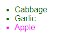
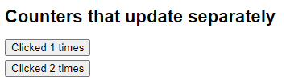
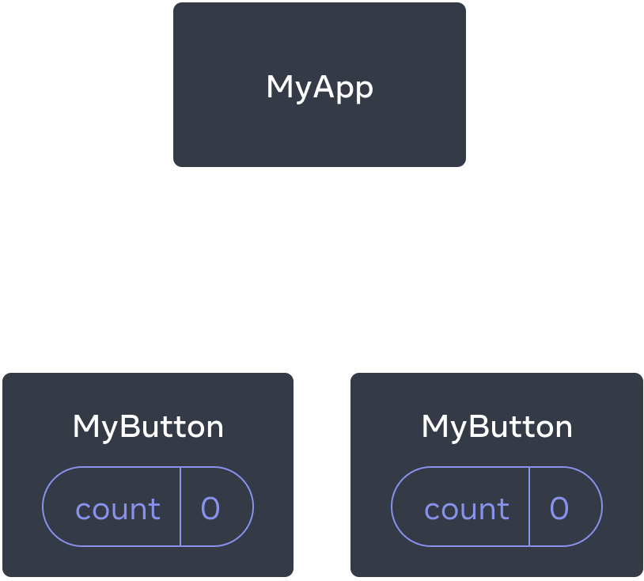
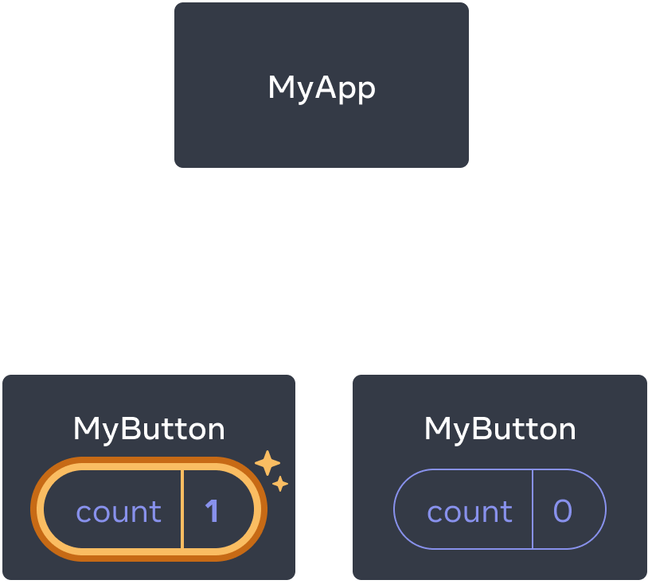
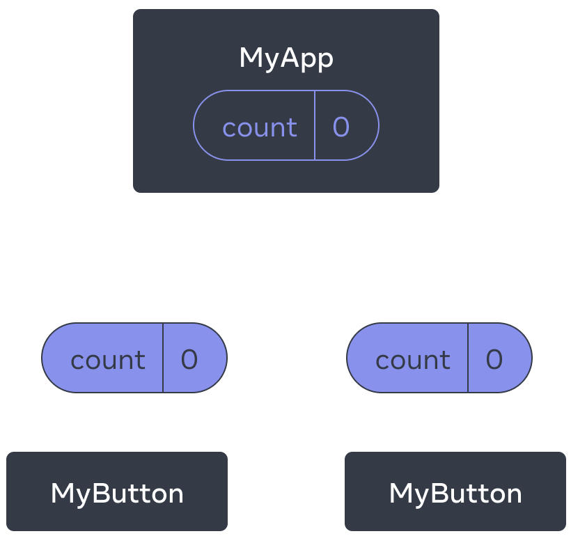
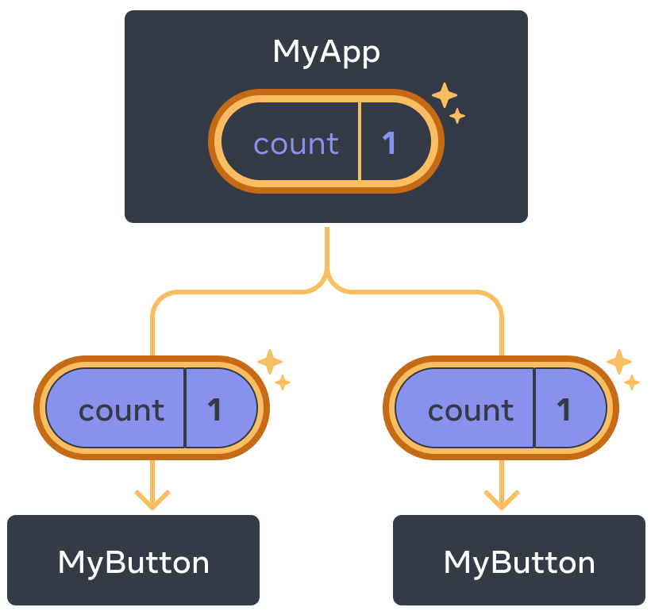
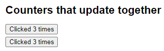

# React

[Tutorial: Tic-Tac-Toe – React](https://react.dev/learn/tutorial-tic-tac-toe#adding-time-travel)

中文：[React (reactjs.org)](https://zh-hans.reactjs.org/)

https://youtu.be/Y6KDk5iyrYE

## Web应用程序的构建块

在构建现代应用程序时，您需要考虑以下几点：

+ 用户界面 - 用户如何使用和与您的应用程序交互。
+ 路由 - 用户如何在应用程序的不同部分之间导航。
+ 数据获取 - 数据存储的位置以及如何获取它。
+ 渲染 - 何时以及在何处呈现静态或动态内容。
+ 集成 - 使用哪些第三方服务（CMS、auth、支付等）以及如何连接它们。
+ 基础设施 - 在哪里部署、存储和运行应用程序代码（无服务器、CDN、Edge等）。
+ 性能 - 如何针对终端用户优化您的应用程序。
+ 可伸缩性 - 您的应用程序如何适应您的团队、数据和流量的增长。
+ 开发者体验 - 您的团队在构建和维护应用程序时的体验。

## 结构

使用后`npx create-react-app my-app`创建react的一个脚手架，使用`npm start`运行

The *Files* section with a list of files like `App.js`, `index.js`, `styles.css` and a folder called `public`

#### `App.js`

The code in `App.js` creates a *component*. In React, a component is a piece of reusable code that represents a part of a user interface. Components are used to render, manage, and update the UI elements in your application. Let’s look at the component line by line to see what’s going on:

```jsx
export default function Square() {

  return <button className="square">X</button>;

}
```

The first line defines a function called `Square`. The `export` JavaScript keyword makes this function accessible outside of this file. The `default` keyword tells other files using your code that it’s the main function in your file.

```jsx
export default function Square() {

  return <button className="square">X</button>;

}
```

The second line returns a button. The `return` JavaScript keyword means whatever comes after is returned as a value to the caller of the function. `<button>` is a *JSX element*. A JSX element is a combination of JavaScript code and HTML tags that describes what you’d like to display. `className="square"` is a button property or *prop* that tells CSS how to style the button. `X` is the text displayed inside of the button and `</button>` closes the JSX element to indicate that any following content shouldn’t be placed inside the button.

#### `styles.css`

此文件定义了React应用程序的样式。

#### `index.js` 

这是在`App.js`文件中创建的组件与Web浏览器之间的桥梁。

```js
import { StrictMode } from 'react';

import { createRoot } from 'react-dom/client';

import './styles.css';

import App from './App';
```

Lines 1-5 brings all the necessary pieces together:

- React
- React’s library to talk to web browsers (React DOM)
- the styles for your components
- the component you created in `App.js`.

文件的其余部分将所有部分整合起来，并将最终产品注入公共文件夹下的 index.html 文件中。

## 创建和嵌套组件 

React 应用程序是由 **组件** 组成的。一个组件是 UI（用户界面）的一部分，它拥有自己的逻辑和外观。组件可以小到一个按钮，也可以大到整个页面。

React 组件是返回标签的 JavaScript 函数：

```jsx
function MyButton() {
  return <button>I'm a button</button>;
}
// 声明了 MyButton，可以把它嵌套到另一个组件中
export default function MyApp() {
  return (
    <div>
      <h1>Welcome to my app</h1>
      <MyButton />
    </div>
  );
}
```

`<MyButton />` 是以大写字母开头的。可以根据此来区分 React 组件。React 组件必须以大写字母开头，而 HTML 标签则必须是小写字母。

`export default` 关键字指定了文件中的主要组件。

## 使用 JSX 编写标签 

上面所使用的标签语法被称为 *JSX*。它是可选的，但大多数 React 项目会使用 JSX，主要是它很方便。所有 我们推荐的本地开发工具 都支持 JSX，开箱即用。

JSX 比 HTML 更加严格。你必须**闭合标签**，如 `<br />`。你的组件也不能返回多个 JSX 标签。你必须将它们**包裹到一个共享的父级中**，比如 `<div>...</div>` 或使用空的 `<>...</>` 包裹：

```jsx
function AboutPage() {
  return (
    <>
      <h1>About</h1>
      <p>Hello there.<br />How do you do?</p>
    </>
  );
}
```

如果你有大量的 HTML 需要移植到 JSX 中，你可以使用 [在线转换器](https://transform.tools/html-to-jsx)。

## 添加样式 

在 React 中，你可以使用 `className` 来指定一个 CSS 的 class。它与 HTML 的 [`class`](https://developer.mozilla.org/en-US/docs/Web/HTML/Global_attributes/class) 属性的工作方式相同：

```

```

然后，你可以在一个单独的 CSS 文件中为它编写 CSS 规则：

```css
/* In your CSS */
.avatar {
  border-radius: 50%;
}
```

React 并没有规定你如何添加 CSS 文件。最简单的方式，你可以在你的 HTML 中添加一个 [` <link> `](https://developer.mozilla.org/en-US/docs/Web/HTML/Element/link) 标签。

## 显示数据 

JSX 会让你把标签放到 JavaScript 中。而大括号会让你 “回到” JavaScript 中，这样你就可以从你的代码中嵌入一些变量并展示给用户。例如，这将显示 `user.name`：

```ASN.1
return (
  <h1>
    {user.name}
  </h1>
);
```

你还可以将 JSX 属性 “转义到 JavaScript”，但你必须使用大括号 **而非** 引号。例如，`className="avatar"` 是将 `"avatar"` 字符串传递给 `className`，作为 CSS 的 class。但 `src={user.imageUrl}` 会读取 JavaScript 的 `user.imageUrl` 变量，然后将该值作为 `src` 属性传递：

```jsx
return (
  
);
```

你也可以把更为复杂的表达式放入 JSX 的大括号内，例如 [字符串拼接](https://javascript.info/operators#string-concatenation-with-binary)：

```jsx
const user = {
  name: 'Hedy Lamarr',
  imageUrl: 'https://i.imgur.com/yXOvdOSs.jpg',
  imageSize: 90,
};

export default function Profile() {
  return (
    <>
      <h1>{user.name}</h1>
      
    </>
  );
}
```

在上面示例中，`style={{}}` 并不是一个特殊的语法，里面的 `{ }` JSX 大括号内的一个普通 `{}` 对象。当你的样式依赖于 JavaScript 变量时，你可以使用 `style` 属性。

## 条件渲染 

在 React 中，没有特殊的语法来编写条件。因此，你将使用与编写常规 JavaScript 代码时相同的技术。例如，你可以使用 [`if`](https://developer.mozilla.org/en-US/docs/Web/JavaScript/Reference/Statements/if...else) 语句根据条件引入 JSX：

```jsx
let content;
if (isLoggedIn) {
  content = <AdminPanel />;
} else {
  content = <LoginForm />;
}
return (
  <div>
    {content}
  </div>
);
```

如果你喜欢更为紧凑的代码，你可以使用 [条件 `?` 运算符](https://developer.mozilla.org/en-US/docs/Web/JavaScript/Reference/Operators/Conditional_Operator)。与 `if` 不同的是，它工作于 JSX 内部：

```jsx
<div>
  {isLoggedIn ? (
    <AdminPanel />
  ) : (
    <LoginForm />
  )}
</div>
```

当你不需要 `else` 分支时，你还可以使用 [逻辑 `&&` 语法](https://developer.mozilla.org/en-US/docs/Web/JavaScript/Reference/Operators/Logical_AND#short-circuit_evaluation)：

```jsx
<div>
  {isLoggedIn && <AdminPanel />}
</div>
```

所有这些方法也适用于有条件地指定属性。如果你对 JavaScript 语法不熟悉，你可以从一直使用 `if...else` 开始。

## 渲染列表 

你将依赖 JavaScript 的特性，例如 [`for` 循环](https://developer.mozilla.org/en-US/docs/Web/JavaScript/Reference/Statements/for) 和 [array 的 `map()` 函数](https://developer.mozilla.org/en-US/docs/Web/JavaScript/Reference/Global_Objects/Array/map) 来渲染组件列表。

例如，假设你有一个产品数组：

```jsx
const products = [
  { title: 'Cabbage', id: 1 },
  { title: 'Garlic', id: 2 },
  { title: 'Apple', id: 3 },
];
```

在你的组件中，使用 `map()` 函数将一个产品数组，转换为 `<li>` 标签的元素列表:

```jsx
const listItems = products.map(product =>
  <li key={product.id}>
    {product.title}
  </li>
);

return (
  <ul>{listItems}</ul>
);
```

注意， `<li>` 有一个 `key` 属性。对于列表中的每一个元素，你应该传递一个字符串或者数字给 `key`，用于在其兄弟节点中唯一标识该元素。通常，key 应该来自你的数据，比如，数据库中的 ID。如果你在后续插入、删除或重新排序这些项目，React 将依靠你提供的 key 来思考发生了什么。

```jsx
const products = [
  { title: 'Cabbage', isFruit: false, id: 1 },
  { title: 'Garlic', isFruit: false, id: 2 },
  { title: 'Apple', isFruit: true, id: 3 },
];

export default function ShoppingList() {
  const listItems = products.map(product =>
    <li
      key={product.id}
      style={{
        color: product.isFruit ? 'magenta' : 'darkgreen'
      }}
    >
      {product.title}
    </li>
  );

  return (
    <ul>{listItems}</ul>
  );
}
```

 

## 响应事件 

你可以通过在组件中声明 **事件处理** 函数来响应事件：

```jsx
export default function MyButton() {
  function handleClick() {
    alert("You clicked me!");
  }

  return <button onClick={handleClick}>Click me</button>;
}
```

注意，`onClick={handleClick}` 的结尾没有小括号！不要 **调用** 事件处理函数：你只需 **传递给事件** 即可。当用户点击按钮时，React 会调用你的事件处理函数。

## 更新界面 

通常，你会希望你的组件 “记住” 一些信息并展示出来。例如，也许你想计算一个按钮被点击的次数。要做到这一点，你需要在你的组件中添加 **state**。

首先，从 React 引入 [`useState`](https://zh-hans.reactjs.org/reference/react/useState)：

```jsx
import { useState } from 'react';
```

现在你可以在你的组件中声明一个 **state 变量**：

```jsx
function MyButton() {
  const [count, setCount] = useState(0);
  // ...
```

你将从 `useState` 中获得两样东西：当前的 state（`count`），以及用于更新它的函数（`setCount`）。你可以给它们起任何名字，但按照惯例，需要像这样 `[something, setSomething]` 为它们命名。

第一次显示按钮时，`count` 的值为 `0`，因为你把 `0` 传给了 `useState()`。当你想改变 state 时，调用 `setCount()` 并将新的值传递给它。点击该按钮计数器将递增：

```jsx
function MyButton() {
  const [count, setCount] = useState(0);

  function handleClick() {
    setCount(count + 1);
  }

  return (
    <button onClick={handleClick}>
      Clicked {count} times
    </button>
  );
}
```

React 将再次调用你的组件函数。这次，`count` 会变成 `1`。接着，变成 `2`。以此类推。

如果你多次渲染同一个组件，每个组件都会拥有自己的 state。你可以尝试点击不同的按钮：

```jsx
import { useState } from 'react';

export default function MyApp() {
  return (
    <div>
      <h1>Counters that update separately</h1>
      <MyButton />
      <MyButton />
    </div>
  );
}

function MyButton() {
  const [count, setCount] = useState(0);

  function handleClick() {
    setCount(count + 1);
  }

  return (
    <button onClick={handleClick}>
      Clicked {count} times
    </button>
  );
}
```

 

注意，每个按钮会 “记住” 自己的 `count`，而不影响其他按钮。

## 使用 Hook 

以 `use` 开头的函数被称为 **Hook**。`useState` 是 React 提供的一个内置 Hook。你可以在 [React API 参考](https://zh-hans.reactjs.org/reference/react) 中找到其他内置的 Hook。你也可以通过组合现有的 Hook 来编写属于你自己的 Hook。

Hook 比普通函数更为严格。你只能在你的组件（或其他 Hook）的 **顶层** 调用 Hook。如果你想在一个条件或循环中使用 `useState`，请提取一个新的组件并在组件内部使用它。

## 组件间共享数据 

在前面的示例中，每个 `MyButton` 都有自己独立的 `count`，当每个按钮被点击时，只有被点击按钮的 `count` 才会发生改变：

  

起初，每个 `MyButton` 的 `count` state 均为 `0`

 

第一个 `MyButton` 会将 `count` 更新为 `1`

然而，你经常需要组件 **共享数据并一起更新**。

为了使得 `MyButton` 组件显示相同的 `count` 并一起更新，你需要将各个按钮的 state “向上” 移动到最接近包含所有按钮的组件之中。

在这个示例中，它是 `MyApp`：

 

起初，`MyApp` 的 `count` state 为 `0` 并传递给了两个子组件

 

点击后，`MyApp` 将 `count` state 更新为 `1`，并将其传递给两个子组件

此刻，当你点击任何一个按钮时，`MyApp` 中的 `count` 都将改变，同时会改变 `MyButton` 中的两个 count。具体代码如下：

首先，将 `MyButton` 的 **state 上移到** `MyApp` 中：

```jsx
export default function MyApp() {
  const [count, setCount] = useState(0);

  function handleClick() {
    setCount(count + 1);
  }

  return (
    <div>
      <h1>Counters that update separately</h1>
      <MyButton />
      <MyButton />
    </div>
  );
}

function MyButton() {
  // ... we're moving code from here ...
}
```

接着，将 `MyApp` 中的点击事件处理函数以及 **state 一同向下传递到** 每个 `MyButton` 中。你可以使用 JSX 的大括号向 `MyButton` 传递信息。就像之前向 `` 等内置标签所做的那样:

```jsx
export default function MyApp() {
  const [count, setCount] = useState(0);

  function handleClick() {
    setCount(count + 1);
  }

  return (
    <div>
      <h1>Counters that update together</h1>
      <MyButton count={count} onClick={handleClick} />
      <MyButton count={count} onClick={handleClick} />
    </div>
  );
}
```

按这种方式传递下来的信息被称作 **prop**。此时，`MyApp` 组件包含了 `count` state 以及 `handleClick` 事件处理函数，并将它们作为 **prop 传递给** 了每个按钮。

最后，改变 `MyButton` 以 **读取** 从父组件传递来的 prop：

```jsx
function MyButton({ count, onClick }) {
  return (
    <button onClick={onClick}>
      Clicked {count} times
    </button>
  );
}
```

当你点击按钮时，`onClick` 处理程序会启动。每个按钮的 `onClick` prop 会被设置为 `MyApp` 内的 `handleClick` 函数，所以函数内的代码会被执行。该代码会调用 `setCount(count + 1)`，使得 state 变量 `count` 递增。新的 `count` 值会被作为 prop 传递给每个按钮，因此它们每次展示的都是最新的值。这被称为“状态提升”。通过向上移动 state，我们实现了在组件间共享它。

```jsx
import { useState } from 'react';

export default function MyApp() {
  const [count, setCount] = useState(0);

  function handleClick() {
    setCount(count + 1);
  }

  return (
    <div>
      <h1>Counters that update together</h1>
      <MyButton count={count} onClick={handleClick} />
      <MyButton count={count} onClick={handleClick} />
    </div>
  );
}

function MyButton({ count, onClick }) {
  return (
    <button onClick={onClick}>
      Clicked {count} times
    </button>
  );
}
```

 

## next.js

### 为什么需要react框架


<details>  <summary>展开</summary>  <div> 可以在没有框架的情况下使用 React——将 React 用于页面的一部分。但是，如果要用 React 构建一个新的应用或网站，建议使用一个框架。<br/>这里是一些原因。<br/>即使你一开始不需要路由或数据获取，你也可能想为它们添加一些库。随着你的 JavaScript 包随着每一个新功能的出现而增长，你可能要弄清楚如何为每一个路由单独拆分代码。随着你的数据获取需求越来越复杂，你很可能会遇到服务器-客户端的网络瀑布，使你的应用感觉非常慢。当你的受众包括更多网络条件差和低端设备的用户时，你可能需要从你的组件中生成 HTML 来提前显示内容——要么在服务器上，要么在构建时间内。改变你的设置以在服务端或在构建时中运行你的一些代码是非常棘手的。<br/>这些问题不是 React 特有的。这就是为什么 Svelte 有 SvelteKit、Vue 有 Nuxt 等等。要自己解决这些问题，你需要将你的 bundler 与路由和数据获取库集成起来。在一开始这些配置工作并不难，但随着时间的推移，要使一个应用快速加载，还涉及很多微妙的问题。你需要尽可能减少应用程序代码的大小，并在单个客户端-服务器往返中同时发送页面所需的所有数据。甚至你可能希望在你的 JavaScript 代码运行之前，页面就已经可以交互，也就是支持渐进式增强。你可能想为你的营销页面生成一个完全静态的 HTML 文件夹，可以在任何地方托管，并且在禁用 JavaScript 的情况下仍然可以使用。自己构建这些功能需要付出实际的努力。<br/>本页面上的 React 框架默认解决了这些问题，不需要你做额外的工作。它们让你可以从非常简洁的框架开始，根据需求扩展应用。每个 React 框架都有社区，可以比较容易地找到问题的答案和升级工具的方法。框架还为你的代码提供了基础结构，帮助你和其他人在不同的项目之间保持统一的开发环境和技术。相反，如果是自己配置，则更容易卡在已经不受支持的依赖版本上，而且你最终会创建一个没有社区和升级路径的框架（如果你创建的框架与我们以前创建的框架类似，那么它可能也存在设计上的不完善之处）。<br/>如果你仍然不相信，或者你的应用有不寻常的限制，而这些框架不能很好地满足你的要求，你想推出你自己的自定义设置，我们不能阻止你——去做吧！从 npm 抓取 react 和 react-dom，用 Vite 或 Parcel 等 bundler 设置你的自定义构建过程，并根据你的需要添加其他工具，用于路由、静态生成或服务器端渲染等等。</div></details>

---

**[Next.js](https://nextjs.org/) 是一个全栈式的 React 框架**。它用途广泛，可以让你创建任意规模的 React 应用——可以是静态博客，也可以是复杂的动态应用。

 [Next.js 教程](https://nextjs.org/learn/foundations/about-nextjs)。

Next.js 由 [Vercel](https://vercel.com/) 维护。你可以 [将 Next.js 应用](https://nextjs.org/docs/deployment) 部署到 Node.js 或 serverless 上，也可以部署到你自己的服务器上。[完全静态的 Next.js 应用](https://nextjs.org/docs/advanced-features/static-html-export) 可以部署在任何支持静态服务的地方。

 

你可以使用React来构建你的UI，然后**逐步**采用Next.js功能来解决常见的应用程序要求，如**路由，数据提取和集成** - 同时改善开发人员和最终用户的体验。

### 创建一个新项目

```shell
npx create-next-app
# 如果要使用yarn进行包管理
yarn create next-app
```

会启动一个交互式体验，引导设置项目

>create-next-app是一个用于快速创建Next.js应用的命令行工具。它可以让您使用默认的Next.js模板，或者使用官方的Next.js示例来初始化一个新的项目。

### 使用模板代码开始

reactArrowFunctionComponentExport（简写rafce）是一个React的术语，表示使用箭头函数定义和导出一个函数组件。例如：

```js
// 使用箭头函数定义一个函数组件
const App = () => {
  return <div>Hello World</div>;
};

// 使用export语句导出该组件
export default App;
```

这种写法和使用普通函数定义和导出函数组件是等效的，例如：

```js
// 使用普通函数定义一个函数组件
function App() {
  return <div>Hello World</div>;
}

// 使用export语句导出该组件
export default App;
```

使用箭头函数的好处是可以简化代码，避免使用this关键字，以及保持一致的编码风格。

## 将 React 添加到现有项目中

[将 React 添加到现有项目中 – React](https://zh-hans.react.dev/learn/add-react-to-an-existing-project)

### 在现有网站的子路由中使用 React

### 在现有页面的一部分中使用 React 

## React 开发者工具

使用 React 开发者工具检查 React [components](https://zh-hans.react.dev/learn/your-first-component)，编辑 [props](https://zh-hans.react.dev/learn/passing-props-to-a-component) 和 [state](https://zh-hans.react.dev/learn/state-a-components-memory)，并识别性能问题。

## npx

npx是一个用于执行node.js包的工具。它不管您是否已经安装了那个包，npx都会临时安装并运行它。npx还可以检查您的路径或本地项目中是否有可执行的包，并执行它。

### npx与npm的区别

npm是用于下载和管理node包的工具，但不方便直接运行任何包。要运行一个包，您必须在package.json文件中指定它，或者输入完整的本地路径。npx则可以简化这个过程，只需输入`npx <pkg>`就可以运行一个包，无论是本地还是远程的。